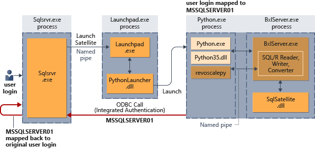

# Security overview for Python in SQL Server Machine Learning
[!INCLUDE[appliesto-ss-xxxx-xxxx-xxx-md-winonly](../../includes/appliesto-ss-xxxx-xxxx-xxx-md-winonly.md)]

This topic describes the security architecture that is used to connect the [!INCLUDE[ssNoVersion_md](../../includes/ssnoversion-md.md)] database engine and Python components. Examples of the security process are provided for two common scenarios: running Python in SQL Server using a stored procedure, and running Python with the SQL Server as the remote compute context.

## Security overview

A [!INCLUDE[ssNoVersion_md](../../includes/ssnoversion-md.md)] login or Windows user account is required to run Python script in SQL Server. These *security principals* are managed at the instance and database level, and identify users who have permission to connect to the database, read and write data, or create database objects such as tables or stored procedures. Additionally, users who run Python script must have permission to execute external script at the database level.

Even users who are using Python in an external tool must be mapped to a login or account in the database if the user needs to run Python code in-database, or access database objects and data. The same permissions are required whether the Python script is sent from a remote data science client or started using a T-SQL stored procedure.

For example, assume that you created a Python script that runs on your laptop, and you want to run that code on [!INCLUDE[ssNoVersion_md](../../includes/ssnoversion-md.md)]. You must ensure that the following conditions are met:

+ The database allows remote connections.
+ The SQL login or Windows account that you used for database access has been added to the [!INCLUDE[ssNoVersion_md](../../includes/ssnoversion-md.md)] at the instance level.
+ The SQL login or Windows user must be granted the permission to execute external scripts. Generally, this permission can only be added by a database administrator.
+ The SQL login or Window user must be added as a user, with appropriate permissions, in each database where the Python script performs any of these operations:
    + Retrieving data
    + Writing or updating data
    + Creating new objects, such as tables or stored procedures

After the login or Windows user account has been provisioned and given the necessary permissions, you can run Python code on [!INCLUDE[ssNoVersion_md](../../includes/ssnoversion-md.md)] by using the data source objects provided by the **revoscalepy** library, or by calling a stored procedure that contains Python script.

Whenever a Python script is launched from [!INCLUDE[ssNoVersion_md](../../includes/ssnoversion-md.md)], the database engine security gets the security context of the user who started the job, and manages the mappings of the user or login to securable objects.

Therefore, all Python scripts that are initiated from a remote client must specify the login or user information as part of the connection string.

## Interaction of [!INCLUDE[ssNoVersion_md](../../includes/ssnoversion-md.md)] security and Launchpad security

When a Python script is executed in the context of the [!INCLUDE[ssNoVersion_md](../../includes/ssnoversion-md.md)] computer, the [!INCLUDE[rsql_launchpad_md](../../includes/rsql-launchpad-md.md)] service gets an available worker account (a local user account) from a pool of worker accounts established for external processes, and uses that worker account to perform the related tasks.

For example, assume you launch a Python script under your Windows domain credentials. SQL Server gets your credentials and maps the task to an available Launchpad worker account, such as *SQLRUser01*.

> [!NOTE]
> The name of the group of worker accounts is the same regardless of whether you are using R or Python. However, a separate group is created for each instance where you enable any external language.

After mapping to a worker account, [!INCLUDE[rsql_launchpad_md](../../includes/rsql-launchpad-md.md)] creates a user token that is used to start processes. 

When all [!INCLUDE[ssNoVersion_md](../../includes/ssnoversion-md.md)] operations are completed, the user worker account is marked as free and returned to the pool.

For more information about [!INCLUDE[rsql_launchpad_md](../../includes/rsql-launchpad-md.md)], see [Components in SQL Server to support Python integration](../../advanced-analytics/python/new-components-in-sql-server-to-support-python-integration.md).

### Implied authentication

**Implied authentication** is the term used for the process under which SQL Server gets the user credentials and then executes all external script tasks on behalf of the users, assuming the user has the correct permissions in the database. Implied authentication is particularly important if the Python script needs to make an ODBC call outside the SQL Server database. For example, the code might retrieve a shorter list of factors from a spreadsheet or other source.

For such loopback calls to succeed, the group that contains the worker accounts, SQLRUserGroup, must have "Allow Log on locally" permissions. By default, this right is given to all new local users, but in some organizations stricter group policies might be enforced.

## Security of worker accounts

The mapping of an external Windows user or valid SQL login to a worker account is valid only for the lifetime of the SQL stored procedure that executes the Python script.

Parallel queries from the same login are mapped to the same user worker account.

The directories used for the processes are managed by the [!INCLUDE[rsql_launchpad_md](../../includes/rsql-launchpad-md.md)], and directories are access-restricted. For Python, PythonLauncher performs this task. Each individual worker account is restricted to its own folder, and cannot access files in folders above its own level. However, the worker account can read, write, or delete children under the session working folder that was created.

For more information about how to change the number of worker accounts, account names, or account passwords, see [Modify the user account pool for SQL Server machine learning](../../advanced-analytics/r/modify-the-user-account-pool-for-sql-server-r-services.md).

## Security isolation for multiple external scripts

The isolation mechanism is based on physical user accounts. As satellite processes are started for a specific language runtime, each satellite task uses the worker account specified by the [!INCLUDE[rsql_launchpad_md](../../includes/rsql-launchpad-md.md)]. If a task requires multiple satellites, for example, in the case of parallel queries, a single worker account is used for all related tasks.

No worker account can see or manipulate files used by other worker accounts.

If you are an administrator on the computer, you can view the directories created for each process. Each directory is identified by its session GUID.

## See Also

[Architecture overview](../../advanced-analytics/python/architecture-overview-sql-server-python.md)
