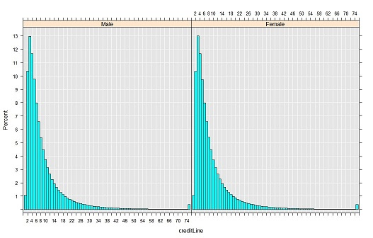
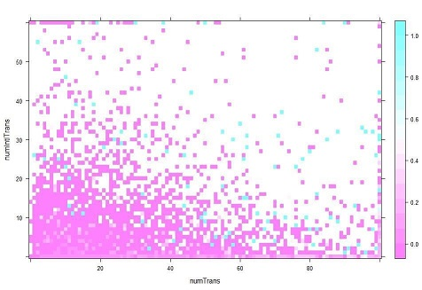

# Lesson 2-1 - Visualize SQL Server Data using R
The enhanced packages in [!INCLUDE[rsql_productname](../../includes/rsql-productname-md.md)] include multiple functions that have been optimized for scalability and parallel processing. Typically these functions are prefixed with *rx* or *Rx*.  
  
For this walkthrough, you will use the *rxHistogram* function to view the distribution of values in the _creditLine_ column by gender.  
  
## Visualize Data using rxHistogram and rxCube  
  
1.  Use the following R code to call the *rxHistogram* function and pass a formula and data source. You can run this locally at first, to see the expected results, and how long it takes.
  
    ```R  
    rxHistogram(~creditLine|gender, data = sqlFraudDS,  histType = "Percent")   
    ```  
 
    Internally, *rxHistogram* calls the *rxCube* function, which is included in the **RevoScaleR** package. The *rxCube* function outputs a single list (or data frame) containing one column for each variable specified in the formula, plus a counts column.
    
2. Now, set the compute context to the remote SQL Server computer and run the *rxHistogram* again.
  
    ```R  
    rxSetComputeContext(sqlCompute)  
    ```  
 
3.    The results are exactly the same, since you're using the same data source; however, the computations are performed on the [!INCLUDE[ssNoVersion](../../includes/ssnoversion-md.md)] computer.  The results are then returned to your local workstation for plotting.  
   
  

  
4.  You can also call the *rxCube* function and pass the results to an R plotting functions.  For example, the following example uses *rxCube* to compute the mean of *fraudRisk* for every combination of *numTrans* and *numIntlTrans*:  
  
    ```R  
    cube1 <- rxCube(fraudRisk~F(numTrans):F(numIntlTrans),  data = sqlFraudDS)   
    ```  
  
    To specify the groups used to compute group means, use the `F()` notation. In this example, `F(numTrans):F(numIntlTrans)` indicates that the integers in the variables _numTrans_ and _numIntlTrans_ should be treated as categorical variables, with a level for each integer value.  
  
    Because the low and high levels were already added to the data source *sqlFraudDS* (using the *colInfo* parameter), the levels will automatically be used in the histogram.  
  
5.  The return value of *rxCube* is by default an *rxCube object*, which represents a cross-tabulation. However, you can use the *rxResultsDF* function to convert the results into a data frame that can easily be used in one of R’s standard plotting functions.  
  
    ```R  
    cubePlot <- rxResultsDF(cube1)   
    ```  
  
    > [!TIP]  
    > Note that the *rxCube* function includes an optional argument, *returnDataFrame* = TRUE, that you could use to convert the results to a data frame directly. For example:  
    >   
    > `print(rxCube(fraudRisk~F(numTrans):F(numIntlTrans), data = sqlFraudDS, returnDataFrame = TRUE))`  
    >   
    > However, the output of *rxResultsDF* is much cleaner and preserves the names of the source columns.  
  
6.  Finally, run the following code to create a heat map using the *levelplot* function from the **lattice** package included with all R distributions.  
  
    ```R  
    levelplot(fraudRisk~numTrans*numIntlTrans, data = cubePlot)   
    ```  
  
    **Results**  
  
      
  
From even this quick analysis, you can see that the risk of fraud increases with both the number of transactions and the number of international transactions.

For more information about the *rxCube* function and crosstabs in general, see [Data Summaries](https://msdn.microsoft.com/microsoft-r/scaler-user-guide-data-summaries).  
  
## Next Step  
[Create Models &#40;Data Science Deep Dive&#41;](../../advanced-analytics/r-services/lesson-2-2-create-models.md)  
  
## Previous Step  
[Lesson 2: Create and Run R Scripts &#40;Data Science Deep Dive&#41;](../../advanced-analytics/r-services/lesson-2-create-and-run-r-scripts-data-science-deep-dive.md)  
  
## See Also  
[Data Science Deep Dive: Using the RevoScaleR Packages](../../advanced-analytics/r-services/data-science-deep-dive-using-the-revoscaler-packages.md)  
  
  
  

