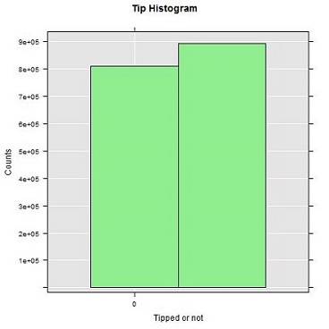
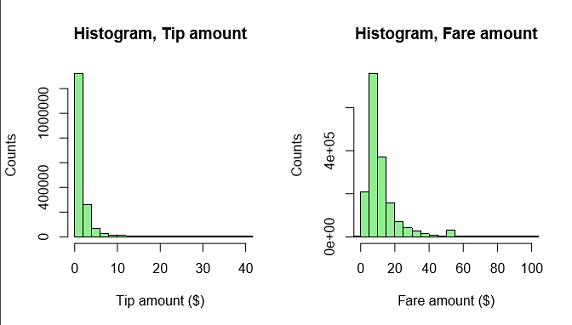
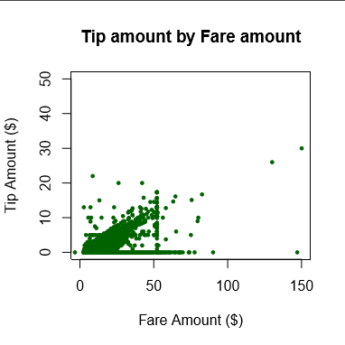

# Step 3: Explore and Visualize the Data (In-Database Advanced Analytics Tutorial)
Developing a data science solution usually includes intensive data exploration and data visualization. In this step, you'll review the sample data, and then generate some plots using R functions. These R functions are already included in [!INCLUDE[rsql_productname](../../includes/rsql-productname-md.md)]; in this walkthrough, you'll practice calling R functions from [!INCLUDE[tsql](../../includes/tsql-md.md)].  
  
## Review the Data  
First, take a minute to review the sample data, if you haven't already.  
  
In the original dataset, the taxi identifiers and trip records were provided in separate files. However, to make the sample data easier to use, the two original datasets have been joined on the columns _medallion_, _hack_license_, and _pickup_datetime_.  The records were also sampled to get just 1% of the original number of records. The resulting down-sampled dataset has 1,703,957 rows and 23 columns.  
  
**Taxi identifiers**  
  
-   The _medallion_ column represents the taxi’s unique id number.  
  
-   The _hack_license_ column contains the taxi driver's license number (anonymized) .  
  
**Trip and fare records**  
  
-   Each trip record includes the pickup and drop-off location and time, and the trip distance.  
  
-   Each fare record includes payment information such as the payment type, total amount of payment, and the tip amount.  
  
-   The last three columns can be used for various machine learning tasks.  The _tip_amount_ column contains continuous numeric values and can be used as the **label** column for regression analysis. The _tipped_ column has only yes/no values and is used for binary classification. The _tip_class_ column has multiple **class labels** and therefore can be used as the label for multi-class classification tasks.  
  
    This walkthrough demonstrates only the binary classification task; you are welcome to try building models for the other two machine learning tasks, regression and multiclass classification.  
  
-   The values used for the label columns are all based on the _tip_amount_ column, using these business rules:  
  
    |Derived column name|Rule|  
    |-|-|  
     |tipped|If tip_amount > 0, tipped = 1, otherwise tipped = 0|  
    |tip_class|Class 0: tip_amount = $0<br /><br />Class 1: tip_amount > $0 and tip_amount <= $5<br /><br />Class 2: tip_amount > $5 and tip_amount <= $10<br /><br />Class 3: tip_amount > $10 and tip_amount <= $20<br /><br />Class 4: tip_amount > $20|  
  
## Create Plots using R in T-SQL  
Because visualization is such a powerful tool for understanding the distribution of the data and outliers, R provides many packages for visualizing data. The standard open-source distribution of R also includes many functions for crating histograms, scatter plots, box plots,  and other data exploration graphs.  
  
R typically creates images using an R device for graphical output. You can capture the output of this device and store the image in a **varbinary** data type for rendering in application, or you can save the images to any of the support file formats (.JPG, .PDF, etc.).  
  
In this section, you'll learn how to work with each type of output using stored procedures.  
  
-   Storing plots as varbinary data type  
  
-   Saving plots in files (.JPG, .PDF) on the server  
  
### Storing plots as varbinary data type  
You'll use `rxHistogram`, one of the enhanced R functions provided in [!INCLUDE[rsql_productname](../../includes/rsql-productname-md.md)], to plot a histogram based on data from a [!INCLUDE[tsql](../../includes/tsql-md.md)] query. To make it easier to call the R function, you will wrap it in a stored procedure, _PlotHistogram_.  
  
The stored procedure returns the image as a stream of varbinary data, which obviously you cannot view directly. However, you can use the **bcp** utility to get the varbinary data and save it as an image file on a client computer.  
  
##### To create the stored procedure PlotHistogram  
  
1.  In [!INCLUDE[ssManStudioFull](../../includes/ssmanstudiofull-md.md)], open a new query window.  
  
2.  Select the database for the walkthrough,  and create the procedure using this statement.  
  
    ```  
    CREATE PROCEDURE [dbo].[PlotHistogram]  
    AS  
    BEGIN  
      SET NOCOUNT ON;  
      DECLARE @query nvarchar(max) =  
      N'SELECT tipped FROM nyctaxi_sample'  
      EXECUTE sp_execute_external_script @language = N'R',  
                                         @script = N'  
       image_file = tempfile();  
       jpeg(filename = image_file);  
       #Plot histogram  
       rxHistogram(~tipped, data=InputDataSet, col=''lightgreen'',   
       title = ''Tip Histogram'', xlab =''Tipped or not'', ylab =''Counts'');  
       dev.off();  
       OutputDataSet <- data.frame(data=readBin(file(image_file, "rb"), what=raw(), n=1e6));  
       ',  
       @input_data_1 = @query  
       WITH RESULT SETS ((plot varbinary(max)));  
    END  
    GO  
  
    ```  
  
    Be sure to modify the code to use the correct table name, if needed.  
  
    -   The variable `@query` defines the query text (`'SELECT tipped FROM nyctaxi_sample'`), which is passed to the R script as the argument to the script input variable, `@input_data_1`.  
  
    -   The R script is fairly simple: an R variable (`image_file`) is defined to store the image, and then the `rxHistogram` function is called to generate the plot.  
  
    -   The R device is set to **off**.  
  
        In R, when you issue a high-level plotting command, R will open a graphics window, called a *device*. You can change the size and colors and other aspects of the window, or you can turn the device off if you are writing to a file or handling the output some other way.  
  
    -   The R graphics object is serialized to an R data.frame for output. This is a temporary workaround for CTP3.  
  
##### To output varbinary data to viewable graphics file  
  
1.  In [!INCLUDE[ssManStudio](../../includes/ssmanstudio-md.md)], run the following statement:  
  
    ```  
    EXEC [dbo].[PlotHistogram]  
    ```  
  
**Results**  
  
*plot*  
*0xFFD8FFE000104A4649...*  
  
2.  Open a PowerShell command prompt and run the following command, providing the appropriate instance name, database name, username, and credentials as arguments:  
  
    ```  
    bcp "exec PlotHistogram" queryout "plot.jpg" -S <SQL Server instance name> -d  <database name>  -U <user name> -P <password>  
  
    ```  
  
    > [!NOTE]  
    > Command switches for **bcp** are case-sensitive.  
  
3.  If the connection is successful, you will be prompted to enter more information about the graphic file format. Press ENTER at each prompt to accept the defaults, except for these changes:  
  
    -   For **prefix-length of field plot**, type 0  
  
    -   Type **Y** if you want to save the output parameters for later reuse.  
  
    ```  
    Enter the file storage type of field plot [varbinary(max)]:  
    Enter prefix-length of field plot [8]: 0  
    Enter length of field plot [0]:  
    Enter field terminator [none]:  
  
    Do you want to save this format information in a file? [Y/n]  
    Host filename [bcp.fmt]:  
  
    ```  
  
**Results**  
  
*Starting copy...*  
*1 rows copied.*  
*Network packet size (bytes): 4096*  
*Clock Time (ms.) Total     : 3922   Average : (0.25 rows per sec.)*  
   
> [!TIP]  
 > If you save the format information to file (bcp.fmt), the **bcp** utility generates a format definition that you can apply to similar commands in future without being prompted for graphic file format options. To use the format file, add `-f bcp.fmt` to the end of any command line, after the password argument.  
  
4.  The output file will be created in the same directory where you ran the PowerShell command. To view the plot, just open the file plot.jpg.  
  
      
  
### Saving plots in files (jpg, pdf) on the server  
Outputting an R plot to a binary data type might be convenient  for consumption by applications, but it is not very useful to a data scientist who needs the rendered plot during the data exploration stage. Typically the data scientist will generate multiple data visualizations, to get insights into the data from different perspectives.  
  
To generate graphs that can be more easily viewed, you can use a stored procedure that creates the output of R in popular formats such as .JPG, .PDF, and .PNG. After the stored procedure creates the graphic, simply open the file to visualize the plot.  
  
In this step, you'll create a new stored procedure, _PlotInOutputFiles_, that demonstrates how to use R plotting functions to create histograms, scatterplots, and more in .JPG and .PDF format. The graphics files are saved to local files; that is, in a folder on the [!INCLUDE[ssNoVersion](../../includes/ssnoversion-md.md)] instance.  
  
##### To create the stored procedure PlotInOutputFiles  
  
1.  In [!INCLUDE[ssManStudioFull](../../includes/ssmanstudiofull-md.md)], open a new query window, and paste in the following [!INCLUDE[tsql](../../includes/tsql-md.md)] statement.  
  
    ```  
    CREATE PROCEDURE [dbo].[PlotInOutputFiles]  
    AS  
    BEGIN  
      SET NOCOUNT ON;  
      DECLARE @query nvarchar(max) =  
      N'SELECT cast(tipped as int) as tipped, tip_amount, fare_amount FROM [dbo].[nyctaxi_sample]'  
      EXECUTE sp_execute_external_script @language = N'R',  
      @script = N'  
       # Set output directory for files and check for existing files with same names   
        mainDir <- ''C:\\temp\\plots''  
        dir.create(mainDir, recursive = TRUE, showWarnings = FALSE)  
        setwd(mainDir);  
        print("Creating output plot files:", quote=FALSE)  
  
        # Open a jpeg file and output histogram of tipped variable in that file.  
        dest_filename = tempfile(pattern = ''rHistogram_Tipped_'', tmpdir = mainDir)  
        dest_filename = paste(dest_filename, ''.jpg'',sep="")  
        print(dest_filename, quote=FALSE);  
        jpeg(filename=dest_filename);  
        hist(InputDataSet$tipped, col = ''lightgreen'', xlab=''Tipped'',   
            ylab = ''Counts'', main = ''Histogram, Tipped'');  
         dev.off();  
           
        # Open a pdf file and output histograms of tip amount and fare amount.   
        # Outputs two plots in one row  
        dest_filename = tempfile(pattern = ''rHistograms_Tip_and_Fare_Amount_'', tmpdir = mainDir)  
        dest_filename = paste(dest_filename, ''.pdf'',sep="")  
        print(dest_filename, quote=FALSE);  
        pdf(file=dest_filename, height=4, width=7);  
        par(mfrow=c(1,2));  
        hist(InputDataSet$tip_amount, col = ''lightgreen'',   
            xlab=''Tip amount ($)'',   
            ylab = ''Counts'',   
            main = ''Histogram, Tip amount'', xlim = c(0,40), 100);  
        hist(InputDataSet$fare_amount, col = ''lightgreen'',   
            xlab=''Fare amount ($)'',   
            ylab = ''Counts'',   
            main = ''Histogram,   
            Fare amount'',   
            xlim = c(0,100), 100);  
       dev.off();  
  
        # Open a pdf file and output an xyplot of tip amount vs. fare amount using lattice;  
        # Only 10,000 sampled observations are plotted here, otherwise file is large.  
        dest_filename = tempfile(pattern = ''rXYPlots_Tip_vs_Fare_Amount_'', tmpdir = mainDir)  
        dest_filename = paste(dest_filename, ''.pdf'',sep="")  
        print(dest_filename, quote=FALSE);  
        pdf(file=dest_filename, height=4, width=4);  
        plot(tip_amount ~ fare_amount,   
            data = InputDataSet[sample(nrow(InputDataSet), 10000), ],   
            ylim = c(0,50),   
            xlim = c(0,150),   
            cex=.5,   
            pch=19,   
            col=''darkgreen'',    
            main = ''Tip amount by Fare amount'',   
            xlab=''Fare Amount ($)'',   
            ylab = ''Tip Amount ($)'');   
        dev.off();',  
     @input_data_1 = @query  
     END  
  
    ```  
  
    -   The output of the SELECT query within the stored procedure is stored in the default R data frame, `InputDataSet`. Various R plotting functions can then be called to generate the actual graphics files.  
  
        Most of the embedded R script represents options for these graphics functions,  such as `plot` or `hist`.  
  
    -   All files are saved to the local folder _C:\temp\Plots\\_.  
  
        The destination folder is defined by the arguments provided to the R script as part of the stored procedure.  You can change the destination folder by changing the value of the variable, `mainDir`.  
  
2.  Run the statement to create the stored procedure.  
  
  
##### To generate the graphics files  
  
1.  In [!INCLUDE[ssManStudioFull](../../includes/ssmanstudiofull-md.md)], run the following SQL query:  
  
    ```  
    EXEC PlotInOutputFiles  
  
    ```  
  
**Results**  
  
*STDOUT message(s) from external script:*  
*[1] Creating output plot files:[1]* *C:\\\temp\\\plots\\\rHistogram_Tipped_18887f6265d4.jpg[1]* *C:\\\temp\\\plots\\\rHistograms_Tip_and_Fare_Amount_1888441e542c.pdf[1]* *C:\\\temp\\\plots\\\rXYPlots_Tip_vs_Fare_Amount_18887c9d517b.pdf*  
  
2.  Open the destination folder and review the files that were created by the R code in the stored procedure. (The numbers in the file names are randomly generated.)  
  
*  rHistogram_Tipped_*nnnn*.jpg: Shows the number of trips that got a tip (1) vs. the trips that got no tip (0). This histogram is much like the one you generated in the previous step.  
  
*  rHistograms_Tip_and_Fare_Amount_*nnnn*.pdf: Shows  the distribution of values in the tip_amount and fare_amount columns.  
  
          
  
*  rXYPlots_Tip_vs_Fare_Amount_*nnnn*.pdf: A scatterplot with the fare amount on the x-axis and the tip amount on the y-axis.  
  
          
  
3.  To output the files to a different folder, change the value of the `mainDir` variable in the R script embedded in the stored procedure.  
  
    You can also modify the script to output different formats, more files, and so on.  
  
## Next Step  
[Step 4: Create Data Features using T-SQL](../../advanced-analytics/r-services/step-4-create-data-features-using-t-sql-in-database-advanced-analytics-tutorial.md)  
  
## Previous Step  
[Step 2: Import Data to SQL Server using PowerShell](../../advanced-analytics/r-services/step-2-import-data-to-sql-server-using-powershell.md)  
  
## See Also  
[In-Database Advanced Analytics for SQL Developers &#40;Tutorial&#41;](../../advanced-analytics/r-services/in-database-advanced-analytics-for-sql-developers-tutorial.md)  
[SQL Server R Services Tutorials](../../advanced-analytics/r-services/sql-server-r-services-tutorials.md)  
  
  
  

