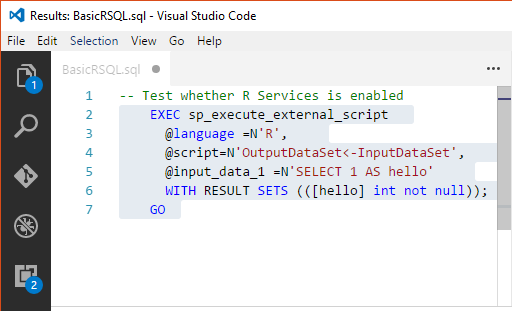
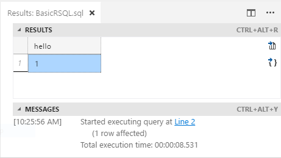

# Using R Code in Transact-SQL (SQL Server R Services)
This tutorial walks you through the basic mechanics of calling an R script from a T-SQL stored procedure. 

**What You'll Learn**

+ About R and SQL data types and data objects
+ How to embed R in a T-SQL function 
+ Creating a simple model and saving it in SQL Server
+ Creating predictions and an R plot using the model   

**Estimated Time**

30 minutes, not including setup 

## Prerequisites

You must have access to an instance of SQL Server where R Services is already installed. The instance can be in an Azure virtual machine or on-premises. YOu can use either SQL Server 2016 or SQL Server vNext.


To run SQL queries that include R script, use SQL Server Management Studio (SSMS), Visual Studio, or any other application that can connect to a database and run ad hoc T-SQL code. To demonstrate how easy it is to run R inside SQL Server, we'll use the new **mssql extension for Visual Studio Code**, a free development environment that can run on Linux, macOS, or Windows. To install it, see this article: [Use the mssql extension for Visual Studio Code](https://docs.microsoft.com/sql/linux/sql-server-linux-develop-use-vscode).


## Connect to a database and run a Hello World test script

1. In Visual Studio Code, create a new text file and name it BasicRSQL.sql.
2. While this file is open, press CTRL+SHIFT+P (COMMAND + P on a macOS), type **sql** to list the SQL commands, and select **CONNECT**. Visual Studio Code will prompt you to create a profile to use when connecting to a specific database. This is optional, but will make it easier to switch between databases and logins.
    + Choose a server or instance where R Services has already been installed.
    + Use an account that has permissions to create a new database, run SELECT statements, and view table definitions.
2. If the connection is successful, you should be able to see the server and database name in the status bar, together with your current credentials. If the connection failed, check whether the computer name and server name are correct.
3. Paste in this statement and run it. 

    ```sql   
    EXEC sp_execute_external_script  
      @language =N'R',    
      @script=N'OutputDataSet<-InputDataSet',      
      @input_data_1 =N'SELECT 1 AS hello'    
      WITH RESULT SETS (([hello] int not null));    
    GO    
    ```   

    In Visual Studio Code, you can highlight the code you want to run and press CTRL+SHIFT+E. If this is too hard to remember, you can change it! See [Customize the shortcut key bindings](https://github.com/Microsoft/vscode-mssql/wiki/customize-shortcuts).  

    

**Results**


   
## Troubleshooting

+ If you get any errors from this query, installation of R Services might be incomplete. After adding the feature using the SQL Server setup wizard, you must take some additional steps to enable use of external code libraries.  See [Set up SQL Server R Services](../../advanced-analytics/r-services/set-up-sql-server-r-services-in-database.md).

+ Make sure that the Launchpad service is running. Depending on your environment, you might need to enable the R worker accounts to connect to SQL Server, install additional network libraries, enable remote code execution, or restart the instance after everything is configured. See
[R Services Installation and Upgrade FAQ](../../advanced-analytics/r-services/upgrade-and-installation-faq-sql-server-r-services.md)

+ To get Visual Studio Code, see [Download and install Visual Studio Code](https://code.visualstudio.com/Download).

## Next Step

Now that your instance of R Services is ready, let's get started. 

Step 1: [Working with Inputs and Outputs](../../advanced-analytics/r-services/working-with-inputs-and-outputs-r-in-t-sql-tutorial.md)

Step 2: [R and SQL Data Types and Data Objects](../../advanced-analytics/r-services/r-and-sql-data-types-and-data-objects-r-in-t-sql-tutorial.md)

Step 3: [Using R Functions with SQL Server Data](../../advanced-analytics/r-services/using-r-functions-with-sql-server-data-r-in-t-sql-tutorial.md)

Step 4:  [Create a Predictive Model](../../advanced-analytics/r-services/create-a-predictive-model-r-in-t-sql-tutorial.md)

Step 5:  [Predict and Plot from Model](../../advanced-analytics/r-services/predict-and-plot-from-model-r-in-t-sql-tutorial.md)

