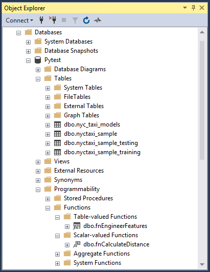

# Step 2: Import data to SQL Server using PowerShell

This article is part of a tutorial, [In-database Python analytics for SQL developers](sqldev-in-database-python-for-sql-developers.md). 

In this step, you run one of the downloaded scripts, to create the database objects required for the walkthrough. The script also creates several stored procedures, and uploads the sample data to a table in the database you specified.

## Create SQL objects and data

Among the downloaded files you should see a PowerShell script, `RunSQL_SQL_Walkthrough.ps1`. The purpose of this script is to prepare the environment for the walkthrough.

The script performs these actions:

- Installs the SQL Native Client and SQL command-line utilities, if not already installed. These utilities are required for bulk-loading the data to the database using **bcp**.

- Creates a database and a table on the [!INCLUDE[ssNoVersion](../../includes/ssnoversion-md.md)] instance, and bulk-inserts data into the table.

- Creates multiple SQL functions and stored procedures.

If you run into problems, you can use the script as a reference to perform the steps manually.

1. Open a PowerShell command prompt as administrator. If you are not already in the folder created in the previous step, navigate to the folder, and then run the following command:
  
    ```ps
    .\RunSQL_SQL_Walkthrough.ps1
    ```

2. The script prompts for the following information:

    - The name or address of a [!INCLUDE[ssCurrent](../../includes/sscurrent-md.md)] instance where Machine Learning Services with Python has been installed
    - The user name and password for an account on the instance. The account you use must have the ability to create databases, create tables and stored procedures, and bulk load data to tables. 
    - If you do not provide the user name and password, your Windows identity is used to sign in to SQL Server, and you are promoted to enter a password.
    - The path and file name of the sample data file that you just downloaded. For example, `C:\temp\pysql\nyctaxi1pct.csv`

	> [!NOTE]
	> To load the data successfully, the library xmlrw.dll must be in the same folder as bcp.exe. 

3. The script also modifies the [!INCLUDE[tsql](../../includes/tsql-md.md)] scripts that you downloaded earlier, and replaces placeholders with the database name and user name that you provide.
  
4. When the script completes, log in to the [!INCLUDE[ssNoVersion](../../includes/ssnoversion-md.md)] instance using the login you specified, to verify that the database, tables, functions, and stored procedures have been created. The following image shows the objects in [!INCLUDE[ssManStudioFull](../../includes/ssmanstudiofull-md.md)].

    

    > [!NOTE]
    > If the database objects already existed, they cannot be created again. 
    > 
    > If an existing table of the same name and schema is found, the data will be appended, not overwritten. Therefore, be sure to drop or truncate existing tables before running the script.

## List of stored procedures and functions

The following SQL Server objects are created by the script:

|**SQL script file name**|**Function**|
|------|------|
|create-db-tb-upload-data.sql|Creates a database and two tables:<br /><br />nyctaxi_sample: Contains the main NYC Taxi dataset. A clustered columnstore index is added to the table to improve storage and query performance. The 1% sample of the NYC Taxi dataset will be inserted into this table.<br /><br />nyc_taxi_models: Used to persist the trained advanced analytics model.|
|fnCalculateDistance.sql|Creates a scalar-valued function that calculates the direct distance between pickup and dropoff locations|
|fnEngineerFeatures.sql|Creates a table-valued function that creates new data features for model training|
|TrainingTestingSplit.sql|Split the data in the nyctaxi_sample table into two parts: nyctaxi_sample_training and nyctaxi_sample_testing.|
|PredictTipSciKitPy.sql|Creates a stored procedure that calls the trained model (scikit-learn) to create predictions using the model. The stored procedure accepts a query as its input parameter and returns a column of numeric values containing the scores for the input rows.|
|PredictTipRxPy.sql|Creates a stored procedure that calls the trained model (revoscalepy) to create predictions using the model. The stored procedure accepts a query as its input parameter and returns a column of numeric values containing the scores for the input rows.|
|PredictTipSingleModeSciKitPy.sql|Creates a stored procedure that calls the trained model (scikit-learn) to create predictions using the model. This stored procedure accepts a new observation as input, with individual feature values passed as in-line parameters, and returns a value that predicts the outcome for the new observation.|
|PredictTipSingleModeRxPy.sql|Creates a stored procedure that calls the trained model (revoscalepy) to create predictions using the model. This stored procedure accepts a new observation as input, with individual feature values passed as in-line parameters, and returns a value that predicts the outcome for the new observation.|

In the latter part of this walkthrough, you create these additional stored procedures:
    
|**SQL script file name**|**Function**|
|------|------|
|SerializePlots.sql|Creates a stored procedure for data exploration. This stored procedure creates a graphic using Python and then serialize the graph objects.|
|TrainTipPredictionModelSciKitPy.sql|Creates a stored procedure that trains a logistic regression model (scikit-learn). The model predicts the value of the  tipped column, and is trained using a randomly selected 60% of the data. The output of the stored procedure is the trained model, which is saved in the table nyc_taxi_models.|
|TrainTipPredictionModelRxPy.sql|Creates a stored procedure that trains a logistic regression model (revoscalepy). The model predicts the value of the  tipped column, and is trained using a randomly selected 60% of the data. The output of the stored procedure is the trained model, which is saved in the table nyc_taxi_models.|

## Next step

[Step 3: Explore and visualize the data](sqldev-py3-explore-and-visualize-the-data.md)

## Previous step

[Step 1: Download the sample data](sqldev-py1-download-the-sample-data.md)

