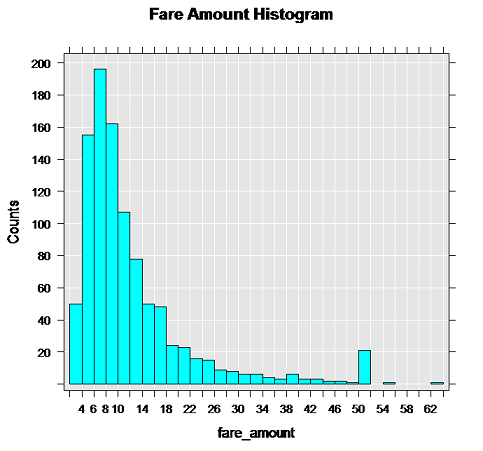
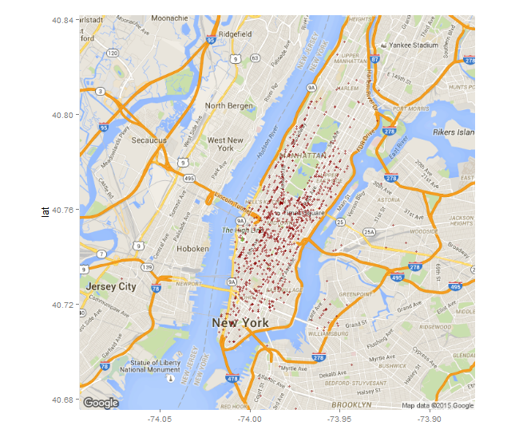

# 4. Create Plots Using R

In this step, you'll learn techniques for generating plots and maps using R with [!INCLUDE[ssNoVersion](../../includes/ssnoversion-md.md)] data. You'll create a simple histogram, to get some practice, and then develop a more complex map plot.

## Create a histogram

1.  Generate the first plot, using the **rxHistogram** function.  This function from RevoScaleR provides functionality similar to that in open source R packages, but can run in a remote execution context.
  
    ```R
    #Plot fare amount on SQL Server and return the plot
    start.time <- proc.time()
    rxHistogram(~fare_amount, data = inDataSource, title = "Fare Amount Histogram")
    used.time \<- proc.time() - start.time
    print(paste("It takes CPU Time=", round(used.time[1]+used.time[2],2), " seconds, Elapsed Time=", round(used.time[3],2), " seconds to generate features.", sep=""))
    ```
  
2.  The image is returned in the R graphics device for your development environment.  For example, in RStudio, click the **Plot** window.  In [!INCLUDE[rsql_rtvs](../../includes/rsql-rtvs-md.md)], a separate graphics window is opened.
  
    
  
    > [!NOTE]
    >  Because the ordering of rows using TOP is non-deterministic in the absence of an ORDER BY clause, you might see very different results. We recommend that you experiment with different numbers of rows to get different graphs, and note how long it takes to return the results in your environment.  This particular image was generated using about 10,000 rows of data.
  
## Create a map plot

To create this map requires some additional R packages (which should be installed), as well as Internet access, to get the maps.

Typically, database servers block Internet access, so you'd expect difficulties when trying to download the map representation on SQl Server. To get around this common restriction, in this sample you'll learn how to generate the map representation on the client, and then overlay on the map the points that are stored as attributes in the *nyctaxi_sample* table.

In other words, you'll create the map representation by calling into Google maps, and then pass the map representation to the SQL Server compute context. This is a pattern that you might find useful when developing your own applications.

1.  Define the function that creates the plot object.

    ```R
    mapPlot <- function(inDataSource, googMap){ 
        library(ggmap)
        library(mapproj)
        ds <- rxImport(inDataSource)
        p <- ggmap(googMap)+
        geom_point(aes(x = pickup_longitude, y =pickup_latitude ), data=ds, alpha =.5,
    color="darkred", size = 1.5)
        return(list(myplot=p))
    }
    ```
    
    + The custom R function *mapPlot* creates a  scatter plot that uses the taxi pickup locations to plot the number of rides that started from each location. It uses the **ggplot2** and  **ggmap** packages, which should already be installed and loaded.
    + The *mapPlot* function takes two arguments: an existing data object, which you defined earlier using RxSqlServerData, and the map representation passed from the client.
    + Note the use of the *ds* variable to load data from the previously created data source, *inDataSource*.  Whenever you use open source R functions, data must be loaded into data frames in memory. You can do this by using the **rxImport** function in the **RevoScaleR** package.  However, this function runs in memory in the [!INCLUDE[ssNoVersion](../../includes/ssnoversion-md.md)] context defined earlier. That is, the function is not using the memory of your local workstation.
  
2.  Load the libraries required for creating the maps in your **local** R environment.
  
    ```R
    library(ggmap)
    library(mapproj)
    gc <- geocode("Times Square", source = "google")
    googMap <- get_googlemap(center = as.numeric(gc), zoom = 12, maptype = 'roadmap', color = 'color';
    ```
    
    + This code is run on the R client. Note the repeated call to the libraries **ggmap** and **mapproj**. The previous function definition ran in the server context and the libraries were never loaded locally. Now you are bringing the plotting operation back to your workstation.
  
    -   The *gc* variable stores a set of coordinates for Times Square, NY.
  
    -   The line beginning with *googmap* generates a map with the specified coordinates at the center.

3.  Execute the plotting function and render the results in your local R environment, by wrapping the plot function in **rxExec** as shown here.
  
    ```R
    myplots <- rxExec(mapPlot, inDataSource, googMap, timesToRun = 1)
    plot(myplots[[1]][["myplot"]]);
    ````

    + The **rxExec** function is part of the **RevoScaleR** package, and supports execution of arbitrary R functions in a remote compute context.
    + In the first line, the map data is passed as an argument (*googMap*) to the  remotely executed function *mapPlot*. That is because the maps were generated in your local environment, and must be passed to the function in order to create the plot in the context of [!INCLUDE[ssNoVersion](../../includes/ssnoversion-md.md)].
  
    + The rendered data is then serialized back to the local R environment so that you can view it, using the **Plot** window in RStudio or other R graphics device.
  
  
4.  The following image shows the output plot. The taxi pickup locations are added to the map as red dots.
  
    

## Next step

[5: Create Data Features using R and SQL](/walkthrough-create-data-features.md)

## Previous step

[3. Summarize Data using R](walkthrough-view-and-summarize-data-using-r.md)