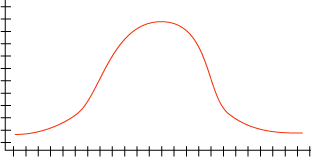
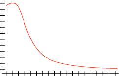
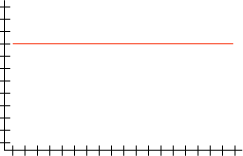

# Column Distributions (Data Mining)
  In [!INCLUDE[msCoName](../../includes/msconame-md.md)] [!INCLUDE[ssNoVersion](../../includes/ssnoversion-md.md)] [!INCLUDE[ssASnoversion](../../includes/ssasnoversion-md.md)], you can define column distributions in a mining structure, to affect how algorithms process the data in those columns when you create mining models. For some algorithms, it is useful to define the distribution of any continuous columns before you process the model, if the columns are known to contain common distributions of values. If you do not define the distributions, the resulting mining models may produce less accurate predictions than if the distributions were defined, because the algorithms will have less information from which to interpret the data.  
  
 The algorithms that are available in [!INCLUDE[ssASnoversion](../../includes/ssasnoversion-md.md)] support the following distribution types:  
  
 **Normal**  
 The values for the continuous column form a histogram with a normal distribution.  
  
   
  
 **Log Normal**  
 The values for the continuous column form a histogram, where the curve is elongated at the upper end and is skewed toward the lower end.  
  
   
  
 **Uniform**  
 The values for the continuous column form a flat curve, in which all values are equally likely.  
  
   
  
 For more information about the algorithms that [!INCLUDE[ssASnoversion](../../includes/ssasnoversion-md.md)] provides, see [Data Mining Algorithms &#40;Analysis Services - Data Mining&#41;](../../analysis-services/data-mining/data-mining-algorithms-analysis-services-data-mining.md).  
  
## See Also  
 [Content Types &#40;Data Mining&#41;](../../analysis-services/data-mining/content-types-data-mining.md)   
 [Mining Structures &#40;Analysis Services - Data Mining&#41;](../../analysis-services/data-mining/mining-structures-analysis-services-data-mining.md)   
 [Discretization Methods &#40;Data Mining&#41;](../../analysis-services/data-mining/discretization-methods-data-mining.md)   
 [Distributions &#40;DMX&#41;](../../dmx/distributions-dmx.md)   
 [Mining Structure Columns](../../analysis-services/data-mining/mining-structure-columns.md)  
  
  