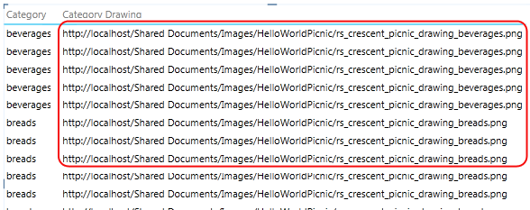
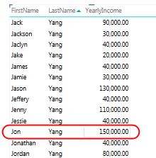
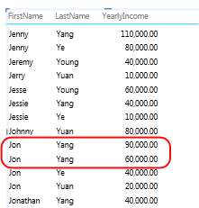
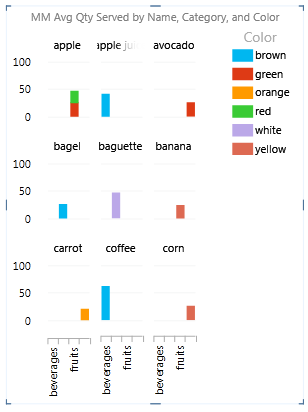
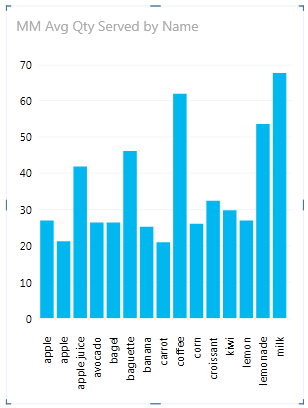

# Power View - Configure Table Behavior Properties for Reports
  If you are using a tabular model as a data model for [!INCLUDE[ssCrescent](../../includes/sscrescent-md.md)], you can set table behavior properties that expose detail rows at a more granular level. Setting table behavior properties changes the grouping behavior of detail rows and produces a better default placement of identifying information (such as names, photo IDs, or logo images) in tile, card, and chart layouts.  
  
 [!INCLUDE[ssCrescent](../../includes/sscrescent-md.md)] differs from other reporting applications in that it will group items automatically during report design, by evaluating which columns you placed in the report field list against the presentation format you are using. In most cases, the default grouping produces an optimum result. But for some tables, primarily those that contain detail data, the default grouping behavior will sometimes group rows that should not be grouped. For such tables, you can set properties that change how groups are evaluated.  
  
 Setting table behavior properties is recommended for tables where the individual rows are of primary interest, such as employee or customer records. In contrast, tables that do not benefit from these properties include those that act as a lookup table (for example, a date table, a product category table, or a department table, where the table consists of a relatively small number of rows and columns), or summary tables containing rows that are only interesting when summarized (for example, census data that rolls up by gender, age, or geography). For lookup and summary tables, the default grouping behavior produces the best result.  
  
> [!NOTE]  
>  Table behavior properties only affect tabular models used as data models in [!INCLUDE[ssCrescent](../../includes/sscrescent-md.md)]. Table behavior properties are not supported in Excel pivot reports.  
  
 Table behavior properties include the following:  
  
-   **Row Identifier** ─ specifies a column that contains only unique values, allowing that column to be used as an internal grouping key.  
  
-   **Keep Unique Rows** ─ specifies which columns provide values that should be treated as unique even if they are duplicates (for example, employee first name and last name, for cases where two or more employees share the same name).  
  
-   **Default Label** ─ specifies which column provides a display name to represent row data (for example, employee name in an employee record).  
  
-   **Default Image** ─ specifies which column provides an image that represents the row data (for example, a photo ID in an employee record).  
  
> [!NOTE]  
>  Refer to the following section to approach layout optimizations from the standpoint of a particular presentation format:  [Optimizing for Specific Layouts](#bkmk_optimizeforlayout).  
  
## Opening the Table Behavior dialog box  
  
1.  In [!INCLUDE[ssBIDevStudioFull](../../includes/ssbidevstudiofull-md.md)], click the table (tab) for which you are configuring a default field list.  
  
2.  In the **Properties** window, in the **Table Behavior** property, click **Click to edit**.  
  
3.  In the **Table Behavior** dialog box, set the **Row Identifier**, and then specify other properties in this dialog box.  
  
## Setting the Row Identifier property  
 Within the table, the row identifier specifies a single column that contains only unique values and no blank values. The Row Identifier property is used to change grouping so a group is not based on a row’s field composition, but rather on a fixed column that is always used to uniquely identify a row, regardless of the fields used in a particular report layout.  
  
 Setting this property changes the default grouping behavior from dynamic grouping based on the columns present on the canvas, to a fixed grouping behavior that summarizes based on the row identifier. Changing the default grouping behavior is relevant for report layouts, such as a matrix, that would otherwise group (or show subtotals) for each column in the row.  
  
 In [!INCLUDE[ssCrescent](../../includes/sscrescent-md.md)], setting a row identifier enables the following additional properties: **Keep Unique Rows** property, **Default Label** property, and **Default Image** property.  
  
 You can also use **Row Identifier** by itself, as a standalone property, to enable the following:  
  
-   Use of binary images in a report. By removing ambiguity around row uniqueness, [!INCLUDE[ssCrescent](../../includes/sscrescent-md.md)] can determine how to assign default images and default labels for a given row.  
  
-   Remove unwanted subtotals from a matrix report. Default grouping at the field level creates a subtotal for each field. If you only want a single subtotal that is calculated at the row level, setting the Row Identifier produces this result.  
  
 You cannot set a Row Identifier for tables marked as date tables. For date tables, the row identifier is specified when you mark the table. For more information, see [Mark as Date Table Dialog Box &#40;SSAS&#41;](http://msdn.microsoft.com/library/698b5ef1-b79b-4d76-9847-39669b4f5bb9).  
  
## Setting the Keep Unique Rows property  
 This property allows you to specify which columns convey identity information (such as an employee name or a product code) in way that distinguishes one row from another. In cases where rows appear to be identical (such as two customers with the same name), the columns you specify for this property repeat in the report table.  
  
 Depending on which columns you add to a report, you might find rows that are treated as identical rows because the values in each row appear to be the same (for example two customers named Jon Yang). This might occur because other columns that provide differentiation (such as a middle name, address, or birth date) are not on the report canvas. In such a scenario, the default behavior is to group the apparently identical rows into a single row, summarizing any calculated values into a single larger result from the combined rows.  
  
 By setting the **Keep Unique Rows** property, you can designate one or more columns that should always repeat, even if there are duplicate instances, whenever you add that column to the report canvas. Calculated values associated with the row will now be allocated based on each individual row rather than rolled up to single row. When choosing columns for the  **Keep Unique Rows** property, choose those containing unique or nearly unique values.  
  
> [!NOTE]  
>  Because the columns the end user selects can affect the grouping, which changes the filter context for expression calculations, model designers must take care to create measures that return the correct results. For more information, see [Power View FAQ](http://go.microsoft.com/fwlink/?LinkId=220674).  
  
## Setting a default label  
 This property specifies a label that appears in the navigation strip of a tile report. When used with a default image, the default label appears under the image. Without an image, the default label appears by itself. When choosing a default label, pick the column that conveys the most information about the row (for example, a name).  
  
 In a tile layout, the default label appears in the title area below an image, as defined by the Default Image property. For example, if you have a list of employees, you might tile employee information, using their photo ID as the default image and Employee Name as the default label. In a tile, the default label appears under the default image. These columns always appear in the tile, even if you do not explicitly select them in the report field list.  
  
## Setting a default image  
 This property specifies an image that appears in the navigation strip of a tile report, or at the front of a card. In the report, when you select the column that contains the default image, the default image will appear placed in the navigation strip of a tile report layout, or at the front of a card. A default image should be visual content. Examples include a photo ID in the employees table, a customer logo in a customer table, or a country shape in a geography table.  
  
> [!NOTE]  
>  Images can be sourced from URL addresses to an image file on a web server, or as binary data embedded in the workbook. If the image is based on a URL, be sure to also set the column as an image type so that [!INCLUDE[ssCrescent](../../includes/sscrescent-md.md)] retrieves the image rather than displaying the URL as text data in the report.  
  
##   Optimizing for Specific Layouts  
 This section describes the effect of setting table behavior properties from the standpoint of a particular presentation format and characteristics of the data. If you are trying to fine tune the layout of a matrix report, for example, you can use this information to understand how to improve a matrix presentation using table behavior properties in the model.  
  
### Images are missing  
 Properties you set in the model determine whether images are visualized in a report, or represented as text values in the report.  
  
   
  
 By default, text in the model is interpreted as text in the report. If a text column is a URL address to a report image, remember to set the **Image URL** property so that [!INCLUDE[ssCrescent](../../includes/sscrescent-md.md)] retrieves the image file. For binary images, remember to set the **Row Identifier** property.  
  
### Tables are missing one or more rows  
 Sometimes the default grouping behavior results in an outcome that is opposite of what you intended; specifically, detail rows that are present in the model do not appear in the report. By default, [!INCLUDE[ssCrescent](../../includes/sscrescent-md.md)] groups on the columns you add to the canvas. If you add **Country Name** to the report, each country appears once on the canvas, even though the underlying table might contain thousands of rows that include multiple instances of each country name. In this case, the default grouping behavior produces the correct result.  
  
 However, consider a different example where you might want multiple instances of a row to appear, because in fact the underlying rows contain data about different entities. In this example, assume you have two customers both named **Jon Yang**. Using the default grouping behavior, only one instance of **Jon Yang** will appear in the report. Moreover, because only one instance appears in the list, the measure **Annual Income** is the sum of that value for both customers.  
  
   
  
 To change the default grouping behavior, set the **Row Identifier** and **Keep Unique Rows** properties. In **Keep Unique Rows**, choose the Last Name column so this value is repeated for a row, even if it already appears in a different row. After you change the properties and republish the workbook, you can create the same report, only this time you will see both customers named **Jon Yang**, with the **Annual Income** correctly allocated to each one.  
  
   
  
### Matrix layout is too crowded  
 When you present a detail table in a matrix, the default grouping provides a summarized value for each column. Depending on your objectives, this might be more summarizations than you want. To change this behavior, you can set **Row Identifier**. No additional properties need to be set; just setting row identifier is sufficient to change the grouping so that summarizations are calculated for each row based on its unique row identifier.  
  
 Compare the following before and after images that show the effect of setting this property for a matrix layout.  
  
 **Before: Default grouping based on fields in matrix**  
  
   
  
 **After: Grouping on row identifier**  
  
   
  
### Chart showing too many items and levels on the axis  
 Chart reports that show detail data should use the row identifier as an axis. Without a row identifier, the axis is indeterminate, resulting in a best-guess layout that might not make sense. To change this behavior, you can set **Row Identifier**. No additional properties need to be set; just setting row identifier is sufficient to change the grouping so that summarizations are calculated for each row based on its unique row identifier.  
  
 Compare the following before and after images that show the effect of setting this property for a chart layout. It is the same report, with identical fields and presentation. The only difference is the bottom image shows a report after **Row Identifier** was set on the Items table.  
  
 **Before: Default grouping based on fields in a chart**  
  
   
  
 **After: Grouping on row identifier (row identifier becomes the axis)**  
  
   
  
## Next Steps  
 After you have evaluated the tables in your model and set table behavior properties on those containing detail rows that should always appear as individual items, you can further optimize the model through additional properties or settings.  
  
  
