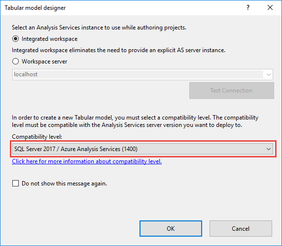
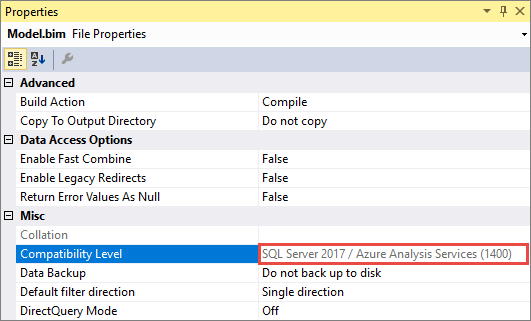
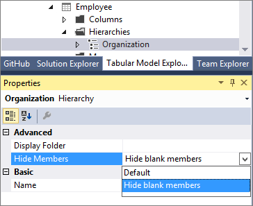

# What&#39;s new in SQL Server Analysis Services vNext
[!INCLUDE[tsql-appliesto-ssvNxt-xxxx-xxxx-xxx](../includes/tsql-appliesto-ssvnxt-xxxx-xxxx-xxx.md)]

## SQL Server Analysis Services on Windows CTP 2.0
This release see many new enhancements for tabular model, including:

* Object-level security to secure the metadata of tabular models.
* Transaction-performance improvements for a more responsive developer experience.
* Dynamic Management View improvements for 1200 and 1400 models enabling dependency analysis and reporting.
* Improvements to the authoring experience for Detail Rows Expressions.
* Hierarchy and column reuse to be surfaced in more helpful locations in the Power BI field list.
* Date relationships to easily create relationships to date dimensions based on date fields.
* Default installation option for Analysis Services is now for tabular mode.
* New Get Data (Power Qery) data sources.
* DAX Editor for SSDT.
* Existing DirectQuery data sources support for M queries.
* SSMS improvements, such as viewing, editing, and scripting support for structured data sources.

To get more details about this CTP 2.0 release, see the [Analysis Services blog](https://blogs.msdn.microsoft.com/analysisservices/).

## SQL Server Analysis Services on Windows CTP 1.4
[SQL Server Data Tools (SSDT)](https://docs.microsoft.com/sql/ssdt/sql-server-data-tools-ssdt-release-candidate) and [SQL Server Management Studio (SSMS)](https://docs.microsoft.com/sql/ssms/sql-server-management-studio-ssms-release-candidate) preview releases coincide with SQL Server vNext preview releases. Be sure to use the latest to get new features. To learn more, see the [Analysis Services blog](https://blogs.msdn.microsoft.com/analysisservices/).


## SQL Server Analysis Services on Windows CTP 1.3

### Encoding hints

This release introduces encoding hints, an advanced feature used to optimize processing (data refresh) of large in-memory tabular models. To better understand encoding, see [Performance Tuning of Tabular Models in SQL Server 2012 Analysis Services](https://msdn.microsoft.com/library/dn393915.aspx) whitepaper to better understand encoding. The encoding process described here applies in CTP 1.3.

* Value encoding provides better query performance for columns that are typically only used for aggregations.

* Hash encoding is preferred for group-by columns (often dimension-table values) and foreign keys. String columns are always hash encoded.

Numeric columns can use either of these encoding methods. When Analysis Services starts processing a table, if either the table is empty (with or without partitions) or a full-table processing operation is being performed, samples values are taken for each numeric column to determine whether to apply value or hash encoding. By default, value encoding is chosen when the sample of distinct values in the column is large enough – otherwise hash encoding will usually provide better compression. It is possible for Analysis Services to change the encoding method after the column is partially processed based on further information about the data distribution, and restart the encoding process. This of course increases processing time and is inefficient. The performance-tuning whitepaper discusses re-encoding in more detail and describes how to detect it using SQL Server Profiler.

Encoding hints in CTP 1.3 allow the modeler to specify a preference for the encoding method given prior knowledge from data profiling and/or in response to re-encoding trace events. Since aggregation over hash-encoded columns is slower than over value-encoded columns, value encoding may be specified as a hint for such columns. It is not guaranteed that the preference will be applied; hence it is a hint as opposed to a setting. To specify an encoding hint, set the EncodingHint property on the column. Possible values are “Default”, “Value” and “Hash”. At time of writing, the property is not yet exposed in SSDT, so must be set using the JSON-based metadata, Tabular Model Scripting Language (TMSL), or Tabular Object Model (TOM). The following snippet of JSON-based metadata from the Model.bim file specifies value encoding for the Sales Amount column.

```
{
    "name": "Sales Amount",
    "dataType": "decimal",
    "sourceColumn": "SalesAmount",
    "formatString": "\\$#,0.00;(\\$#,0.00);\\$#,0.00",
    "sourceProviderType": "Currency",
    "encodingHint": "Value"
}
```

### Extended events not working in CTP 1.3
SSAS extended events do not work in CTP 1.3. A fix is planned in the next CTP.

## SQL Server Analysis Services on Windows CTP 1.2

There are no new features in this release. Improvements include bug fixes and performance.

The latest preview release of SQL Server Data Tools (SSDT), which coincides with the SQL Server vNext CTP 1.2, improves upon the new modern Get Data experience introduced in CTP 1.1 with new query editor menu and quick access functionality. 

## SQL Server Analysis Services on Windows CTP 1.1 

This release introduces enhancements for tabular models. 

### 1400 Compatibility level for tabular models
  To take advantage of the features and functionality described in this article, new or existing tabular models must be set to the 1400 compatibility level. Models at the 1400 compatibility level cannot be deployed to SQL Server 2016 SP1 or earlier, or downgraded to lower compatibility levels.
  
  To create new or upgrade existing tabular model projects to the 1400 compatibility level, download and install a **preview release** of [SQL Server Data Tools (SSDT) 17.0 RC2](https://go.microsoft.com/fwlink?LinkId=837939). 
  
In SSDT, you can select the new 1400 compatibility level when creating new tabular model projects. 



>[!NOTE]
> Integrated workspace in the December release of SQL Server Data Tools (SSDT) supports the 1400 compatibility level. If you create new tabular model projects on a Workspace server instance, that instance or any instance you deploy to must be [!INCLUDE[ssSQLv14_md](../includes/sssqlv14-md.md)] CTP 1.1. 

To upgrade an existing tabular model in SSDT, in Solution Explorer, right-click **Model.bim**, and then in **Properties**, set the  **Compatibility Level** property to **SQL Server vNext (1400)**. 



### Modern Get Data experience
The latest preview release of SQL Server Data Tools (SSDT), which coincides with the [!INCLUDE[ssSQLv14_md](../includes/sssqlv14-md.md)] CTP 1.1 release, introduces a modern **Get Data** experience for tabular models at the 1400 compatibility level. This new feature is based on similar functionality in Power BI Desktop and Microsoft Excel 2016.


>[!NOTE]
> For this release a limited number of data sources are supported. Future updates will support additional data sources and functionality.

To learn more about the modern Get Data experience, see the [Analysis Services Team Blog](https://blogs.msdn.microsoft.com/analysisservices/2016/12/16/introducing-a-modern-get-data-experience-for-sql-server-vnext-on-windows-ctp-1-1-for-analysis-services/).

## Ragged hierarchies
In tabular models, you can model parent-child hierarchies. Hierarchies with a differing number of levels are often referred to as ragged hierarchies. By default, ragged hierarchies are displayed with blanks for levels below the lowest child. Here's an example of a ragged hierarchy in an organizational chart:


This release introduces the **Hide Members** property. You can set the **Hide Members** property for a hierarchy to **Hide blank members**.



 >[!NOTE]
 > Blank members in the model are represented by a DAX blank value, not an empty string.

When set to **Hide blank members**, and the model deployed, an easier to read version of the hierarchy is shown in reporting clients like Excel.


### Detail Rows
You can now define a custom row set contributing to a measure value. Detail Rows is similar to the default drillthrough action in multidimensional models. This allows end-users to view information in more detail than the aggregated level. 

The following PivotTable shows Internet Total Sales by year from the Adventure Works sample tabular model. You can right-click a cell with an aggregated value from the measure and then click **Show Details** to view the detail rows.


By default, the associated data in the Internet Sales table is displayed. This limited behavior is often not meaningful for the user because the table may not have the necessary columns to show useful information such as customer name and order information. With Detail Rows, you can specify a **Detail Rows Expression** property for measures.

#### Detail Rows Expression property for measures
The **Detail Rows Expression** property for measures allows model authors to customize the columns and rows returned to the end-user.


The [SELECTCOLUMNS](https://msdn.microsoft.com/library/mt761759.aspx) DAX function will be commonly used in a Detail Rows Expression. The following example defines the columns to be returned for rows in the Internet Sales table in the sample Adventure Works tabular model:

```
SELECTCOLUMNS(
    'Internet Sales',
    "Customer First Name", RELATED( Customer[Last Name]),
    "Customer Last Name", RELATED( Customer[First Name]),
    "Order Date", 'Internet Sales'[Order Date],
    "Internet Total Sales", [Internet Total Sales]
)
```

With the property defined and the model deployed, a custom row set is returned when the user selects **Show Details**. It automatically honors the filter context of the cell that was selected. In this example, only the rows for 2010 value are displayed:


#### Default Detail Rows Expression property for tables
In addition to measures, tables also have a property to define a detail rows expression. The **Default Detail Rows Expression** property acts as the default for all measures within the table. Measures that do not have their own expression defined will inherit the expression from the table and show the row set defined for the table. This allows reuse of expressions, and new measures added to the table later will automatically inherit the expression.


 
#### DETAILROWS DAX Function
Included in this release is a new `DETAILROWS` DAX function that returns the row set defined by the detail rows expression. It works similarly to the `DRILLTHROUGH` statement in MDX, which is also compatible with detail rows expressions defined in tabular models.

The following DAX query returns the row set defined by the detail rows expression for the measure or its table. If no expression is defined, the data for the Internet Sales table is returned because it's the table containing the measure.

```
EVALUATE DETAILROWS([Internet Total Sales])
```

## DAX enhancements
This release includes an `IN` operator for DAX expressions. This is similar to the [`TSQL IN`](https://msdn.microsoft.com/library/ms177682.aspx) operator commonly used to specify multiple values in a `WHERE` clause.

Previously, it was common to specify multi-value filters using the logical `OR` operator, like in the following measure expression:

```
Filtered Sales:=CALCULATE (
        [Internet Total Sales],
                 'Product'[Color] = "Red"
            || 'Product'[Color] = "Blue"
            || 'Product'[Color] = "Black"
    )
```

This is simplified using the `IN` operator:
```
Filtered Sales:=CALCULATE (
        [Internet Total Sales], 'Product'[Color] IN { "Red", "Blue", "Black" }
    )
```

In this case, the `IN` operator refers to a single-column table with 3 rows; one for each of the specified colors. Note the table constructor syntax uses curly braces.

The `IN` operator is functionally equivalent to the `CONTAINSROW` function:
```
Filtered Sales:=CALCULATE (
        [Internet Total Sales], CONTAINSROW({ "Red", "Blue", "Black" }, 'Product'[Color])
    )
```

The `IN` operator can also be used effectively with table constructors. For example, the following measure  filters by combinations of product color and category:
```
Filtered Sales:=CALCULATE (
        [Internet Total Sales],
        FILTER( ALL('Product'),
              ( 'Product'[Color] = "Red"   && Product[Product Category Name] = "Accessories" )
         || ( 'Product'[Color] = "Blue"  && Product[Product Category Name] = "Bikes" )
         || ( 'Product'[Color] = "Black" && Product[Product Category Name] = "Clothing" )
        )
    )
```

By using the new `IN` operator, the measure expression above is now equivalent to the one below:
```
Filtered Sales:=CALCULATE (
        [Internet Total Sales],
        FILTER( ALL('Product'),
            ('Product'[Color], Product[Product Category Name]) IN
            { ( "Red", "Accessories" ), ( "Blue", "Bikes" ), ( "Black", "Clothing" ) }
        )
    )
```


## Table-level security
This release introduces table-level security. In addition to restricting access to table data, sensitive table names can be secured. This helps prevent a malicious user from discovering such a table exists.

Table-level security must be set using the JSON-based metadata, Tabular Model Scripting Language (TMSL), or Tabular Object Model (TOM). 

For example, the following code helps secure the Product table in the sample Adventure Works tabular model by setting the **MetadataPermission** property of the **TablePermission** class to **None**.

```
//Find the Users role in Adventure Works and secure the Product table
ModelRole role = db.Model.Roles.Find("Users");
Table productTable = db.Model.Tables.Find("Product");
if (role != null && productTable != null)
{
    TablePermission tablePermission;
    if (role.TablePermissions.Contains(productTable.Name))
    {
        tablePermission = role.TablePermissions[productTable.Name];
    }
    else
    {
        tablePermission = new TablePermission();
        role.TablePermissions.Add(tablePermission);
        tablePermission.Table = productTable;
    }
    tablePermission.MetadataPermission = MetadataPermission.None;
}
db.Update(UpdateOptions.ExpandFull);
```
## Future updates
Additional enhancements will be included in future release. This article will be updated with significant announcements about new features in SQL Server vNext.
