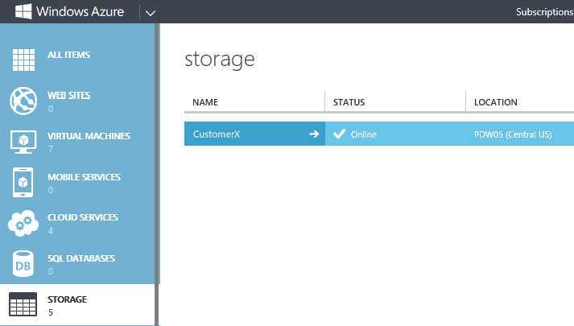
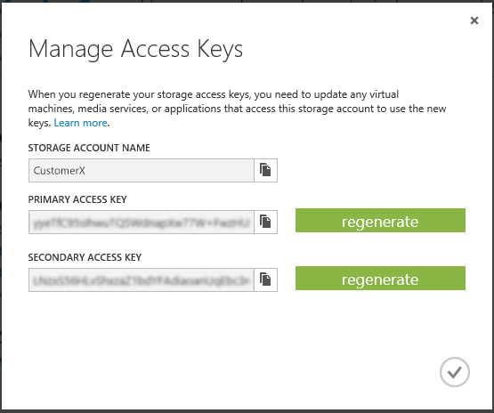

# Configure PolyBase Connectivity to External Data
Explains how to configure PolyBase in SQL Server PDW to connect to external Hadoop or Microsoft Azure storage blob data sources. Use PolyBase to run queries that integrate data from multiple sources, including Hadoop, Azure blob storage, and SQL Server PDW.  
  
### To configure connectivity  
  
1.  Open a query tool, such as sqlcmd or SQL Server Data Tools (SSDT), and run sp_configure to view the current 'hadoop connectivity' settings.  
  
      
  
2.  Decide which Hadoop connectivity setting you need and whether you need to change the current setting. This option applies to the entire SQL Server PDW region. For a full list of the configuration settings and versions, see [sp_configure](./relational-databases/system-stored-procedures/sp-configure-transact-sql.md).  
  
3.  To change the 'hadoop connectivity' setting, run sp_configure with RECONFIGURE. Here are some examples.  
  
    ```  
    --Enable connectivity to Hortonworks Data Platform for Windows Server (HDP), HDInsight on Analytics Platform System, or HDInsight’s Microsoft Azure blob storage  
    EXEC sp_configure 'hadoop connectivity', 4;   
    RECONFIGURE;  
  
    -- Enable connectivity to Hortonworks Data Platform (HDP)for Linux   
    EXEC sp_configure 'hadoop connectivity', 5;   
    RECONFIGURE;  
  
    -- Enable connectivity to Cloudera CDH for Linux   
    EXEC sp_configure 'hadoop connectivity', 3;   
    RECONFIGURE;  
  
    -- Disable the Hadoop connectivity option   
    EXEC sp_configure 'hadoop connectivity', 0;  
    RECONFIGURE;  
    ```  
  
    Running sp_configure with RECONFIGURE sets the config value. Restarting the region is needed to set the run value. Since a restart is required after the next stop also, you don’t need to do the restart until after the next step which changes core-site.xml.  
  
4.  To enable Microsoft Azure blob storage as an external data source, add one or more Microsoft Azure storage account access keys to PDW core-site.xml file. To add a key:  
  
    1.  Find your Microsoft Azure storage account name. To view your storage accounts, login to the[Azure portal](https://portal.azure.com) and click **Storage accounts (classic)**.  
  
          
  
    2.  Find your Azure storage account access key. To do this, click your storage account name, and on the Settings blade click **Keys**. This will show you your account name and storage keys.  
  
          
  
    3.  Open a remote desktop connection to the PDW Control node.  
  
    4.  Open the file C:\Program Files\Microsoft SQL Server Parallel Data Warehouse\100\Hadoop\conf\core-site.xml.  
  
    5.  Add the following property with name and value attributes to core-site.xml.  
  
        ```  
        <property>  
          <name>fs.azure.account.key.<your storage account name>.blob.core.windows.net</name>  
          <value><your storage account access key></value>  
        </property>  
        ```  
  
        This example uses the account name and access key shown previously.  
  
        ```  
        <property>  
          <name>fs.azure.account.key.CustomerX.blob.core.windows.net</name>  
          <value>yyeTfCxxxxxxxxQ5WdnapXw77W+FwzHUhX/p/f26fIpnNFGtewzyRN90e1/qmTOl1xxxxxxxxa0goG71LsNcw==</value>  
        </property>  
        ```  
  
        > [!CAUTION]  
        > Take security precautions before storing the access key in core-site.xml. Any user who has CONTROL SERVER or ALTER ANY EXTERNAL DATA SOURCE permission can create an external data source that accesses this account. Once the external data source is created, all SQL Server PDW users who have permission to create tables can create an external table that accesses this storage account. The users will then be able to access account data and consume resources in the account.  
  
    6.  Save the changes to core-site.xml.  
  
5.  Add yarn.application.classpath property and values to the yarn-site.xml file.  
  
    Skip this step if you are connecting to an external Hadoop 1.3.  
  
    Beginning with Hadoop 2.0, the yarn-site.xml file contains configuration settings for Hadoop YARN framework. This file is located on the Control node under **C:\program files\Microsoft SQL Server Parallel Data Warehouse\100\Hadoop\conf\\**.  
  
    To run PolyBase queries against an external Hadoop 2.0 Cluster on Windows or Linux, you need to configure the yarn.application.classpath property and values to be consistent with the yarn-site.xml settings on your external Hadoop Cluster. This configuration is necessary even if your external Hadoop Cluster uses the default settings.  
  
    Default settings example:  
  
    ```  
    <property>  
        <name>yarn.application.classpath</name>  
        <value>  
          %HADOOP_CONF_DIR%,  
          %HADOOP_COMMON_HOME%/share/hadoop/common/*,  
          %HADOOP_COMMON_HOME%/share/hadoop/common/lib/*,  
          %HADOOP_HDFS_HOME%/share/hadoop/hdfs/*,  
          %HADOOP_HDFS_HOME%/share/hadoop/hdfs/lib/*,  
          %HADOOP_YARN_HOME%/share/hadoop/yarn/*,  
          %HADOOP_YARN_HOME%/share/hadoop/yarn/lib/*  
         </value>  
      </property>  
    ```  
  
    Once any property is defined in yarn-site.xml, PolyBase will use those property settings when it runs queries against the HDInsight Region. If you plan to run PolyBase queries against both the HDInsight Region and an external Hadoop 2.0 Cluster on Windows, there must be consistency among all of the yarn-site.xml files, or else the PolyBase queries will fail.  
  
    To run PolyBase against both the HDInsight Region and an external Hadoop 2.0 Cluster, use the yarn-site.xml default settings on your external Hadoop Cluster.  
  
6.  Restart the PDW region. To do this, use the Configuration Manager tool. See [Launch the Configuration Manager &#40;Analytics Platform System&#41;](launch-the-configuration-manager.md).  
  
7.  Verify security settings for Hadoop connections. If the **weak authentication** on Hadoop side is enabled by using `dfs.permission = true`, you must create a Hadoop user **pdw_user** and grant full read and write permissions to this user. SQL Server PDW and the corresponding calls from SQL Server PDW are always issued as **pdw_user** which is a fixed user name and cannot be changed in this version of Hadoop connectivity and SQL Server PDW release. If security on Hadoop is disabled by using `dfs.permission = false`, then no further actions need to be taken.  
  
8.  Decide which users can create an external data source to the Microsoft Azure blob storage. Give each of these users the storage account name and also **ALTER ANY EXTERNAL DATA SOURCE** or **CONTROL SERVER** permission.  
  
9. For Hadoop connections, decide which users can create an external data source to Hadoop. Give each of these users the IP address and port number of each Hadoop name node, and give them **ALTER ANY EXTERNAL DATA SOURCE** OR **CONTROL SERVER** permission.  
  
10. Connecting to WASB also requires DNS forwarding to be configured on the appliance. To configure DNS forwarding, see [Use a DNS Forwarder to Resolve Non-Appliance DNS Names &#40;Analytics Platform System&#41;](use-a-dns-forwarder-to-resolve-non-appliance-dns-names.md).  
  
Authorized users can now create external data sources, external file formats, and external tables. They can use these to integrate data from multiple sources including Hadoop, Microsoft Azure blob storage, and SQL Server PDW.  
  
## See Also  
[Appliance Configuration &#40;Analytics Platform System&#41;](appliance-configuration.md)  
<!-- MISSING LINKS [PolyBase &#40;SQL Server PDW&#41;](../sqlpdw/polybase-sql-server-pdw.md)  -->  
  
