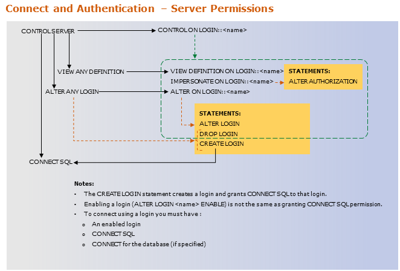
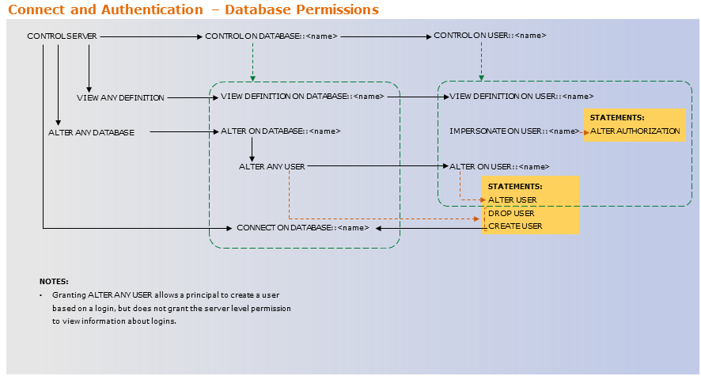

# Grant permissions

## Grant Permissions to Submit Database Queries
This section describes how to grant permissions to database roles and users to query data on the SQL Server PDW appliance.  
  
The statements used to grant permissions to query data depend on the scope of access desired. The following SQL statements create a login named KimAbercrombie that can access the appliance, create a database user named KimAbercrombie in the **AdventureWorksPDW2012** database, create a database role named PDWQueryData, adds the use KimAbercrombie to the PDWQueryData role, and then show options for granting query access, based on whether the access is granted at the object, or database level.  
  
```  
USE master;  
GO  
  
CREATE LOGIN KimAbercrombie WITH PASSWORD = 'A2c3456$#' MUST_CHANGE,  
CHECK_EXPIRATION = ON,  
CHECK_POLICY = ON;  
GO  
  
USE AdventureWorksPDW2012;  
GO  
  
CREATE USER KimAbercrombie;  
GO  
  
CREATE ROLE PDWQueryData;  
GO  
  
EXEC sp_addrolemember 'PDWQueryData', 'KimAbercrombie'  
GO  
  
-- If the permission is granted against a table or view only, use this syntax:  
GRANT SELECT ON OBJECT::AdventureWorksPDW2012..DimEmployee TO PDWQueryData;  
GO  
  
-- If the permission is granted for the database, use this syntax:  
GRANT SELECT ON DATABASE::AdventureWorksPDW2012 TO PDWQueryData;  
GO  
  
-- If KimAbercrombie is the only user that needs to access a table, use this syntax:  
GRANT SELECT ON OBJECT::AdventureWorksPDW2012..DimEmployee TO KimAbercrombie;  
GO  
```  
  
## Grant Permissions to Use the Admin Console
This section describes how to grant permissions to logins to use the Admin Console.  
  
**Use the Admin Console**  
  
To use the Admin Console a login requires the server level **VIEW SERVER STATE** permission. The following SQL statement grants the **VIEW SERVER STATE** permission to the login `KimAbercrombie` so that Kim can use the Admin Console to monitor the SQL Server PDW appliance.  
  
```  
USE master;  
GO  
GRANT VIEW SERVER STATE TO KimAbercrombie;  
GO  
```  
  
**Kill Sessions**  
  
To grant a login the permission to kill sessions, grant the **ALTER ANY CONNECTION** permission as follows:  
  
```  
GRANT ALTER ANY CONNECTION TO KimAbercrombie;  
```  
  
## Grant Permissions to Load Data
This section describes how to grant permissions to database roles and database users to load data onto the SQL Server PDWappliance.  
  
The following script shows which permissions are required for each loading option. You can modify this to meet your specific needs.  
  
```  
-- Create server login for the examples that follow.  
USE master;  
CREATE LOGIN BI_ETLUser WITH PASSWORD = '******';  
  
--Grant BULK Load permissions   
GRANT ADMINISTER BULK OPERATIONS TO BI_ETLUser;  
  
--Grant Staging database permissions  
USE stagedb;  
CREATE USER BI_ETLUser for login BI_ETLUser;  
EXEC sp_addrolemember 'db_datareader','BI_ETLUser';  
EXEC sp_addrolemember 'db_datawriter','BI_ETLUser';  
EXEC sp_addrolemember 'db_ddladmin','BI_ETLUser';  
  
-- The CREATE TABLE permission is required for the database hosting the temporary table.  
-- This may be the staging database (if specified) or destination database.   
-- The CREATE permission is not required if loading in fastappend mode.  
GRANT CREATE TABLE ON database::stagedb TO BI_ETLUser;  
  
-- If loading in append or fastappend mode, the INSERT permission is required on the destination table.  
GRANT INSERT ON database::stagedb TO BI_ETLUser;  
  
-- If loading in reload mode, the INSERT and DELETE permissions are required on the destination table.  
GRANT INSERT ON database::stagedb TO BI_ETLUser;  
GRANT DELETE ON database::stagedb TO BI_ETLUser;  
  
-- If loading in upsert mode, the INSERT and UPDATE permissions are required on the destination table.  
GRANT INSERT ON database::stagedb TO BI_ETLUser;  
GRANT UPDATE ON database::stagedb TO BI_ETLUser;  
  
-- Destination DB  
USE tpch_1gb;  
CREATE USER BI_ETLUser FOR LOGIN BI_ETLUser;  
EXEC sp_addrolemember 'db_datareader','BI_ETLUser';  
EXEC sp_addrolemember 'db_datawriter','BI_ETLUser';  
```  
  
## Grant Permissions to Copy Data Off the Appliance
This section describes how to grant permissions to a user or database role to copy data off the SQL Server PDW appliance.  
  
To move data to another location requires **SELECT** permission on the table containing the data to be moved.  
  
If the destination for the data is another SQL Server PDW, the user must have **CREATE TABLE** permission at the destination and **ALTER SCHEMA** permission on the schema that will contain the table.  
  
## Grant Permissions to Manage Databases
This section describes how to grant permissions to a database user to manage a database on the SQL Server PDW appliance.  
  
In some situations, a company assigns a manager for a database. The manager controls the access that other logins have to the database, as well as the data and objects in the database. To manage all objects, roles, and users in a database grant the user the **CONTROL** permission on the database. The following statement grants the **CONTROL** permission on the **AdventureWorksPDW2012** database to the user `KimAbercrombie`.  
  
```Transact-SQL  
USE AdventureWorksPDW2012;  
GO  
GRANT CONTROL ON DATABASE:: AdventureWorksPDW2012 TO KimAbercrombie;  
```  
  
To grant someone the permission to control all the databases on the appliance, grant the **ALTER ANY DATABASE** permission in the master database.  
  
## Grant Permissions to Manage Logins, Users, and Database Roles
This section describes how to grant permissions to manage logins, database users, and database roles.  
  
### <a name="PermsAdminConsole"></a>Grant Permissions to Manage Logins  
**Add or Manage Logins**  
  
The following SQL statements create a Login named KimAbercrombie  that can create new logins by using the [CREATE LOGIN](../t-sql/statements/create-login-transact-sql.md) statement and alter existing logins by using the [ALTER LOGIN](../t-sql/statements/alter-login-transact-sql.md) statement.  
  
The **ALTER ANY LOGIN** permission grants the ability to create new logins and drop exisiting. Once a login exists, the login can be managed by logins with the **ALTER ANY LOGIN** permission or the **ALTER** permission on that login. A login can change the password and default database for its own login.  
  
```Transact-SQL  
CREATE LOGIN KimAbercrombie   
WITH PASSWORD = 'A2c3456$#' MUST_CHANGE,  
CHECK_EXPIRATION = ON,  
CHECK_POLICY = ON;  
GO  
  
GRANT ALTER ANY LOGIN TO KimAbercrombie;  
```  
  
### Grant Permissions to Manage Login Sessions  
To have the ability to view all sessions on the server requires the **VIEW SERVER STATE** permission. The ability to terminate the sessions of other logins requires the **ALTER ANY CONNECTION** permission. The following example uses the `KimAbercrombie` login created earlier.  
  
```  
-- Grant permissions to view sessions and queries  
GRANT VIEW SERVER STATE TO KimAbercrombie;  
  
-- Grant permission to end sessions  
GRANT ALTER ANY CONNECTION TO KimAbercrombie;  
```  
  
### Grant Permission to Manage Database Users  
Creating and dropping database users requires the **ALTER ANY USER** permission. Managing existing users requires the **ALTER ANY USER** permission or the **ALTER** permission on that user. The following example uses the `KimAbercrombie` login created earlier.  
  
```  
-- Create a user  
USE AdventureWorksPDW2012;  
GO  
CREATE USER KimAbercrombie;  
  
-- Grant permissions to create and drop users   
GRANT ALTER ANY USER TO KimAbercrombie;  
```  
  
### Grant Permisson to Manage Database Roles  
Create and dropping user-defined database roles requires the **ALTER ANY ROLE** permission. The following example uses the `KimAbercrombie` login and use created earlier.  
  
```  
USE AdventureWorksPDW2012;  
GO  
-- Grant permissions to create and drop roles  
GRANT ALTER ANY ROLE TO KimAbercrombie;  
```  
  
### Login, User, and Role Permission Charts  
The following charts can be confusing, but they show how higher lever permissions (such as CONTROL) include more granular permissions that can be granted separately (such as ALTER). It is a best practice to always grant the least amount of permissions for someone to complete their necessary tasks. To do that, grant more specific permissions, instead of the top level permissions.  
  
**Login permissions:**  
  
  
  
**User permissions:**  
  
  
  
**Role permissions:**  
  
  
  
<!-- MISSING LINKS
For a list of all permissions, see [Permissions: GRANT, DENY, REVOKE &#40;SQL Server PDW&#41;](../sqlpdw/permissions-grant-deny-revoke-sql-server-pdw.md).  
  
-->

## Grant Permissions to Monitor the Appliance
The SQL Server PDW appliance can be monitored by using either the Admin Console or SQL Server PDW system views. Logins require the server level **VIEW SERVER STATE** permission to monitor the appliance. Logins require the **ALTER ANY CONNECTION** permission to terminate connections by using the Admin Console or the **KILL** command. For information on permissions required to use the Admin Console, see [Grant Permissions to Use the Admin Console &#40;SQL Server PDW&#41;](#grant-permissions-to-use-the-admin-console).  
  
### <a name="PermsAdminConsole"></a>Grant Permission to Monitor the Appliance by Using System Views  
The following SQL statements create a login named `monitor_login` and grants the **VIEW SERVER STATE** permission to the `monitor_login` login.  
  
```  
USE master;  
GO  
CREATE LOGIN monitor_login WITH PASSWORD='Password4321';  
GRANT VIEW SERVER STATE TO monitor_login;  
GO  
```  
  
### Grant Permission to Monitor the Appliance by Using System Views and to Terminate Connections  
The following SQL statements create a login named `monitor_and_terminate_login` and grants the **VIEW SERVER STATE** and **ALTER ANY CONNECTION** permissions to the `monitor_and_terminate_login` login.  
  
```  
USE master;  
GO  
CREATE LOGIN monitor_and_terminate_login WITH PASSWORD='Password1234';   
GRANT VIEW SERVER STATE TO monitor_and_terminate_login;   
GRANT ALTER ANY CONNECTION TO monitor_and_terminate_login;  
GO  
```  
  
To create admin logins, see [Fixed Server Roles](pdw-permissions.md#fixed-server-roles).  
  
## See also
[CREATE LOGIN](../t-sql/statements/create-login-transact-sql.md)  
[CREATE USER](../t-sql/statements/create-user-transact-sql.md)  
[CREATE ROLE](../t-sql/statements/create-role-transact-sql.md)  
[Load](load-overview.md)  
