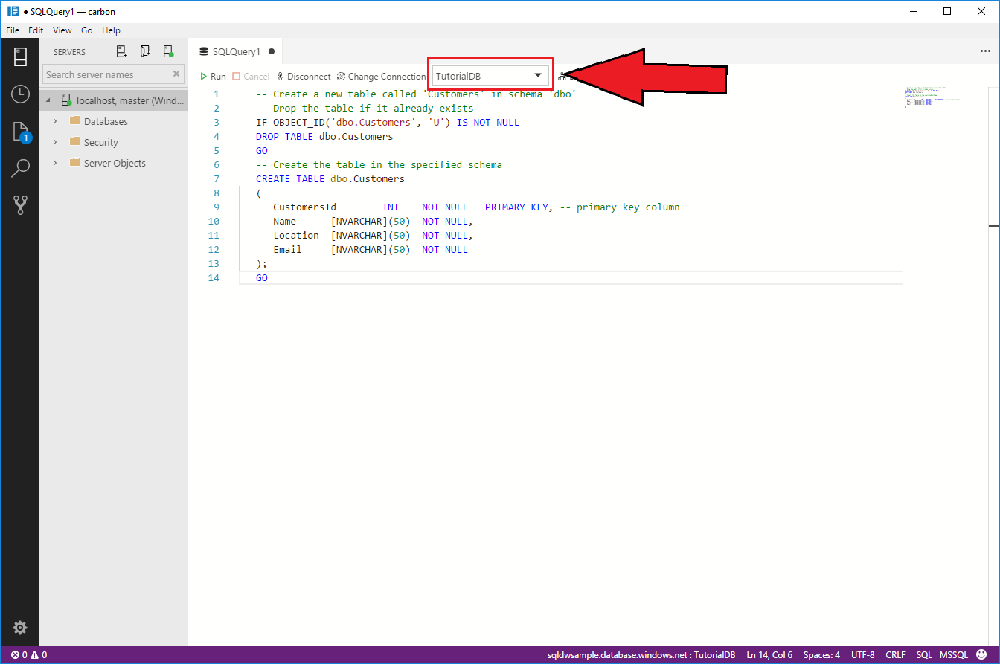

# Connect and query SQL Server using Carbon
This topic shows how to get started using Carbon with SQL Server databases, and this Quickstart should take about five minutes.

## Prerequisites

### Windows
Before starting this quickstart, you must have access to a running SQL Server instance. If you don't have it, [download SQL Server 2017 Developer Edition for Windows](https://www.microsoft.com/en-us/sql-server/sql-server-downloads). **Please remember your username and password.**

To install Carbon with Windows, follow [these directions](download.md#get-carbon-for-windows).

### macOS
- Before starting this quickstart, please download [Docker](https://docs.docker.com/docker-for-mac/install/#download-docker-for-mac).

- You will need access to a running SQL Server instance. On macOS, we will install SQL Server on Docker. Please [follow these instructions to download SQL Server on Docker](https://docs.microsoft.com/en-us/sql/linux/quickstart-install-connect-docker). Follow the steps up to "Create and Query Data." Please remember your username and password.

- To install Carbon with macOS, follow [these directions](download.md#get-carbon-for-macos).

### Linux
Before starting this quickstart, you must have access to a running SQL Server instance. If you don't have it, [download SQL Server 2017 Developer Edition on Linux](https://docs.microsoft.com/en-us/sql/linux/sql-server-linux-overview#install). 
**Note:** You only need to follow the steps up to "Create and Query Data", and please make sure you remember your SQL Login and Password that you will have setup after following these tutorials.

To install Carbon with Linux, follow [these directions](download.md#get-carbon-for-linux).

## Connect to a server
1. If you do not have a SQL Server instance to connect to, run the following command on docker (requirement for macOS prerequisite).
   ```bash
   docker run --name mssql-tutorial -d -e "ACCEPT_EULA=Y" -e "SA_PASSWORD=SqlDevOps2017" -e "MSSQL_PID=Developer" -p "1433:1433" microsoft/mssql-server-linux:latest
   ```
   
2. When first loading Carbon, a connection page should be displayed. If not, click the **New Connection** icon on the top left.
   
   

3. Windows Authentication is fully supported. For this tutorial, we will use SQL Login authentication type. Please fill the fields as follows:
 
   **Server Name:** localhost

   **Authentication Type:** SQL Login

   **User name:** User name for SQL Server

   **Password:** Password for SQL Server

   **Database Name:** (leave it blank)

   **Server Group:** \<Default\>

   

## Create a tutorial database
1. Right click on your server, **localhost**, in the object explorer and select **New Query.**

2. Copy the snippet below and paste in the query window. Click **Run** to execute the query.

   ```sql
   USE master
   GO
   IF NOT EXISTS (
      SELECT name
      FROM sys.databases
      WHERE name = N'TutorialDB'
   )
   CREATE DATABASE [TutorialDB]
   GO

   ALTER DATABASE [TutorialDB] SET QUERY_STORE=ON
   GO
   ```

## Create a table
1. Copy the snippet below and paste in the query window.
   ```sql
   -- Create a new table called 'Customers' in schema 'dbo'
   -- Drop the table if it already exists
   IF OBJECT_ID('dbo.Customers', 'U') IS NOT NULL
   DROP TABLE dbo.Customers
   GO
   -- Create the table in the specified schema
   CREATE TABLE dbo.Customers
   (
      CustomersId        INT    NOT NULL   PRIMARY KEY, -- primary key column
      Name      [NVARCHAR](50)  NOT NULL,
      Location  [NVARCHAR](50)  NOT NULL,
      Email     [NVARCHAR](50)  NOT NULL
   );
   GO
   ```

2. Change the context to **TutorialDB.** Click **Run** to execute the query.

   

## Insert rows
Copy the snippet below to insert four rows and paste in the query window. Click **Run** to execute the query.
   ```sql
   -- Insert rows into table 'Customers'
   INSERT INTO dbo.Customers
      ([CustomersId],[Name],[Location],[Email])
   VALUES
      ( 1, N'Jared', N'Australia', N''),
      ( 2, N'Nikita', N'India', N'nikita@vsdata.io'),
      ( 3, N'Tom', N'Germany', N'tom@vsdata.io'),
      ( 4, N'Jake', N'United States', N'jake@vsdata.io')   
   GO   
   ```

## View the result
Copy the snippet below to view all the rows and paste in the query window. Click **Run** to execute the query.
   ```sql
   -- Select rows from table 'Customers'
   SELECT * FROM dbo.Customers;
   ```
   

## Save result as Excel
1. Right click on the results table and save as a **Excel** file. 

   

2. Save as **Results.xls**.

## View chart
View an existing, built-in widget through the dashboard.

## Next steps
> [!div class="nextstepaction"]
> [Apply modern code flow using Carbon](tutorial-modern-code-flow-sql-server.md)

> [!div class="nextstepaction"]
> [Monitor your SQL Server databases using Carbon](tutorial-qds-sql-server.md)

> [!div class="nextstepaction"]
> [Backup and restore your SQL Server databases using Carbon](tutorial-backup-restore-sql-server.md)