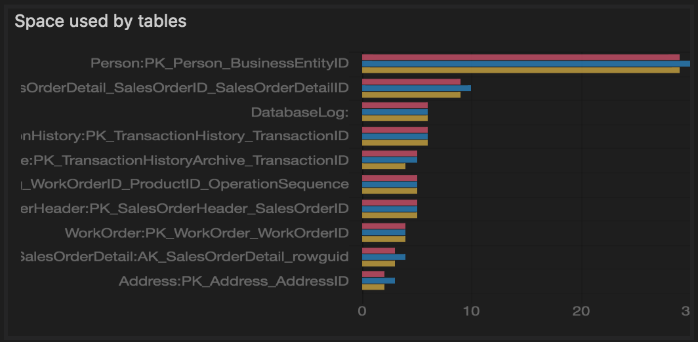
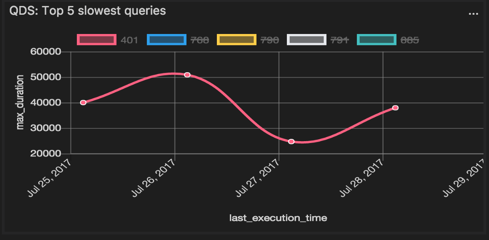
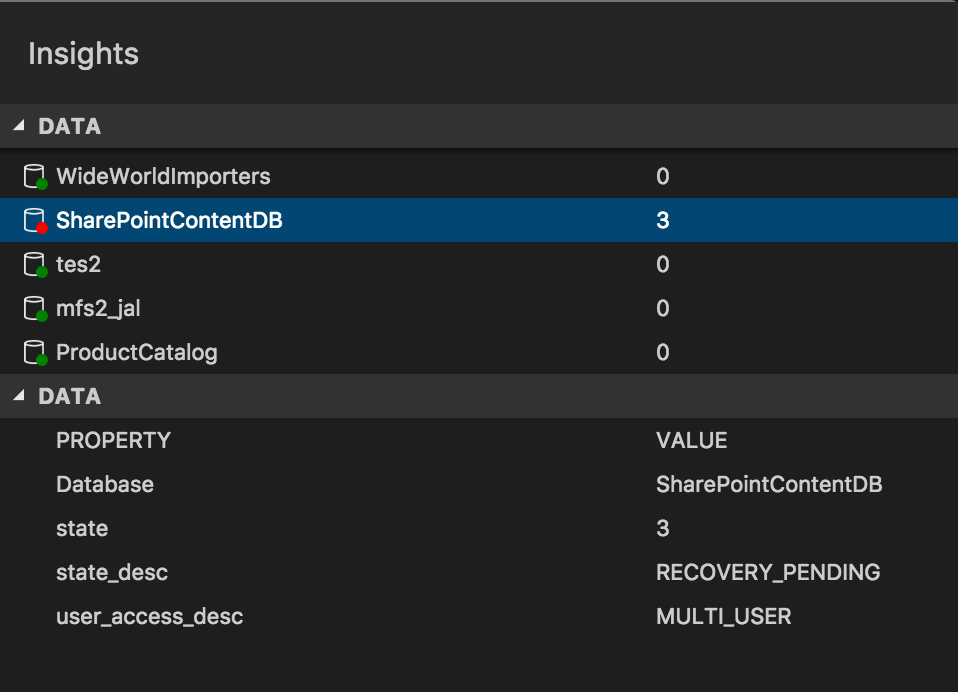

# Manage servers and databases with Insight widgets in Carbon

Carbon's support for creating Insight widgets takes the SQL queries you use to monitor servers & databases, and easily visualize the results with charts and graphs on a customizable monitoring dashboard. 

- **Manage with insights**: view at-a-glance insights of your servers and databases, drill into more details then launch a management action. 
- **Build insights tailored to your own needs**: share with community or leverage community efforts via insight widget extensions.
- **Build insight widget using your most familiar language**: T-SQL or pgSQL

You can build your own server and database manage dashboards like the following example:


Insight widgets in Carbon utilize many open source projects. 

**Visualization**

Chart.js through an Angular.JS module is the underlying open source project that powers up Carbon's insight visualizations. Hence, Carbon shares similar concepts and configuration experience with Chart.js. Take a look at the [Chart.JS sample page](http://www.chartjs.org/samples/latest/).

**Configuration**

For configuration, Carbon tries to avoid introducing yet another language or heavy UI.  It tries to stick to SQL as much as possible with a minimal JSON configuration. SQL is the language Carbon users are familiar with and there are countless number of sources of useful SQL queries that can be turned into Insight widgets.

## SQL Queries

Insight widgets require a minimum of one or two SQL queries:
* *Insight widget query* is mandatory, and is the query that returns the data that appears in the widget.
* *Insight details query* is only required if you are creating an Insight details flyout.

Insight widget query defines the dataset to render a count, chart, or graph. Insight details query is used to list relevant insight detail information in a tabular format in the Insight Details flyout dialog. See [samples](How-to-configure-insight-widget) for examples of insight widgets and insight details flyout.

Carbon executes insight widget query and maps the query result set to a chart's dataset then renders it. When user opens up an insight detail flyout, Carbon executes the insight details query and prints out the result in a grid view within the dialog.

The basic idea is to write a SQL query in a way to be used as a dataset of a count, chart, and graph widget. 

## Mapping between a query result and dataset of chart / graph / count.
Caron interprets the query's result set in two ways, vertical and horizontal. Let's call it as 'dataDirection'.
For example, in horizontal dataDirection, each row defines a dataset and column defines the legend or label. In the sample's database state query, it uses horizontal dataDirection.

|ONLINE|RECOVERY_PENDING|
|:---|:---|
|10|2|

Count, Pie, Doughnut, Bar, HorizontalBar can render this result set by mapping the column names as each legend in chart and each row as the dataset value. A dataset with horizontal dataDirection can have multiple rows. Then each row is interpreted as different data series. In [sample extension](How-to-configure-insight-widget), space usage by table sample is an example of horizontal dataDirection with multiple data series in a dataset. In that case, a Carbon uses the first column for grouping.

|TableName|TotalSpace|UsedSpace|DataSpace|
|:---|:---|:---|:--|
|Table1|10|8|8|
|Table2|20|19|19|
|Table3|30|29|29|

In a horizontal bar chart, Carbon renders the dataset as shown below: multiple column data is grouped by the same table name.



The sample t-sql query that produces horizontal dataDirection is:
```sql
select 
    ONLINE, RECOVERY_PENDING
from 
    (select state_desc, database_id from sys.databases) p
    pivot (count(database_id) for state_desc in (ONLINE, RECOVERY_PENDING)) as pvt;
```

If dataDirection is vertical, Carbon uses the first column as the legend (label) and second column as a numeric value. In line graph, timeseries and scatter plotting where x and y values are required, Carbon takes the second column as x value and the third column as y value.

|LegendColumn|xAxisValueColmun|yAxisValueColumn|
|:---|:---|:---|
|A|10|10|
|B|11|10|
|C|12|10|

In this case, LegendColumn values are mapped to Chart's legend, and for each row the value of xAxisValueColum and yAxisValueColumn are used to plotting and rendering lines.

Line and Scatter plot charts requires numeric value for the xAxisValueColumn. TimeSeries chart requires datetime value for the xAxisValueColumn. yAxisValueColumn should be numeric in all cases.

For instance, QDS: Top five slowest query TimeSeries chart is based on the following result:

|query_id|last_execution_time|max_duration|
|:---|:---|:---|
|401|2107-07-25 12:01:11|6000|
|401|2017-07-26 13:23:10|8000|
|...|...|...|

The sample query that produces vertical dataDirection is:

```sql
WITH SlowestQry AS( 
    SELECT TOP 5  
        q.query_id, 
        MAX(rs.max_duration ) max_duration 
    FROM sys.query_store_query_text AS qt    
    JOIN sys.query_store_query AS q    
        ON qt.query_text_id = q.query_text_id    
    JOIN sys.query_store_plan AS p    
        ON q.query_id = p.query_id    
    JOIN sys.query_store_runtime_stats AS rs    
        ON p.plan_id = rs.plan_id   
    WHERE rs.last_execution_time > DATEADD(week, -1, GETUTCDATE())   
    AND is_internal_query = 0 
    GROUP BY q.query_id 
    ORDER BY MAX(rs.max_duration ) DESC) 
SELECT  
    q.query_id,  -- legend 
    format(rs.last_execution_time,'yyyy-MM-dd hh:mm:ss') as [last_execution_time],   -- x axis 
    rs.max_duration,  -- y axis
    p.plan_id 
FROM sys.query_store_query_text AS qt    
    JOIN sys.query_store_query AS q    
        ON qt.query_text_id = q.query_text_id    
    JOIN sys.query_store_plan AS p    
        ON q.query_id = p.query_id    
    JOIN sys.query_store_runtime_stats AS rs    
        ON p.plan_id = rs.plan_id   
    JOIN SlowestQry tq 
        ON tq.query_id = q.query_id 
WHERE rs.last_execution_time > DATEADD(week, -1, GETUTCDATE())   
AND is_internal_query = 0 
order by format(rs.last_execution_time,'yyyy-MM-dd hh:mm:ss')
```

It renders the following TimeSeries chart:




## Result set mapping for Insight Details

Insight details query can be any query with multiple columns and multiple rows since an insight detail dialog simply prints out the result in a grid view. Insight Details requires a column name to be used as a key value such as database name, query id, and condition check column to overlay a color indicator for a state or health condition. In the sample database state detail query below, database column is the key value and state column is used for a condition check. For example if the state value equals 0 (Online), then render green color dot, otherwise red color dot.

```sql
SELECT 
    [name] as [Database], 
    [state], 
    [state_desc], 
    [user_access_desc] 
FROM sys.databases;

```

Other column values are printed out in each database's detail section in the bottom half as shown below.



## Summary

T-SQL query and its result set itself determines the insight widget behavior. Writing a query for a chart type or mapping a right chart type for existing query is the key consideration to build an effective Insight widget.


## Next steps
- [Download and Install Carbon](download.md)
- [Connect to SQL Server](get-started-sql-server.md)