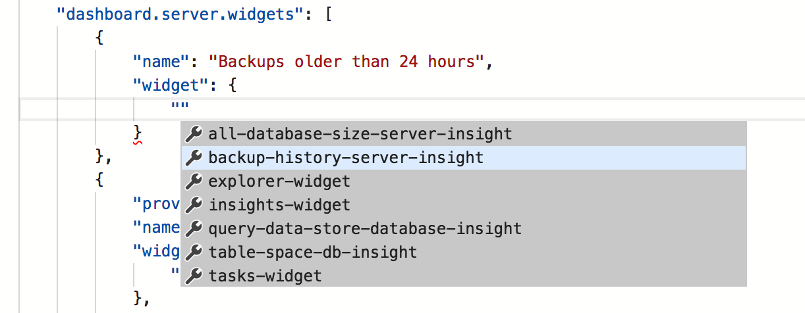
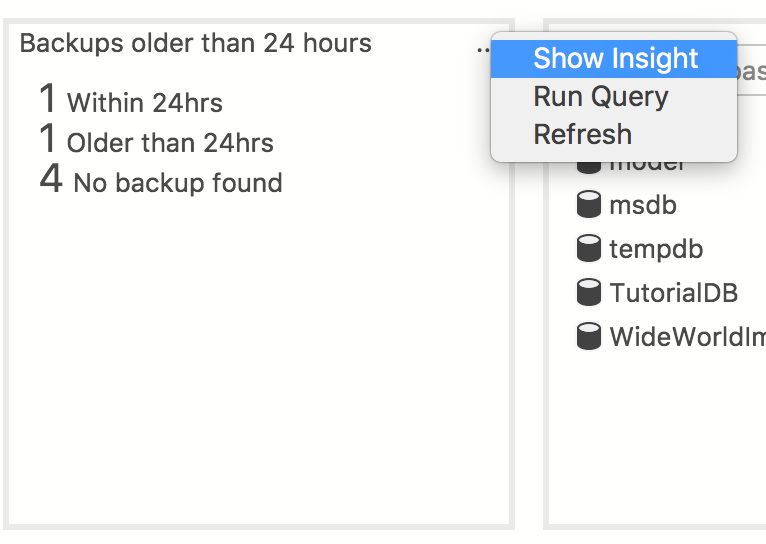
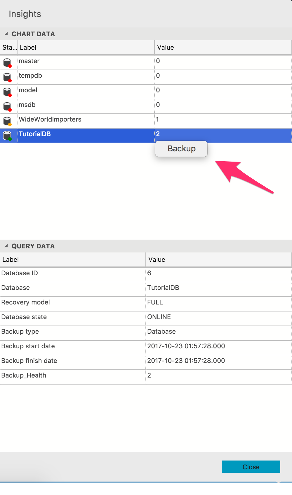
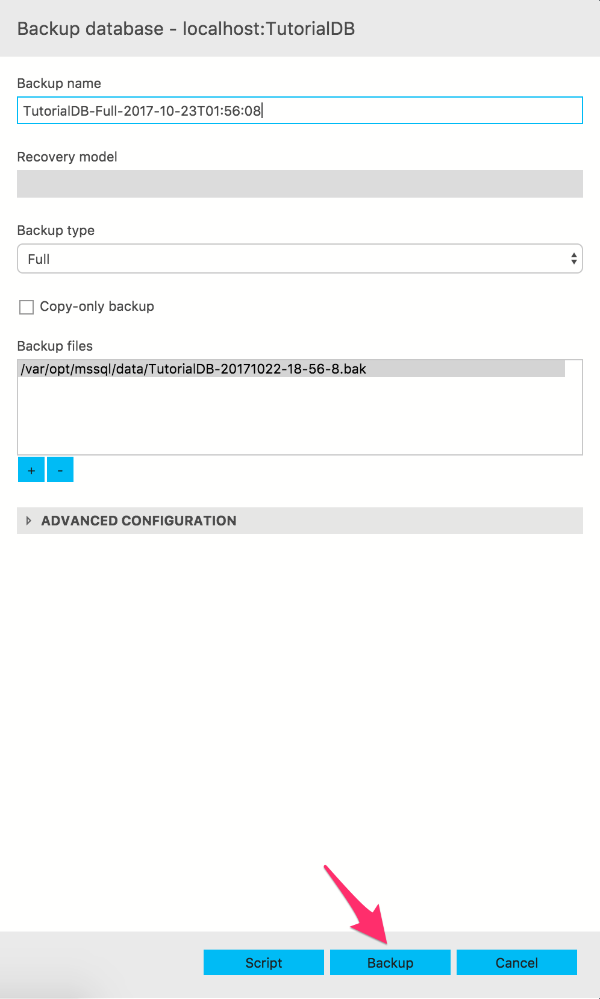

# Monitor Backup Status with Carbon
In this tutorial, we will walk-through how to enable an insight widget on Dashboard to get an at-a-glance view about the current backup status of all databases in a SQL Server instance. We will futher examine how to view the details of the backup history of each datase and take a backup action directly from the insight. After following through this tutorial, you will learn learn how to:

> [!div class="checklist"]
> * Quickly turn on an insight widget using a built-in insight widget sample.
> * View the details of each database's backup history.
> * Launch a backup action directly from the backup status insight detail dialog.

## Prerequisites
* Follow [Get Started with Carbon](./get-started-sql-server.md) to a SQL Server 2017 instance and TutorialDB database.

## Turn on a management insight on Carbon's database Manage dashboard
Carbon has a built-in sample widget to monitor the backup status and history of all databases in a SQL Server instance. With a few simple steps, you can easily visualize the business critical information in a chart.

1. Open User Settings by pressing 'F1' to open Command Palette, type in 'settings' in the command search input box and select 'Preferences: Open User Settings' command.

   

2. Type 'dashboard' in Settings Search input box to search "dashboard.server.widgets" in Settings.

   

3. Click 'Copy to Settings' to copy "dashboard.database.widgets" settings to customize.

4. Using Carbon's insight settings IntelliSense, configure 'name' for the widget title and 'widget' by selecting 'query-data-store-database-insight' from the drop down list as shown in the screenshot below:

   

5. Press 'CTRL + S' to save the user's settings file.

6. Open Server dashboard by navigate to 'localhost' or your SQL Server instance name in Servers viewlet, and click 'Manage' in the context menu. 

   

7. View 'Backups older than 24 hours' widget as shown in the screen shot below: 

   

## View insight details dialog for know more about the insight

1. Click 'Show Insight' context menu. It will open Inishgts detail dialog as shown in the screenshot:

   

2. Click 'TutorialDB' to view the detail of backup history.

## Launch Backup action from the insight details dialog.

1. Open a context menu from 'TutorialDB' using the right-mouse-click.

2. Click 'Backup'. It will open Carbon's backup dialog for 'TutorialDB'.

   

3. Click 'Backup'.

4. Press 'CTRL + T' to view the status of backup task.

## Next Steps
In this tutorial, you learned how to:
> [!div class="checklist"]
> * Quickly turn on an insight widget using a built-in insight widget sample.
> * View the details of each database's backup history.
> * Launch a backup action directly from the backup status insight detail dialog.

Next, learn how to use X, try this tutorial: 
> [!div class="nextstepaction"]
> [What article is next in sequence](tutorial-monitoring-sql-server.md)