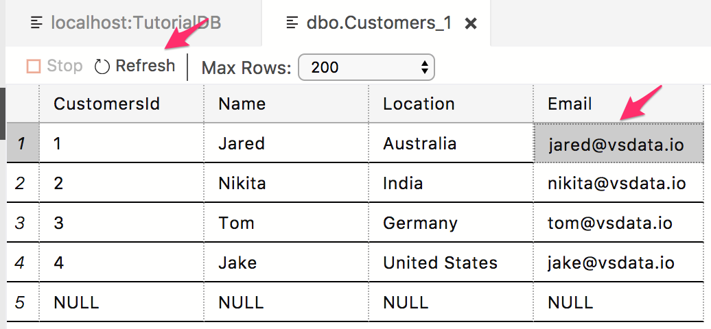

# Modernize T-SQL code flow with Carbon
Carbon provides ... [finish intro] 

In this tutorial, you use the Carbon to learn to:
> [!div class="checklist"]
> * Quick search
> * Edit table data 
> * Use snippet
> * Peek Definition and Go to Definition

## Prerequisites
Follow [Get Started with Carbon](./get-started-sql-server.md)

## Quickly find a table and edit data
[step overview]

1. Open Servers viewlet with ```CTRL+G``` and expand ```Databases``` folder. Select ```TutorialDB```. 
2. Open TutorialDB dashboard using ```Manage``` context menu with right-mouse-click.
3. Type ```Employee``` in Search widget as shown below and press ```Enter```.
4. Select ```dbo.Employees``` table from Search widget on the dashboard and run ```Edit data``` context menu with right-mouse-click.

   

5. Select ```EmailAddress``` column in the first row and type in ```jared@vsdata.io```.
6. Click Refresh.



## Use T-SQL snippet and IntelliSense to create a procedure
[todo: step overview]

1. Open TutorialDB dashboard, open a new editor with ```New Query``` task in Tasks widget. Or select TutorialDB in Servers viewlet and run ```New query``` context menu with right-mouse-click.
2. Type ```sql``` in the editor, then select ```sqlCreateStoredProcedure```. Press ```Tab```.
3. Type ```GetEmployee```. All ```StoredProcedureName``` entries will change to the specified name. 
4. Press ```Tab``` and then type ```dbo``` for ```SchemaName``` entry.
5. Type in the following parameter definition.

   ```sql
   CREATE PROCEDURE dbo.GetEmployee
       @ID int
   ```
6. Using T-SQL Intellisense, type in the following SELECT statement in the body of procedure. Tip: Type in ```SELECT FROM dbo.Employees emp``` first and type the rest as IntelliSense guides you. 

```sql
SELECT  emp.EmployeeID, 
        emp.Name, 
        emp.Location, 
        emp.EmailAddress
FROM dbo.Employees emp
WHERE emp.EmployeeID = @ID
FOR JSON PATH
```

7. The final statement should be:

```sql
-- Create a new stored procedure called 'GetEmployee' in schema 'dbo'
-- Drop the stored procedure if it already exists
IF EXISTS (
SELECT *
    FROM INFORMATION_SCHEMA.ROUTINES
WHERE SPECIFIC_SCHEMA = N'dbo'
    AND SPECIFIC_NAME = N'GetEmployee'
)
DROP PROCEDURE dbo.GetEmployee
GO
-- Create the stored procedure in the specified schema
CREATE PROCEDURE dbo.GetEmployee
    @ID int
AS
    -- body of the stored procedure
    SELECT emp.EmployeeID, emp.Name, emp.Location, emp.EmailAddress
    FROM dbo.Employees emp
    WHERE emp.EmployeesID = @ID
    FOR JSON PATH
GO
```

8. Press ```F5``` and execute the statement.

## Use Peek Definition and Go to Definition 
[step overview]

1. Open a new editor from Servers viewlet or from TutorialDB dashboard.  
2. Using ```sqlCreateStoredProcedure```, start CREATE Procedure snippet. Type in ```SetEmployee``` for ```StoredProcedureName``` and ```dbo``` for ```SchemaName```.
3. Specify a parameter:

```sql
CREATE PROCEDURE dbo.setEmployee
    @json_val nvarchar(max)
```
4. In the body of procedure, type in following:
```sql
-- body of the stored procedure
INSERT INTO dbo.Employees
```
5. Right-mouse-click on ```dbo.Employees``` and run ```Peek Definition```


6. By referencing the table defintion in the peek definition, complete the following insert statement.

```sql
INSERT INTO dbo.Employees (EmployeesID, Name, Location, EmailAddress)
    SELECT EmployeesID, Name, Location, EmailAddress
    FROM OPENJSON (@json_val)
    WITH(   EmployeesID int, 
            Name nvarchar(50), 
            Location nvarchar(50), 
            EmailAddress nvarchar(50)
```
7. The final statement should be:

```sql
-- Create a new stored procedure called 'SetEmployee' in schema 'dbo'
-- Drop the stored procedure if it already exists
IF EXISTS (
SELECT *
    FROM INFORMATION_SCHEMA.ROUTINES
    WHERE SPECIFIC_SCHEMA = N'dbo'
    AND SPECIFIC_NAME = N'SetEmployee'
)
DROP PROCEDURE dbo.SetEmployee
GO
-- Create the stored procedure in the specified schema
CREATE PROCEDURE dbo.SetEmployee
    @json_val nvarchar(max) 
AS
    -- body of the stored procedure
    INSERT INTO dbo.Employees (EmployeesID, Name, Location, EmailAddress)
    SELECT EmployeesID, Name, Location, EmailAddress
    FROM OPENJSON (@json_val)
    WITH(   EmployeesID int, 
            Name nvarchar(50), 
            Location nvarchar(50), 
            EmailAddress nvarchar(50)
    )
GO
```

8. Press ```F5``` and execute the script.

## Save as Json
[step overview goes here]

Let's test the procedures

1. First, run ```SELECT TOP 1000 Rows``` from dbo.Employees table.
2. Select and highlight the first row in the result view.
3. Click ```Save as Json```. It opens the highlighted row in json format.


4. Select the json data and copy with ```CTRL+C```.
5. Open a new query for TutorialDB and paste the json data into the new query editor. 
6. Complete the following test script using the json data as a template in the previous step. Modify the values for ```EmployeeID```, ```Name```, ```Location``` and ```EmailAddress```.

```sql
-- example to execute the stored procedure we just created
declare @json nvarchar(max) =
N'[
    {
        "EmployeesID": 5,
        "Name": "New User",
        "Location": "US",
        "EmailAddress": "newuser@vsdata.io"
    }
]'

EXECUTE dbo.setEmployee @json_val = @json
GO

EXECUTE dbo.getEmployee @ID = 5
```

7. Press ```F5``` and execute the script. It will insert a new employee and return the new employee's information in json format. Click the result.


## Next Steps
In this tutorial, you learned how to:
> [!div class="checklist"]
> * Create something
> * Do something
> * Do something else
> * Finish something 

Next, learn how to use X, try this tutorial: 
> [!div class="nextstepaction"]
> [What article is next in sequence](tutorial-monitoring-sql-server.md)