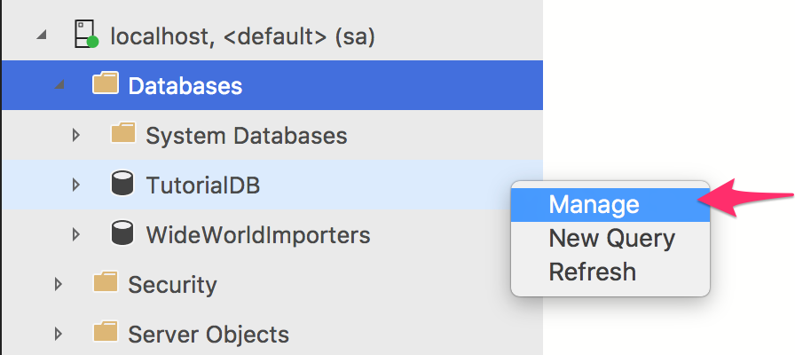
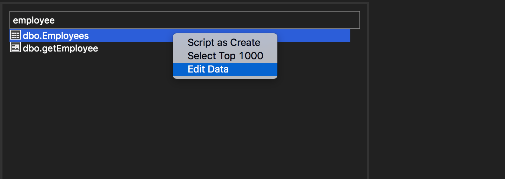
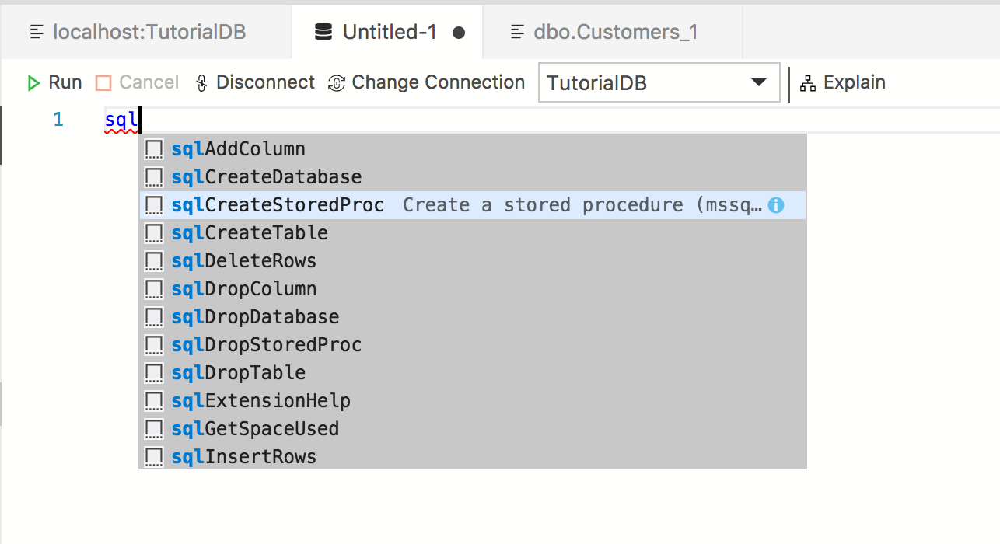
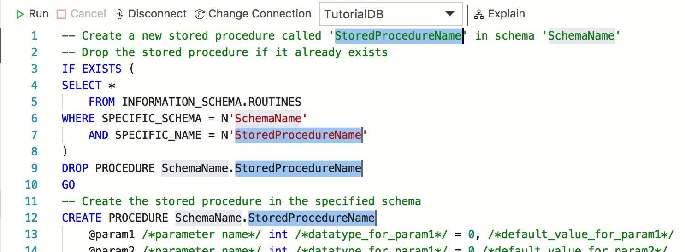
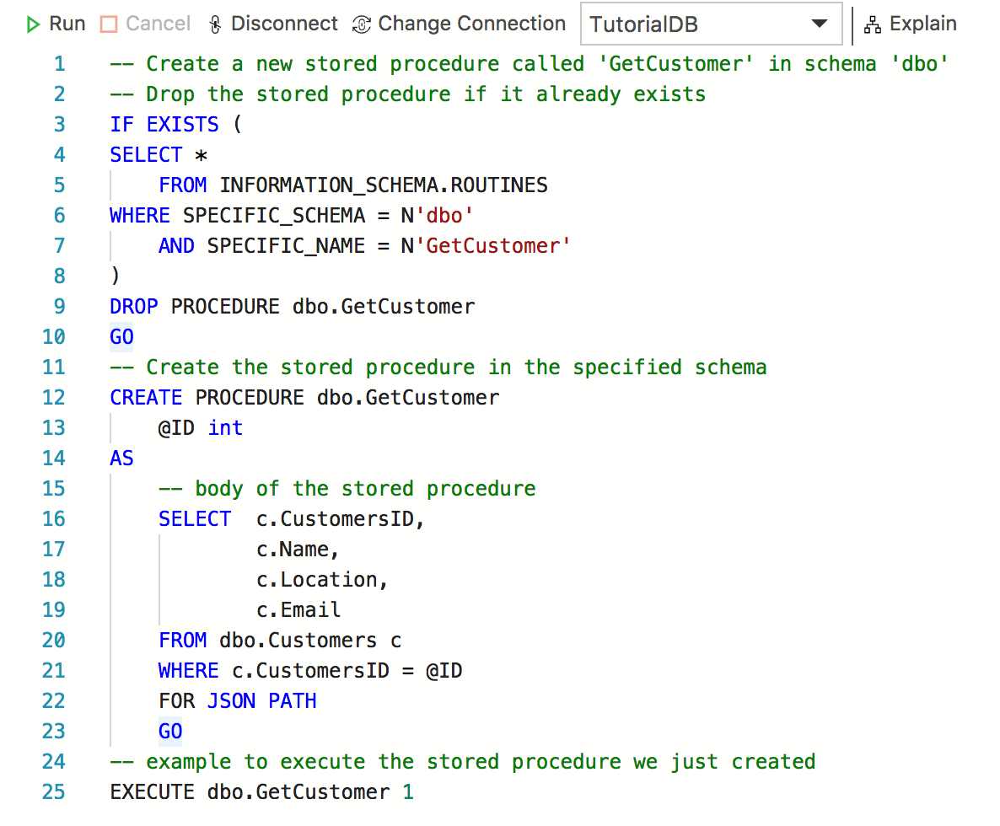
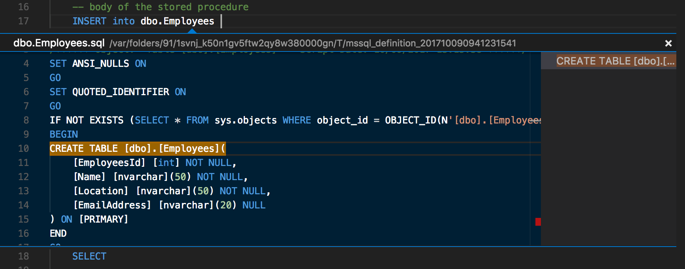
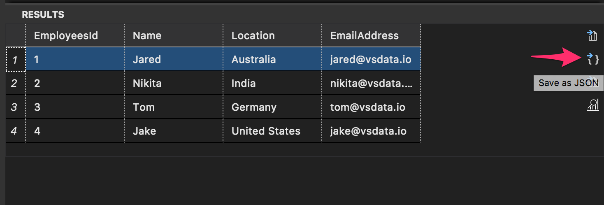

# Create and run queries using [!INCLUDE[name-sos](../includes/name-sos-short.md)]

Creating and running queries, stored procedures, scripts, etc. are the core tasks of database professionals. This tutorial walks through the key features in [!INCLUDE[name-sos](../includes/name-sos-short.md)] that simplify using T-SQL.

In this tutorial, you learn how to use [!INCLUDE[name-sos-short](../includes/name-sos-short.md)] to:
> [!div class="checklist"]
> * Search database objects
> * Edit table data 
> * Use snippets to quickly write T-SQL
> * View database object details using *Peek Definition* and *Go to Definition*


## Prerequisites

To complete this tutorial, [install [!INCLUDE[name-sos](../includes/name-sos-short.md)]](download.md).


## Quickly find a table and edit data
[!INCLUDE[name-sos-short](../includes/name-sos-short.md)] provides a quick database schema object search functionality using 'Explorer widget' in a dashboard and quickly launch a task based on an object type such as 'Edit data' for a table.

1. Open Servers viewlet with ```CTRL+G``` and expand ```Databases``` folder. Select ```TutorialDB```. 

2. Open TutorialDB Dashboard using ```Manage``` context menu with right-mouse-click.

   

3. Type ```Customer``` in Search widget as shown below.

4. Select ```dbo.Customer``` table from Search widget on the dashboard and run ```Edit data``` context menu with right-mouse-click.

   

5. Select ```Email``` column in the first row and type in ```jared@vsdata.io```.

6. Click Refresh. The result is shown in the screenshot below.

   

## Use T-SQL snippet and IntelliSense to create a stored procedure

1. Press 'CTRL + N' to open a new editor.

2. Type ```sql``` in the editor, then select ```sqlCreateStoredProcedure```. Press ```Tab```. [!INCLUDE[name-sos-short](../includes/name-sos-short.md)] creates a new stored procedure snippet.

   

3. Type ```GetCustomer```. All ```StoredProcedureName``` entries will change to the specified name. 
   

4. Press ```Tab``` and then type ```dbo``` for ```SchemaName``` entry.

5. Type in the following parameter definition.

   ```sql
   CREATE PROCEDURE dbo.GetCustomer
       @ID int
   ```

6. Using T-SQL Intellisense, type in the following SELECT statement in the body of procedure. Tip: Type in ```SELECT FROM dbo.Customers c``` first and type the rest as IntelliSense guides you. 

   ```sql
    SELECT  c.CustomersID, 
            c.Name, 
            c.Location, 
            c.Email
    FROM dbo.Customers c
    WHERE c.CustomersID = @ID
    FOR JSON PATH
   ```

   

7. Press ```F5``` and execute the statement.

## Use Peek Definition and Go to Definition 

1. Press 'CTRL + N' to open a new editor. 

2. Type and select ```sqlCreateStoredProcedure``` from the snippet suggestion list. Type in ```SetCustomer``` for ```StoredProcedureName``` and ```dbo``` for ```SchemaName```.
3. Specify following parameter:

   ```sql
   CREATE PROCEDURE dbo.SetCustomer
       @json_val nvarchar(max)
   ```

4. In the body of procedure, type in following:
   ```sql
   -- body of the stored procedure
   INSERT INTO dbo.Customers
   ```

5. Right-mouse-click on ```dbo.Customers``` and run ```Peek Definition```

   

6. By referencing the table defintion in the peek definition, complete the following insert statement.

   ```sql
   INSERT INTO dbo.Customers (CustomersID, Name, Location, Email)
       SELECT CustomersID, Name, Location, Email
       FROM OPENJSON (@json_val)
       WITH(   CustomersID int, 
               Name nvarchar(50), 
               Location nvarchar(50), 
               Email nvarchar(50)
   ```
7. The final statement should be:

   ```sql
   -- Create a new stored procedure called 'SetCustomer' in schema 'dbo'
   -- Drop the stored procedure if it already exists
   IF EXISTS (
   SELECT *
       FROM INFORMATION_SCHEMA.ROUTINES
       WHERE SPECIFIC_SCHEMA = N'dbo'
       AND SPECIFIC_NAME = N'SetCustomer'
   )
   DROP PROCEDURE dbo.SetCustomer
   GO
   -- Create the stored procedure in the specified schema
   CREATE PROCEDURE dbo.SetCustomer
       @json_val nvarchar(max) 
   AS
       -- body of the stored procedure
       INSERT INTO dbo.Customers (CustomersID, Name, Location, Email)
       SELECT CustomersID, Name, Location, Email
       FROM OPENJSON (@json_val)
       WITH(   CustomersID int, 
               Name nvarchar(50), 
               Location nvarchar(50), 
               Email nvarchar(50)
       )
   GO
   ```

8. Press ```F5``` and execute the script.

## Save as Json

In this step, we will walkthrough how Save as JSON can make a developing and testing application login in stored procedures and using JSON as a data format in applications.

1. First, run ```SELECT TOP 1000 Rows``` from dbo.Customers table.

2. Select and highlight the first row in the result view.

3. Click ```Save as Json```. It opens the highlighted row in json format.

   

4. Select the json data and copy with ```CTRL+C```.

5. Open a new query for TutorialDB and paste the json data into the new query editor. 

6. Complete the following test script using the json data as a template in the previous step. Modify the values for ```CustomerID```, ```Name```, ```Location``` and ```Email```.

   ```sql
   -- example to execute the stored procedure we just created
   declare @json nvarchar(max) =
   N'[
       {
           "CustomersID": 5,
           "Name": "New User",
           "Location": "US",
           "Email": "newuser@vsdata.io"
       }
   ]'

   EXECUTE dbo.setCustomer @json_val = @json
   GO

   EXECUTE dbo.getCustomer @ID = 5
   ```

7. Press ```F5``` and execute the script. It inserts a new Customer and returns the new Customer's information in json format. Click the result.

   

## Next Steps
In this tutorial, you learned how to:
> [!div class="checklist"]
> * Quick search schema objects
> * Edit table data 
> * Writing T-SQL script using snippets
> * Learn about database object details using Peek Definition and Go to Definition

Next, learn how to use X, try this tutorial: 
> [!div class="nextstepaction"]
> [What article is next in sequence](tutorial-monitoring-sql-server.md)