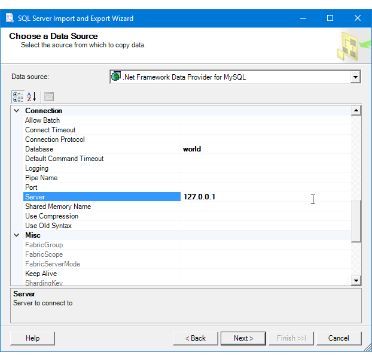
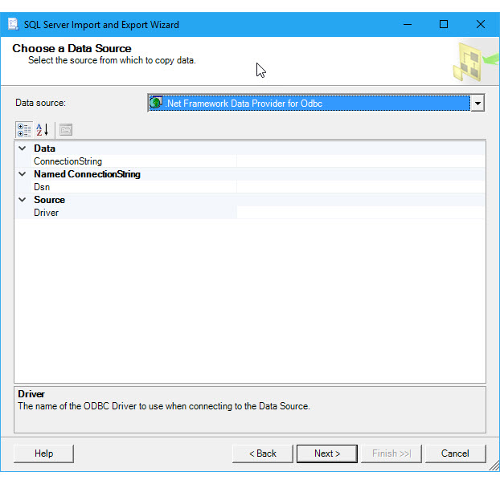
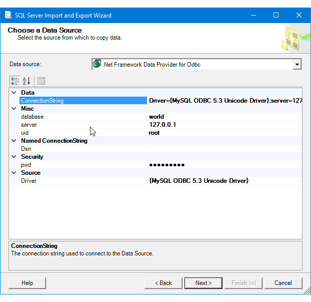

# Connect to a MySQL Data Source (SQL Server Import and Export Wizard)
This topic shows you how to connect to an **MySQL** data source from the **Choose a Data Source** or **Choose a Destination** page of the SQL Server Import and Export Wizard. There are several data providers that you can use to connect to MySQL.

> [!IMPORTANT]
> The detailed requirements and prerequisites for connecting to a MySQL database are beyond the scope of this Microsoft article. This article assumes that you already have MySQL client software installed and that you can already connect successfully to the target MySQL database. For more info, consult your MySQL database administrator or the MySQL documentation.

## Get the MySQL connectors
Download the providers and drivers described in this topic from the [MySQL Connectors](https://dev.mysql.com/downloads/connector/) page.

## Connect to MySQL with the .Net Framework Data Provider for MySQL
After you select **.NET Framework Data Provider for MySQL** on the **Choose a Data Source** or **Choose a Destination** page of the wizard, the page presents a grouped list of options for the provider. Many of these are unfriendly names and unfamiliar settings. Fortunately, you only have to provide a few pieces of information. You can ignore the default values for the other settings.

|Required info|.Net Framework Data Provider for MySQL property|
|---|---|
|Server name|**Server**|
|Database name|**Database**|
|Authentication (login) info|**User Id** and **Password**|

You don't have to enter the connection string in the **ConnectionString** field of the list. After you enter individual values for the MySQL server name (**Server**) and login info, the wizard assembles the connection string from the individual properties and their values. 

> [!NOTE]
> The connection options for this data provider are the same whether MySQL is your source or your destination. That is, the options you see are the same on both the **Choose a Data Source** and the **Choose a Destination** pages of the wizard.

## Connect to MySQL with the MySQL ODBC driver
ODBC drivers aren't listed in the drop-down list of data sources. To connect with an ODBC driver, start by selecting the **.NET Framework Data Provider for ODBC** as the data source on the **Choose a Data Source** or **Choose a Destination** page. This provider acts as a wrapper around the ODBC driver.

Here's the generic screen that you see immediately after selecting the .NET Framework Data Provider for ODBC.

### Options to specify (MySQL ODBC Driver)
To connect to MySQL with the MySQL ODBC driver, assemble a connection string that includes the following settings and their values. The format of a complete connection string immediately follows the list of settings.

> [!TIP]
> Get help assembling a connection string that's just right. Or, instead of providing a connection string, provide an existing DSN (data source name) or create a new one. For more info about these options, see [Connect to an ODBC Data Source](../../integration-services/import-export-data/connect-to-an-odbc-data-source-sql-server-import-and-export-wizard.md).

**Driver**  
The name of the ODBC driver.

**Server**  
The name of the MySQL server. 

**Database**  
The name of the MySQL database.

**UID** and **PWD**   
The user id and password to connect.

### Connection string format
Here's the format of a typical connection string.

    Driver={MySQL ODBC 5.3 Unicode Driver};Server=<server>;Database=<database>;UID=<user id>;PWD=<password>

### Enter the connection string
Enter the connection string in the **ConnectionString** field, or enter the DSN name in the **Dsn** field, on the **Choose a Data Source** or **Choose a Destination** page. After you enter the connection string, the wizard parses the string and displays the individual properties and their values in the list.

The following example uses this connection string.

    Driver={MySQL ODBC 5.3 Unicode Driver};Server=127.0.0.1;Database=world;UID=root;PWD=********

Here's the screen that you see after entering the connection string.

> [!NOTE]
> The connection options for this data provider and ODBC driver are the same whether MySQL is your source or your destination. That is, the options you see are the same on both the **Choose a Data Source** and the **Choose a Destination** pages of the wizard.

## Other data providers and more info
For info about how to connect to MySQL with a data provider that's not listed here, see [MySQL connection strings](https://www.connectionstrings.com/mysql/). This third-party site also contains more info about the data providers and the connection parameters described on this page.

## See also
[Choose a Data Source](../../integration-services/import-export-data/choose-a-data-source-sql-server-import-and-export-wizard.md)  
[Choose a Destination](../../integration-services/import-export-data/choose-a-destination-sql-server-import-and-export-wizard.md)

