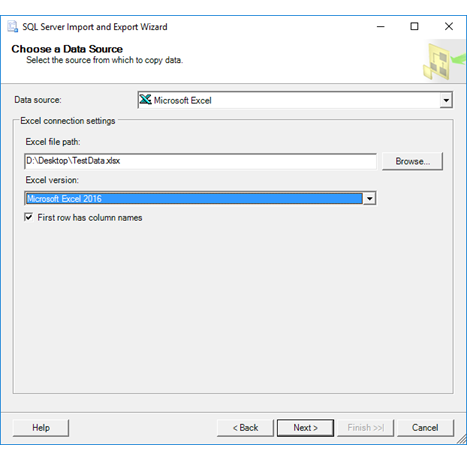

# Connect to an Excel Data Source (SQL Server Import and Export Wizard)
This topic shows you how to connect to a **Microsoft Excel** data source from the **Choose a Data Source** or **Choose a Destination** page of the SQL Server Import and Export Wizard.

The following screen shot shows a sample connection to a Microsoft Excel workbook.

 

> [!NOTE]
> The connection options for this data provider are the same whether Excel is your source or your destination. That is, the options you see are the same on both the **Choose a Data Source** and the **Choose a Destination** pages of the wizard.

## Options to specify
**Excel file path**  
 Specify the path and file name for the Excel file. For example:
-   For a file on the local computer, **C:\\MyData.xlsx**.
-   For a file on a network share, **\\\\Sales\\Database\\Northwind.xlsx**.

Or, click **Browse**.  
  
 **Browse**  
 Locate the spreadsheet by using the **Open** dialog box.  

> [!NOTE]
> The wizard can't open a password-protected Excel file.

 **Excel version**  
Select the version of Excel that's used by the source workbook.

> [!IMPORTANT]
> You may have to download and install additional files to connect to the version of Excel that you select. See [Get the files you need to connect to Excel](#officeDownloads) on this page for more info.

If you have a problem when you specify a version, try specifying a different version, even an earlier version. For example, you may not be able to install the Office 2016 data providers because you have a Microsoft Office 365 subscription. You can only install the data providers for Excel 2016 and Access 2016 with a desktop version of Microsoft Office. In this case, you can specify Excel 2013 instead of Excel 2016. The two versions of the provider are functionally equivalent. This limitation of the Office 2016 runtime is mentioned in [this blog post](https://blogs.office.com/2015/12/16/access-2016-runtime-is-now-available-for-download/).

**First row has column names**  
Indicate whether the first row of the data contains column names.
-   If the data doesn't contain column names but you enable this option, the wizard treats the first row of source data as the column names.
-   If the data contains column names but you disable this option, the wizard treats the row of column names as the first row of data.

If you specify that the data doesn't have column names, the wizard uses F1, F2, and so forth as column headings.

## I don't see Excel in the list of data sources
If you don't see Excel in the list of data sources, are you running the 64-bit wizard? The providers for Excel and Access are typically 32-bit and aren't visible in the 64-bit wizard. Run the 32-bit wizard instead.

## Get the files you need to connect to Excel  
You may have to download the connectivity components for Microsoft Office data sources, including Excel and Access, if they're not already installed.

Later versions of the components can open files created by earlier versions of the programs. In some cases, earlier versions of the components can also open files created by later versions of the programs. For example, if you can't install the Office 2016 components, use the Office 2013 components instead. The two versions of the provider are functionally equivalent. This limitation of the Office 2016 runtime is mentioned in [this blog post](https://blogs.office.com/2015/12/16/access-2016-runtime-is-now-available-for-download/).

If the computer has a 32-bit version of Office - this is typical, even on 64-bit computers - then you have to install the 32-bit version of the components. You also have to ensure that you run the 32-bit wizard, or run the SQL Server Integration Services package that the wizard creates in 32-bit mode. 
 
|Microsoft Office version|Download|  
|------------------------------|--------------|  
|2016|[Microsoft Access 2016 Runtime](https://www.microsoft.com/download/details.aspx?id=50040)|
|2013|[Microsoft Access 2013 Runtime](http://www.microsoft.com/download/details.aspx?id=39358)|
|2010|[Microsoft Access 2010 Runtime](https://www.microsoft.com/download/details.aspx?id=10910)|  
|2007|[2007 Office System Driver: Data Connectivity Components](https://www.microsoft.com/download/details.aspx?id=23734)|  

## See also
[Choose a Data Source](../../integration-services/import-export-data/choose-a-data-source-sql-server-import-and-export-wizard.md)  
[Choose a Destination](../../integration-services/import-export-data/choose-a-destination-sql-server-import-and-export-wizard.md)

