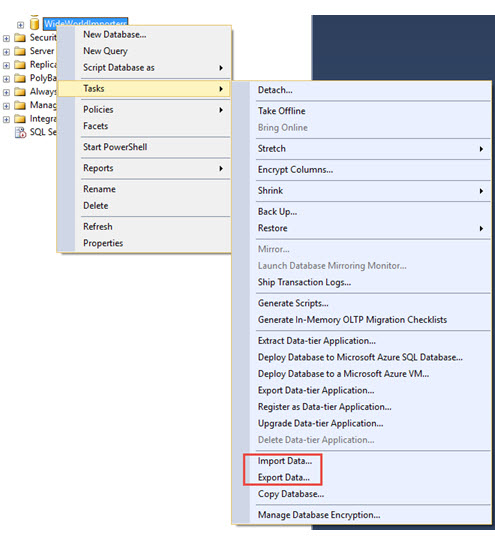

# Start the SQL Server Import and Export Wizard

 > For content related to previous versions of SQL Server, see [Run the SQL Server Import and Export Wizard](https://msdn.microsoft.com/en-US/library/ms140052(SQL.120).aspx).

Start the [!INCLUDE[ssNoVersion](../../includes/ssnoversion-md.md)] Import and Export Wizard in one of the ways described in this topic to import data from and export data to any supported data source.

> [!IMPORTANT]
> This topic describes only how to **start** the wizard. If you're looking for something else, see [Related tasks and content](#related).

You can start the wizard:
-   From the [Start menu](#startStart).
-   From the [command prompt](#startCmd). 
-   From [SQL Server Management Studio (SSMS)](#startSSMS).
-   From [Visual Studio with SQL Server Data Tools (SSDT)](#startVS).

## Prerequisite - Is the wizard installed on your computer?
If you want to run the wizard, but you don't have [!INCLUDE[msCoName](../../includes/msconame-md.md)] [!INCLUDE[ssNoVersion](../../includes/ssnoversion-md.md)] installed on your computer, you can install the [!INCLUDE[ssNoVersion](../../includes/ssnoversion-md.md)] Import and Export Wizard  by installing SQL Server Data Tools (SSDT). For more info, see [Download SQL Server Data Tools (SSDT)](https://msdn.microsoft.com/library/mt204009.aspx).

> [!NOTE]
> To use the 64-bit version of the SQL Server Import and Export Wizard, you have to install SQL Server. SQL Server Data Tools (SSDT) and SQL Server Management Studio (SSMS) are 32-bit applications and only install 32-bit files, including the 32-bit version of the wizard.

##  Start menu  
### Start the SQL Server Import and Export Wizard from the Start menu
1.  On the **Start** menu, find and expand **Microsoft SQL Server 2016**.
3.  Click one of the following options.
  
    -   **SQL Server 2016 Import and Export Data (64-bit)**
          
    -   **SQL Server 2016 Import and Export Data (32-bit)**  
  
    Run the 64-bit version of the wizard unless you know that your data source requires a 32-bit data provider.
 
    
  
##  Command prompt
### Start the SQL Server Import and Export Wizard from the command prompt  
In a Command Prompt window, run **DTSWizard.exe** from one of the following locations.  
  
-   **C:\Program Files\Microsoft SQL Server\130\DTS\Binn** for the 64-bit version.  
  
-   **C:\Program Files (x86)\Microsoft SQL Server\130\DTS\Binn** for the 32-bit version.  
  
Run the 64-bit version of the wizard unless you know that your data source requires a 32-bit data provider.

  
  
##  SQL Server Management Studio (SSMS)
### Start the SQL Server Import and Export Wizard from SQL Server Management Studio (SSMS)    
1.  In [!INCLUDE[ssManStudioFull](../../includes/ssmanstudiofull-md.md)], connect to an instance of the [!INCLUDE[ssNoVersion](../../includes/ssnoversion-md.md)] [!INCLUDE[ssDE](../../includes/ssde-md.md)].
    
2.  Expand **Databases**.
3.  Right-click a database.
4.  Point to **Tasks**.
5.  Click one of the following options.
  
    -   **Import Data**
      
    -   **Export Data**  

     

If you don't have SQL Server installed, or you have SQL Server but don't have SQL Server Management Studio installed, see [Download SQL Server Management Studio (SSMS)](/sql-docs/docs/ssms/download-sql-server-management-studio-ssms).
  
##  Visual Studio
### Start the SQL Server Import and Export Wizard from Visual Studio with SQL Server Data Tools (SSDT) 
 In Visual Studio with [!INCLUDE[ssBIDevStudioFull](../../includes/ssbidevstudiofull-md.md)], with an Integration Services project open, do one of the following things. 
  
-   On the **Project** menu, click **SSIS Import and Export Wizard**. 

     
    
    \- or -
    
-   In Solution Explorer, right-click the **SSIS Packages** folder, and then click **SSIS Import and Export Wizard**.

    

If you don't have Visual Studio installed, or you have Visual Studio but don't have SQL Server Data Tools installed, see [Download SQL Server Data Tools (SSDT)](/sql-docs/docs/ssdt/download-sql-server-data-tools-ssdt).

## Get the wizard
If you want to run the wizard, but you don't have [!INCLUDE[msCoName](../../includes/msconame-md.md)] [!INCLUDE[ssNoVersion](../../includes/ssnoversion-md.md)] installed on your computer, you can install the [!INCLUDE[ssNoVersion](../../includes/ssnoversion-md.md)] Import and Export Wizard  by installing SQL Server Data Tools (SSDT). For more info, see [Download SQL Server Data Tools (SSDT)](https://msdn.microsoft.com/library/mt204009.aspx).

## Get help while the wizard is running
> [!TIP]
> Tap the F1 key from any page or dialog box of the wizard to see documentation for the current page.   

 ## What's next?  
 When you start the wizard, the first page is **Welcome to SQL Server Import and Export Wizard**. You don't have to take any action on this page. For more info, see [Welcome to SQL Server Import and Export Wizard](../../integration-services/import-export-data/welcome-to-sql-server-import-and-export-wizard.md).  
  
##  Related tasks and content  
 Here are some other basic tasks.
-   **See a quick example of how the wizard works.**

    -   **If you prefer to see screen shots.** Take a look at this simple end-to-end example on a single page - [Get started with this simple example of the Import and Export Wizard](../../integration-services/import-export-data/get-started-with-this-simple-example-of-the-import-and-export-wizard.md).

    -   **If you prefer to watch a video.** Watch this four-minute video from YouTube that demonstrates the wizard and explains clearly and simply how to export data to Excel - [Using the SQL Server Import and Export Wizard to Export to Excel](https://go.microsoft.com/fwlink/?linkid=829049).

-   **Learn more about how the wizard works.**

    -   **Learn more about the wizard.** If you're looking for an overview of the wizard, see [Import and Export Data with the SQL Server Import and Export Wizard](../../integration-services/import-export-data/import-and-export-data-with-the-sql-server-import-and-export-wizard.md).

    -   **Learn about the steps in the wizard.** If you're looking for info about the steps in the wizard, see [Steps in the SQL Server Import and Export Wizard](../../integration-services/import-export-data/steps-in-the-sql-server-import-and-export-wizard.md). There's also a separate page of documentation for each page of the wizard.

    -   **Learn how to connect to data sources and destinations.** If you're looking for info about how to connect to your data, select the page you want from the list here - [Connect to data sources with the SQL Server Import and Export Wizard](../../integration-services/import-export-data/connect-to-data-sources-with-the-sql-server-import-and-export-wizard.md). There's a separate page of documentation for each of several commonly used data sources.

