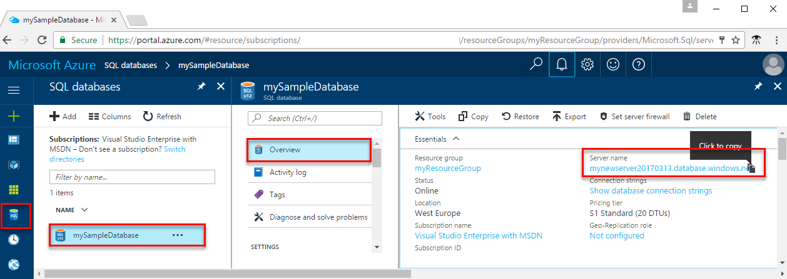

# Connect to the SSISDB Catalog database on Azure

Get the connection information you need to connect to the SSISDB Catalog database hosted on an Azure SQL Database server. You  need the following items to connect:
- fully qualified server name
- database name
- login information 

## Prerequisites
Before you start, make sure you have version 17.2 or later of SQL Server Management Studio. To download the latest version of SSMS, see [Download SQL Server Management Studio (SSMS)](https://docs.microsoft.com/sql/ssms/download-sql-server-management-studio-ssms).

## Get the connection info from the Azure portal
1. Log in to the [Azure portal](https://portal.azure.com/).
2. In the Azure portal, select **SQL Databases** from the left-hand menu, and then select the `SSISDB` database on the **SQL databases** page. 
3. On the **Overview** page for the `SSISDB` database, review the fully qualified server name as shown in the following image. Hover over the server name to bring up the **Click to copy** option.

     

4. If you have forgotten the login information for the SQL Database server, navigate to the SQL Database server page. There you can view the server admin name and, if necessary, reset the password.

## Connect with SSMS
1. Open SQL Server Management Studio.

2. **Connect to the server**. In the **Connect to Server** dialog box, enter the following information:

   | Setting       | Suggested value | Description | 
   | ------------ | ------------------ | ------------------------------------------------- | 
   | **Server type** | Database Engine | This value is required. |
   | **Server name** | The fully qualified server name | The name should be in this format: **mysqldbserver.database.windows.net**. |
   | **Authentication** | SQL Server Authentication | This quickstart uses SQL authentication. |
   | **Login** | The server admin account | This is the account that you specified when you created the server. |
   | **Password** | The password for your server admin account | This is the password that you specified when you created the server. |

3. **Connect to the SSISDB database**. Select **Options** to expand the **Connect to Server** dialog box. In the expanded **Connect to Server** dialog box, select the **Connection Properties** tab. In the **Connect to database** field, select or enter `SSISDB`.

4. Then select **Connect**.

5. In Object Explorer, expand **Integration Services Catalogs** and then expand **SSISDB** to view the objects in the SSIS Catalog database.

## Next steps
- Deploy a package. For more info, see [Deploy an SSIS project with SQL Server Management Studio (SSMS)](../ssis-everest-quickstart-deploy-ssms.md).
- Run a package. For more info, see [Run an SSIS package with SQL Server Management Studio (SSMS)](../ssis-everest-quickstart-run-ssms.md).
- Schedule a package. For more info, see [Schedule SSIS package execution on Azure](ssis-azure-schedule-packages.md)
