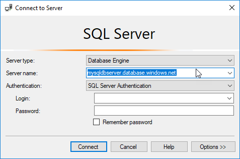
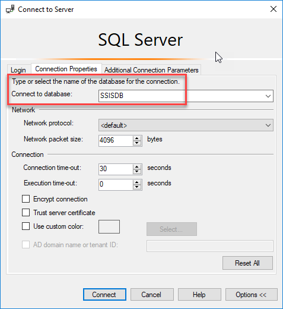

# Connect to the SSIS Catalog (SSISDB) in Azure

Find the connection information you need to connect to the SSIS Catalog (SSISDB) hosted on an Azure SQL Database server. You need the following items to connect:
- fully qualified server name
- database name
- login information 

> [!IMPORTANT]
> You can't create the SSISDB Catalog database on Azure SQL Database at this time independently of creating the Azure-SSIS Integration Runtime in Azure Data Factory version 2. The Azure-SSIS IR is the runtime environment that runs SSIS packages on Azure. For a walkthrough of the process, see [Deploy and run an SSIS package in Azure](https://docs.microsoft.com/azure/data-factory/tutorial-create-azure-ssis-runtime-portal). 

## Prerequisites
Before you start, make sure you have version 17.2 or later of SQL Server Management Studio (SSMS). If the SSISDB Catalog database is hosted on SQL Database Managed Instance (Preview), make sure you have version 17.6 or later of SSMS. To download the latest version of SSMS, see [Download SQL Server Management Studio (SSMS)](https://docs.microsoft.com/sql/ssms/download-sql-server-management-studio-ssms).

## Get the connection info from the Azure portal
1. Log in to the [Azure portal](https://portal.azure.com/).
2. In the Azure portal, select **SQL Databases** from the left-hand menu, and then select the `SSISDB` database on the **SQL databases** page. 
3. On the **Overview** page for the `SSISDB` database, review the fully qualified server name as shown in the following image. Hover over the server name to bring up the **Click to copy** option.

     

4. If you have forgotten the login information for the SQL Database server, navigate to the SQL Database server page. There you can view the server admin name and, if necessary, reset the password.

## Connect with SSMS
1. Open SQL Server Management Studio.

2. **Connect to the server**. In the **Connect to Server** dialog box, enter the following information:

   | Setting       | Suggested value | Description | 
   | ------------ | ------------------ | ------------------------------------------------- | 
   | **Server type** | Database Engine | This value is required. |
   | **Server name** | The fully qualified server name | The name should be in this format: **mysqldbserver.database.windows.net**. |
   | **Authentication** | SQL Server Authentication | |
   | **Login** | The server admin account | This is the account that you specified when you created the server. |
   | **Password** | The password for your server admin account | This is the password that you specified when you created the server. |

    

3. **Connect to the SSISDB database**. Select **Options** to expand the **Connect to Server** dialog box. In the expanded **Connect to Server** dialog box, select the **Connection Properties** tab. In the **Connect to database** field, select or enter `SSISDB`.

    > [!IMPORTANT]
    > If you don't select `SSISDB` when you connect, you may not see the SSIS Catalog in Object Explorer.

    

4. Then select **Connect**.

5. In Object Explorer, expand **Integration Services Catalogs** and then expand **SSISDB** to view the objects in the SSIS Catalog database.

    

## Next steps
- Deploy a package. For more info, see [Deploy an SSIS project with SQL Server Management Studio (SSMS)](../ssis-quickstart-deploy-ssms.md).
- Run a package. For more info, see [Run an SSIS package with SQL Server Management Studio (SSMS)](../ssis-quickstart-run-ssms.md).
- Schedule a package. For more info, see [Schedule SSIS packages in Azure](ssis-azure-schedule-packages.md)
