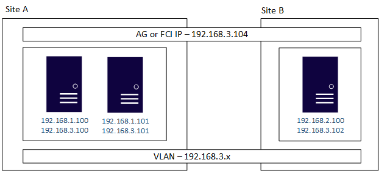

# Configure multiple-subnet Always On Availability Groups and failover cluster instances

[!INCLUDE[appliesto-ss-xxxx-xxxx-xxx-md-linuxonly](../includes/appliesto-ss-xxxx-xxxx-xxx-md-linuxonly.md)]

When an Always On Availability Group (AG) or failover cluster instance (FCI) spans more than one site, each site usually has its own networking. This often means that each site has its own IP addressing. For example, Site A’s addresses start with 192.168.1.*x* and Site B’s addresses start with 192.168.2.*x*, where *x* is the part of the IP address that is unique to the server. Without some sort of routing in place at the networking layer, these servers will not be able to communicate with each other. There are two ways to handle this scenario: set up a network that bridges the two different subnets, known as a VLAN, or configure routing between the subnets.

## VLAN-based solution
 
**Prerequisite**: For a VLAN-based solution, each server participating in an AG or FCI needs two network cards (NICs) for proper availability (a dual port NIC would be a single point of failure on a physical server), so that it can be assigned IP addresses on its native subnet as well as one on the VLAN. This is in addition to any other network needs, such as iSCSI, which also needs its own network.

The IP address creation for the AG or FCI is done on the VLAN. In the following example, the VLAN has a subnet of 192.168.3.*x*, so the IP address created for the AG or FCI is 192.168.3.104. Nothing additional needs to be configured, since there is a single IP address assigned to the AG or FCI.



## Configuration with Pacemaker

In the Windows world, a Windows Server Failover Cluster (WSFC) natively supports multiple subnets and handles multiple IP addresses via an OR dependency on the IP address. On Linux, there is no OR dependency, but there is a way to achieve a proper multi-subnet natively with Pacemaker, as shown by the following. You cannot do this by simply using the normal Pacemaker command line to modify a resource. You need to modify the cluster information base (CIB). The CIB is an XML file with the Pacemaker configuration.


### Update the CIB

1.  Export the CIB.

    **Red Hat Enterprise Linux (RHEL) and Ubuntu**

    ```bash
    sudo pcs cluster cib <filename>
    ```

    **SUSE Linux Enterprise Server (SLES)**

    ```bash
    sudo cibadmin -Q > <filename>
    ```

    Where *filename* is the name you want to call the CIB.

2.  Edit the file that was generated. Look for the `<resources>` section. You will see the various resources that were created for the AG or FCI. Find the one associated with the IP address. Add a `<instance attributes>` section with the information for the second IP address either above or below the existing one, but before `<operations>`. It will look something like the following syntax:

    ```xml
    <instance attributes id="<NameForAttribute>" score="<Score>">
        <rule id="<RuleName>" score="INFINITY">
            <expression id="<ExpressionName>" attribute="\#uname" operation="eq" value="<NodeNameInSubnet2>" />
        </rule>
        <nvpair id="<NameForSecondIP>" name="ip" value="<IPAddress>"/>
        <nvpair id="<NameForSecondIPNetmask>" name="cidr\_netmask" value="<Netmask>"/>
    </instance attributes>
    ```
    
    where *NameForAttribute* is the unique name for this attribute, *Score* is the number assigned to the attribute, which must be higher than the primary subnet’s, *RuleName* is the name of the rule, *ExpressionName* is the name of the expression, *NodeNameInSubnet2* is the name of the node in the other subnet, *NameForSecondIP* is the name associated with the second IP address, *IPAddress* is the IP address for the second subnet, *NameForSecondIPNetmask* is the name associated with the netmask, and *Netmask* is the netmask for the second subnet.
    
    The following shows an example.
    
    ```xml
    <instance attributes id="Node3-2nd-IP" score="2">
        <rule id="Subnet2-IP" score="INFINITY">
            <expression id="Subnet2-Node" attribute="\#uname" operation="eq" value="Node3" />
        </rule>
        <nvpair id="IP-In-Subnet-2" name="ip" value="192.168.2.102"/>
        <nvpair id="Netmask-For-IP2" name="cidr\_netmask" value="24" />
    </instance attributes>
    ```

3.  Import the modified CIB and reconfigure Pacemaker.

    **RHEL/Ubuntu**
    
    ```bash
    sudo pcs cluster cib-push <filename>
    ```

    **SLES**
    
    ```bash
    sudo cibadmin -R -x <filename>
    ```

    where *filename* is the name of the CIB file with the modified IP address information.

### Check and verify failover

1.  After the CIB is successfully applied with the updated configuration, ping the DNS name associated with the IP address resource in Pacemaker. It should reflect the IP address associated with the subnet currently hosting the AG or FCI.
2.  Fail the AG or FCI to the other subnet.
3.  After the AG or FCI is fully online, ping the DNS name associated with the IP address. It should reflect the IP address in the second subnet.
4.  If desired, fail the AG or FCI back to the original subnet.
