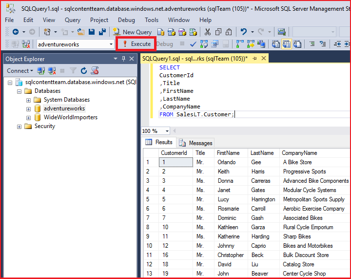

---
# required metadata

title: Connect and query SQL Server on Linux (SSMS) | SQL Server vNext CTP1
description: 
author: rothja 
ms.author: jroth 
manager: jhubbard
ms.date: 10-28-2016
ms.topic: article
ms.prod: sql-non-specified
ms.service: 
ms.technology: 
ms.assetid: 

# optional metadata

# keywords: ""
# ROBOTS: ""
# audience: ""
# ms.devlang: ""
# ms.reviewer: ""
# ms.suite: ""
# ms.tgt_pltfrm: ""
# ms.custom: ""

---
# Connect and query SQL Server on Linux (SSMS)
This topic is a walkthrough for using SQL Server Management Studio (SSMS) to connect and query SQL Server vNext CTP1 on Linux.

This article shows how to connect to an Azure SQL database using SQL Server Management Studio (SSMS). After successfully connecting, we run a simple Transact-SQL (T-SQL) query to verify communication with the database.

[!include[SSMS Install](../../includes/sql-server-management-studio-install.md)]

[!include[SSMS Connect](../../includes/sql-database-sql-server-management-studio-connect-server-principal.md)]

## Run sample queries

After you connect to your server, you can connect to a database and run a sample query. If you are new to writing queries, see [Writing Transact-SQL Statements](https://msdn.microsoft.com/library/ms365303.aspx).

1. In **Object Explorer**, navigate to a database on the server, such as the **AdventureWorks** sample database.
2. Right-click the database and then select **New Query**:

	

3. In the query window, copy and paste the following:

		SELECT
		CustomerId
		,Title
		,FirstName
		,LastName
		,CompanyName
		FROM SalesLT.Customer;

4. Click the **Execute** button:

	

## Next steps

You can use T-SQL statements to create and manage databases in Azure in much the same way you can with SQL Server.

If you're new to T-SQL, see [Tutorial: Writing Transact-SQL Statements](https://msdn.microsoft.com/library/ms365303.aspx) and the [Transact-SQL Reference (Database Engine)](https://msdn.microsoft.com/library/bb510741.aspx).

For more information on how to use SSMS, see [Use SQL Server Management Studio](https://msdn.microsoft.com/library/ms174173.aspx).
