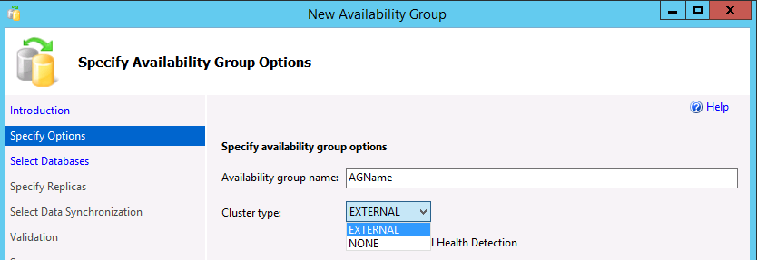
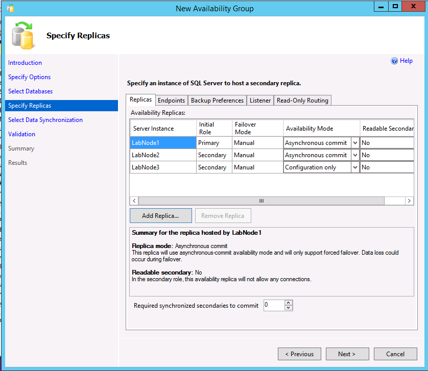

# Create an availability group for SQL Server on Linux

[!INCLUDE[tsql-appliesto-sslinux-only](../includes/tsql-appliesto-sslinux-only.md)]

This article covers how to use SQL Server Management Studio (SSMS) or Transact-SQL to create an availability group (AG) for SQL Server on Linux.

## Prerequisite
Ensure that the endpoints are already created on all replicas, using the certificate process described in [Create endpoints and certificates](sql-server-linux-create-ag-endpoints.md).

## Use SQL Server Management Studio

This section shows how to create an AG with a cluster type of External using SSMS with the New Availability Group Wizard.

1.  In SSMS, expand **Always On High Availability**, right click **Availability Groups**, and select **New Availability Group Wizard**.

2.  On the Introduction dialog, click **Next**.

3.  In the Specify Availability Group Options dialog, enter a name for the availability group and select a cluster type of EXTERNAL or NONE in the dropdown. External should be used when Pacemaker will be deployed. None is for specialized scenarios, such as read scale out. Selecting the option for database level health detection is optional. For more information on this option, see [Availability group database level health detection failover option](../database-engine/availability-groups/windows/sql-server-always-on-database-health-detection-failover-option.md). Click **Next**.

    

4.  In the Select Databases dialog, select the database(s) that will participate in the AG. Each database must have a full backup before it can be added to an AG. Click **Next**.

5.  In the Specify Replicas dialog, click **Add Replica**.

6.  In the Connect to Server dialog, enter the name of the Linux instance of SQL Server that will be the secondary replica, and the credentials to connect. Click **Connect**.

7.  Repeat steps 6 and 7 for the instance that will contain a configuration-only replica or another secondary replica.

8.  All three instances should now be listed on the Specify Replicas dialog. If using a cluster type of External, for the secondary replica that will be a true secondary, make sure the Availability Mode matches that of the primary replica and failover mode is set to External. For the configuration-only replica, select an availability mode of Configuration only.

    The following example shows an AG with two replicas, a cluster type of External, and a configuration-only replica.

    

    The following example shows an AG with two replicas, a cluster type of None, and a configuration-only replica.

    

9.  If you want to alter the backup preferences, click on the Backup Preferences tab. For more information on backup preferences with AGs, see [Configure backup on availability replicas](../database-engine/availability-groups/windows/configure-backup-on-availability-replicas-sql-server.md).

10. If using readable secondaries or creating an AG with a cluster type of None for read-scale, you can create a listener by selecting the Listener tab. A listener can also be added later. To create a listener, choose the option **Create an availability group listener** and enter a name, a TCP/IP port, and whether to use a static or automatically assigned DHCP IP address. Remember that for an AG with a cluster type of None, the IP should be static and set to the primary’s IP address.

    

11. If a listener is created for readable scenarios, SSMS 17.3 or later allows the creation of the read-only routing in the wizard. It can also be added later via SSMS or Transact-SQL. To add read-only routing now:

    a.  Select the Read-Only Routing tab.

    b.  Enter the URLs for the read-only replicas. These URLs are similar to the endpoints, except they use the port of the instance, not the endpoint.

    c.  Select each URL and from the bottom, select the readable replicas. To multi-select, hold down SHIFT or click-drag.

12. Click **Next**.

13. Choose how the secondary replica(s) will be initialized. The default is to use [automatic seeding](../database-engine/availability-groups/windows/automatically-initialize-always-on-availability-group.md), which requires the same path on all servers participating in the AG. You can also have the wizard do a backup, copy, and restore (the second option); have it join if you have manually backed up, copied, and restored the database on the replica(s) (third option); or add the database later (last option). As with certificates, if you are manually making backups and copying them, permissions on the backup files will need to be set on the other replica(s). Click **Next**.

14. On the Validation dialog, if everything does not come back as Success, investigate. Some warnings are acceptable and not fatal, such as if you do not create a listener. Click **Next**.

15. On the Summary dialog, click **Finish**. The process to create the AG will now begin.

16. When the AG creation is complete, click **Close** on the Results. You can now see the AG on the replicas in the dynamic management views as well as under the Always On High Availability folder in SSMS.

## Use Transact-SQL

This section will show examples of creating an AG using Transact-SQL. The listener and read-only routing can be configured after the AG is created. The AG itself can be modified with `ALTER AVAILABILITY GROUP`, but changing the cluster type cannot be done in SQL Server 2017. If you did not mean to create an AG with a cluster type of External, you must delete it and recreate it with a cluster type of None. More information and other options can be found at the following links:

-   [CREATE AVAILABILITY GROUP (Transact-SQL)](../t-sql/statements/create-availability-group-transact-sql.md)
-   [ALTER AVAILABILITY GROUP (Transact-SQL)](../t-sql/statements/alter-availability-group-transact-sql.md)
-   [Configure Read-Only Routing for an Availability Group (SQL Server)](../database-engine/availability-groups/windows/configure-read-only-routing-for-an-availability-group-sql-server.md)
-   [Create or Configure an Availability Group Listener (SQL Server)](../database-engine/availability-groups/windows/create-or-configure-an-availability-group-listener-sql-server.md)

### Example One – Two replicas with a configuration-only replica (External cluster type)

This example shows how to create a two-replica AG that uses a configuration-only replica.

1.  Execute on the node that will be the primary replica containing the fully read/write copy of the database(s). This example uses automatic seeding.

    ```t-sql
    CREATE AVAILABILITY GROUP [<AGName>]
    WITH (CLUSTER_TYPE = EXTERNAL)
    FOR DATABASE <DBName>
    REPLICA ON N'LinAGN1' WITH (
       ENDPOINT_URL = N' TCP://LinAGN1.FullyQualified.Name:5022',
       FAILOVER_MODE = EXTERNAL,
       AVAILABILITY_MODE = SYNCHRONOUS_COMMIT),
    N'LinAGN2' WITH (
       ENDPOINT_URL = N'TCP://LinAGN2.FullyQualified.Name:5022',
       FAILOVER_MODE = EXTERNAL,
       AVAILABILITY_MODE = SYNCHRONOUS_COMMIT,
       SEEDING_MODE = AUTOMATIC),
    N'LinAGN3' WITH (
       ENDPOINT_URL = N'TCP://LinAGN3.FullyQualified.Name:5022',
       AVAILABILITY_MODE = CONFIGURATION_ONLY);
       
    GO
>```

1.  In a query window connected to the other replica, execute the following to join the replica to the AG and initiate the seeding process from the primary to the secondary replica.

    
    ```t-sql
    ALTER AVAILABILITY GROUP [<AGName>] JOIN WITH (CLUSTER_TYPE = EXTERNAL);
    
    GO
    
    ALTER AVAILABLITY GROUP [<AGName>] GRANT CREATE ANY DATABASE;

    GO
    ```

2.  In a query window connected to the configuration only replica, join it to the AG.

   ```t-sql
    ALTER AVAILABILITY GROUP [<AGName>] JOIN WITH (CLUSTER_TYPE = EXTERNAL);

    GO
    ```

### Example Two – Three replicas with read-only routing (External cluster type)

This example shows three full replicas and how read-only routing can be configured as part of the initial AG creation.

1.  Execute on the node that will be the primary replica containing the fully read/write copy of the database(s). This example uses automatic seeding.

    ```t-sql
    CREATE AVAILABILITY GROUP [<AGName>]
    WITH (CLUSTER_TYPE = EXTERNAL)
    FOR DATABASE <DBName>
    REPLICA ON N'LinAGN1'
    WITH (
       ENDPOINT_URL = N'TCP://LinAGN1.FullyQualified.Name:5022',
       FAILOVER_MODE = EXTERNAL,
       AVAILABILITY_MODE = SYNCHRONOUS_COMMIT,
       PRIMARY_ROLE (ALLOW_CONNECTIONS = READ_WRITE, READ_ONLY_ROUTING_LIST = (('LinAGN2.FullyQualified.Name', 'LinAGN3.FullyQualified.Name'))),
       SECONDARY_ROLE (ALLOW_CONNECTIONS = ALL, READ_ONLY_ROUTING_URL = N'TCP://LinAGN1.FullyQualified.Name:1433')),
    N'LinAGN2' WITH (
       ENDPOINT_URL = N'TCP://LinAGN2.FullyQualified.Name:5022',
       FAILOVER_MODE = EXTERNAL,
       SEEDING_MODE = AUTOMATIC,
       AVAILABILITY_MODE = SYNCHRONOUS_COMMIT,
       PRIMARY_ROLE (ALLOW_CONNECTIONS = READ_WRITE, READ_ONLY_ROUTING_LIST = (('LinAGN1.FullyQualified.Name', 'LinAGN3.FullyQualified.Name'))),
       SECONDARY_ROLE (ALLOW_CONNECTIONS = ALL, READ_ONLY_ROUTING_URL = N'TCP://LinAGN2.FullyQualified.Name:1433')),
    N'LinAGN3' WITH (
       ENDPOINT_URL = N'TCP://LinAGN3.FullyQualified.Name:5022',
       FAILOVER_MODE = EXTERNAL,
       SEEDING_MODE = AUTOMATIC,
       AVAILABILITY_MODE = SYNCHRONOUS_COMMIT,
       PRIMARY_ROLE (ALLOW_CONNECTIONS = READ_WRITE, READ_ONLY_ROUTING_LIST = (('LinAGN1.FullyQualified.Name', 'LinAGN2.FullyQualified.Name'))),
       SECONDARY_ROLE (ALLOW_CONNECTIONS = ALL, READ_ONLY_ROUTING_URL = N'TCP://LinAGN3.FullyQualified.Name:1433'))
    LISTENER '<ListenerName>' (WITH IP = ('<IPAddress>', '<SubnetMask>'), Port = 1433);
    GO
    ```
    
    A few things to note about this configuration:
    
    - *AGName* is the name of the availability group.
    - *DBName* is the name of the database that will be used with the availability group. It can also be a list of names separated by commas.
    - *ListenerName* is a name that is different than any of the underlying servers/nodes. It will be registered in DNS along with *IPAddress*.
    - *IPAddress* is an IP address that is associated with *ListenerName*. It is also unique and not the same as any of the servers/nodes. Applications and end users will use either *ListenerName* or *IPAddress* to connect to the AG.
    - *SubnetMask* is the subnet mask of *IPAddress*; for example, 255.255.255.0.

2.  In a query window connected to the other replica, execute the following to join the replica to the AG and initiate the seeding process from the primary to the secondary replica.
    
    ```t-sql
    ALTER AVAILABILITY GROUP [<AGName>] JOIN WITH (CLUSTER_TYPE = EXTERNAL);
    
    GO
    
    ALTER AVAILABLITY GROUP [<AGName>] GRANT CREATE ANY DATABASE;
    
    GO
    ```
    
3.  Repeat Step 2 for the third replica.

### Example Three – Two replicas with read-only routing (None cluster type)

This example shows the creation of a two-replica configuration using a cluster type of None. It is used for the read scale scenario where no failover is expected,. This creates the listener that is actually the primary replica, as well as the read-only routing, using the round robin functionality.

1.  Execute on the node that will be the primary replica containing the fully read/write copy of the database(s). This example uses automatic seeding.

    ```t-sql
    CREATE AVAILABILITY GROUP [<AGName>]
    WITH (CLUSTER_TYPE = NONE)
    FOR DATABASE <DBName>
    REPLICA ON N'LinAGN1'
    WITH (
       ENDPOINT_URL = N'TCP://LinAGN1.FullyQualified.Name: <PortOfEndpoint>',
       FAILOVER_MODE = MANUAL,
       AVAILABILITY_MODE = ASYNCHRONOUS_COMMIT,
       PRIMARY_ROLE (ALLOW_CONNECTIONS = READ_WRITE, READ_ONLY_ROUTING_LIST = (('LinAGN1.FullyQualified.Name'.'LinAGN2.FullyQualified.Name'))),
       SECONDARY_ROLE (ALLOW_CONNECTIONS = ALL, READ_ONLY_ROUTING_URL = N'TCP://LinAGN1.FullyQualified.Name:<PortOfInstance>'));
    N'LinAGN2' WITH (
       ENDPOINT_URL = N'TCP://LinAGN2.FullyQualified.Name:<PortOfEndpoint>',
       FAILOVER_MODE = MANUAL,
       SEEDING_MODE = AUTOMATIC,
       AVAILABILITY_MODE = ASYNCHRONOUS_COMMIT,
       PRIMARY_ROLE (ALLOW_CONNECTIONS = READ_WRITE, READ_ONLY_ROUTING_LIST = (('LinAGN1.FullyQualified.Name', 'LinAGN2.FullyQualified.Name'))),
       SECONDARY_ROLE (ALLOW_CONNECTIONS = ALL, READ_ONLY_ROUTING_URL =N'TCP://LinAGN2.FullyQualified.Name:<PortOfInstance>'));
    LISTENER '<ListenerName>' (WITH IP = ('<PrimaryReplicaIPAddress>', '<SubnetMask>'), Port = <PortOfListener>);
    
    GO
    ```
    
    Where
    - *AGName* is the name of the availability group.
    - *DBName* is the name of the database that will be used with the availability group. It can also be a list of names separated by commas.
    - *PortOfEndpoint* is the port number used by the endpoint created.
    - *PortOfInstance* is the port number used by the instance of SQL Server.
    - *ListenerName* is a name that is different than any of the underlying replicas but will not actually be used.
    - *PrimaryReplicaIPAddress* is the IP address of the primary replica.
    - *SubnetMask* is the subnet mask of *IPAddress*. For example, 255.255.255.0.
    
2.  Join the secondary replica to the AG and initiate automatic seeding.
    
    ```t-sql
    ALTER AVAILABILITY GROUP` [<AGName>] JOIN WITH (CLUSTER_TYPE = NONE);
    
    GO
    
    ALTER AVAILABILITY GROUP` [<AGName>] GRANT CREATE ANY DATABASE;
    
    GO
    ```


