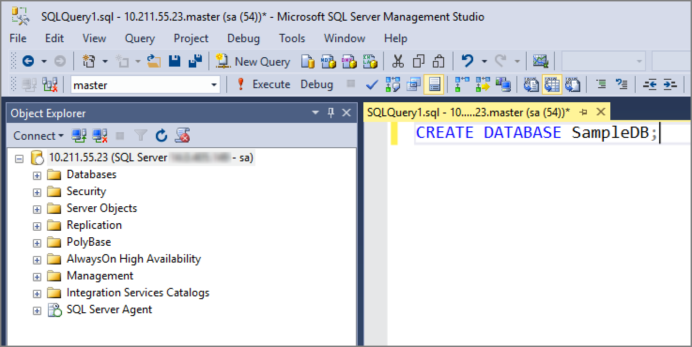
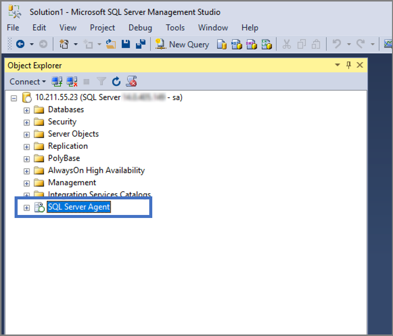
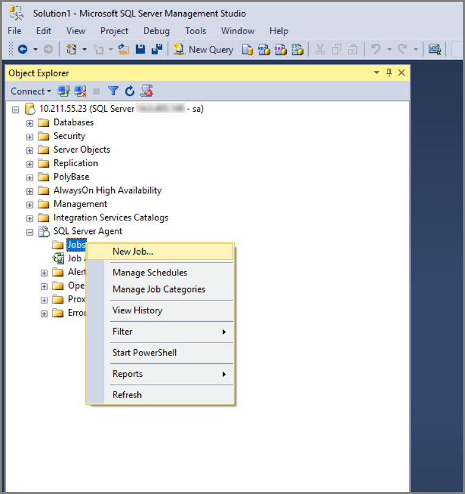
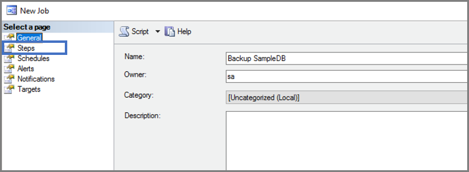
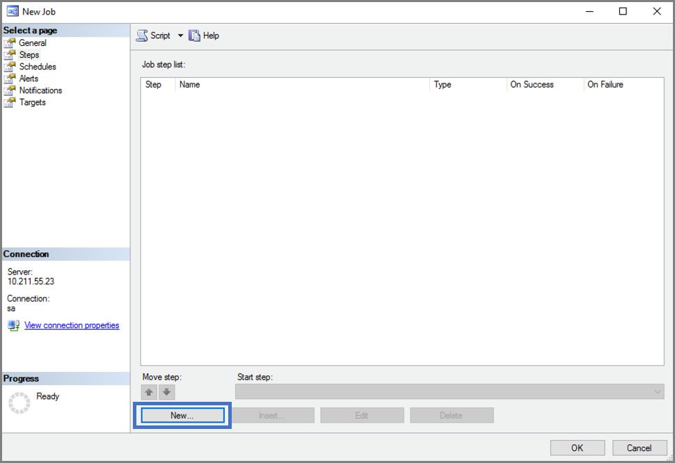
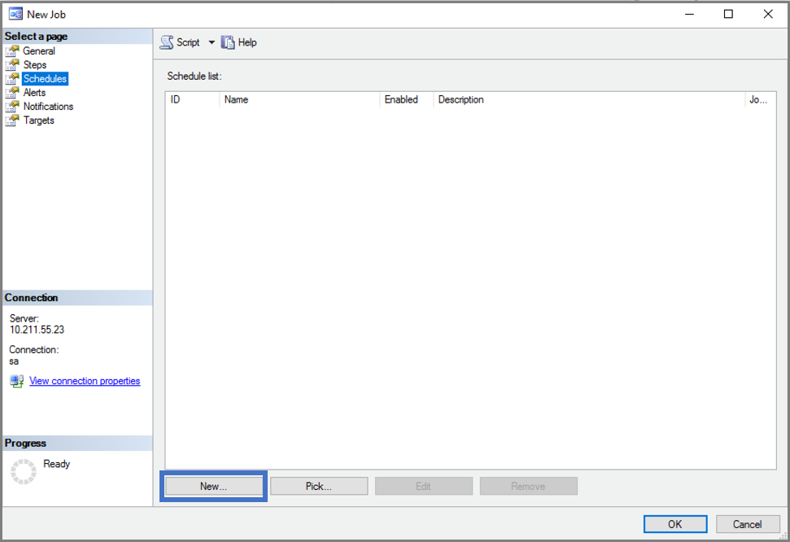
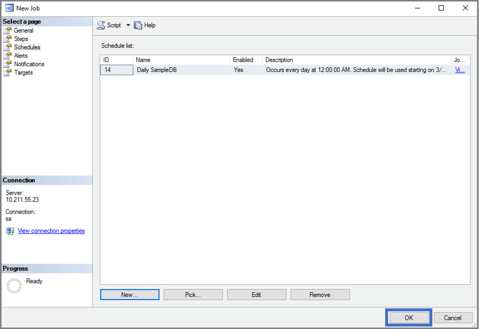
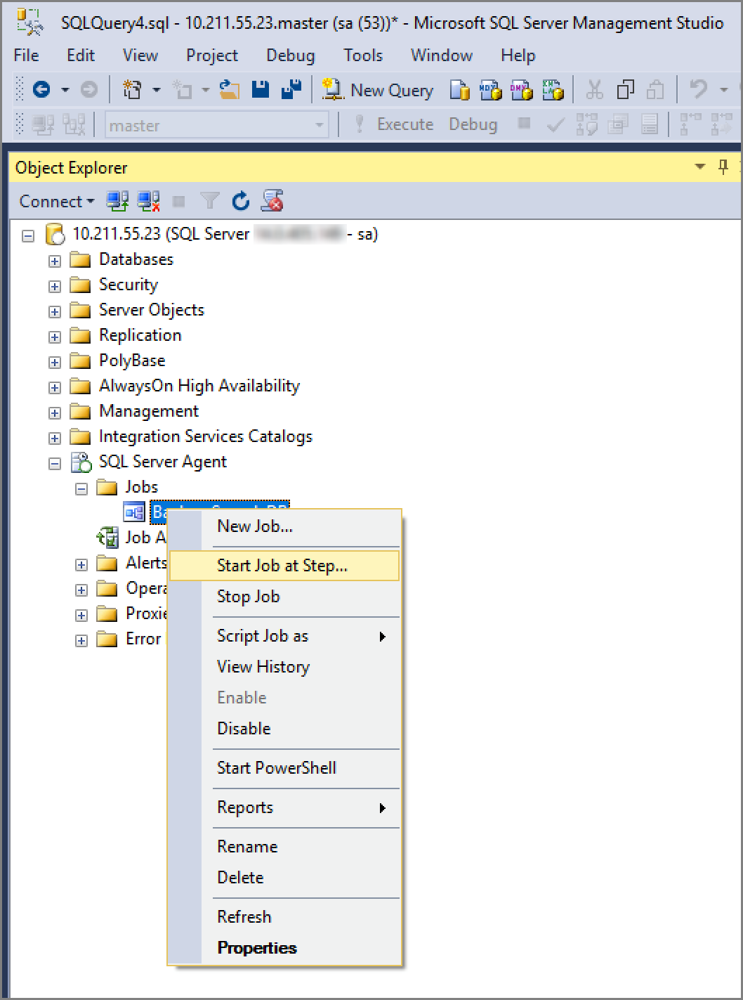

---
# required metadata

title: Create and run jobs for SQL Server on Linux | Microsoft Docs
description: This tutorial shows how to run SQL Server Agent job on Linux.
author: rothja 
ms.author: jroth 
manager: jhubbard
ms.date: 03/15/2017
ms.topic: article
ms.prod: sql-linux
ms.technology: database-engine
ms.assetid: 1d93d95e-9c89-4274-9b3f-fa2608ec2792

# optional metadata

# keywords: ""
# ROBOTS: ""
# audience: ""
# ms.devlang: ""
# ms.reviewer: ""
# ms.suite: ""
# ms.tgt_pltfrm: ""
# ms.custom: ""

---

# Create and run SQL Server Agent jobs on Linux
SQL Server jobs are used to regularly perform the same sequence of commands in your SQL Server database. This topic provides examples of how to create SQL Server Agent jobs on Linux using both Transact-SQL and SQL Server Management Studio (SSMS).

For known issues with SQL Server Agent in this release, see the [Release Notes](sql-server-linux-release-notes.md).

## Prerequisites 
To create and run jobs, you must first install the SQL Server Agent service. For installation instructions, see the [SQL Server Agent installation topic](sql-server-linux-setup-sql-agent.md).

## Create a job with Transact-SQL

The following steps provide an example of how to create a SQL Server Agent job on Linux with Transact-SQL commands. These job in this example runs a daily backup on a sample database `SampleDB`. 


> [!TIP]
> You can use any T-SQL client to run these commands. For example, on Linux you can use [sqlcmd](sql-server-linux-connect-and-query-sqlcmd.md) or [Visual Studio Code](sql-server-linux-develop-use-vscode.md). From a remote Windows Server, you can also run queries in SQL Server Management Studio (SSMS) or use the UI interface for job management, which is described in the next section.

1. **Create the job**. The following example uses [sp_add_job](https://msdn.microsoft.com/library/ms182079.aspx) to create a job named `Daily AdventureWorks Backup`.

    ```tsql
     -- Adds a new job executed by the SQLServerAgent service 
     -- called 'Daily AdventureWorks Backup'  
     CREATE DATABASE SampleDB
     USE msdb ;  
     GO  
     EXEC dbo.sp_add_job  
         @job_name = N'Daily SampleDB Backup' ;  
     GO

    ```

2. **Add one or more job steps**. The following Transact-SQL script uses [sp_add_jobstep](https://msdn.microsoft.com/library/ms187358.aspx) to create a job step that creates a backup of the `AdventureWlorks2014` database.

    ```tsql
    -- Adds a step (operation) to the job  
	EXEC sp_add_jobstep  
      @job_name = N'Daily SampleDB Backup',  
      @step_name = N'Backup database',  
      @subsystem = N'TSQL',  
      @command = N'BACKUP DATABASE SampleDB TO DISK = \
      N''/var/opt/mssql/data/SampleDB.bak'' WITH NOFORMAT, NOINIT, \
              NAME = ''SampleDB-full'', SKIP, NOREWIND, NOUNLOAD, STATS = 10',   
      @retry_attempts = 5,  
      @retry_interval = 5 ;  
 	GO
    ```

3. **Create a job schedule**. This example uses [sp_add_schedule](https://msdn.microsoft.com/library/ms366342.aspx) to create a daily schedule for the job.

    ```tsql
    -- Creates a schedule called 'Daily'  
    EXEC dbo.sp_add_schedule  
     @schedule_name = N'Daily SampleDB',  
     @freq_type = 4,  
     @freq_interval = 1,
     @active_start_time = 233000 ;  
   USE msdb ;  
   GO
    ```

4. **Attach the job schedule to the job**. Use [sp_attach_schedule](https://msdn.microsoft.com/library/ms186766.aspx) to attach the job schedule to the job.

    ```tsql
    -- Sets the 'Daily' schedule to the 'Daily AdventureWorks Backup' Job  
    EXEC sp_attach_schedule  
     @job_name = N'Daily SampleDB Backup',  
     @schedule_name = N'Daily SampleDB';  
    GO
    ```

5. **Assign the job to a target server**. Assign the job to a target server with [sp_add_jobserver](https://msdn.microsoft.com/library/ms178625.aspx). In this example, the local server is the target.

    ```tsql
    EXEC dbo.sp_add_jobserver  
     @job_name = N'Daily SampleDB Backup',  
     @server_name = N'(LOCAL)';  
    GO
    ```
6. **Start the job**. 

    ```tsql
 	EXEC dbo.sp_add_jobserver  
     @job_name = N'Daily SampleDB Backup',  
     @server_name = N'(LOCAL)';  
 	GO
    ```
## Create a job with SSMS

You can also create and manage jobs remotely using SQL Server Management Studio (SSMS) on Windows.

1. **Start SSMS on Windows and connect to your Linux SQL Server instance.** For more information, see [Manage SQL Server on Linux with SSMS](sql-server-linux-develop-use-ssms.md).

1. **Create a new database named SampleDB**.

    

2. **Verify that SQL Agent was installed and configured correctly.** Look for the plus sign next to SQL Server Agent in the Object Explorer. If SQL Server Agent is not installed, see [Install SQL Server Agent on Linux](sql-server-linux-setup-sql-agent.md).

    


3. **Create a new job.**

    


4. **Give your job a name and create your job step.**

    


5. **Specify what subsystem you want to use and what the job step should do.**

    

    

6. **Create a new job schedule.**

    
  
    

7. **Start your job.**

    

## Next Steps

For more information about creating and managing SQL Server Agent jobs, see [SQL Server Agent](https://docs.microsoft.com/sql/ssms/agent/sql-server-agent).
