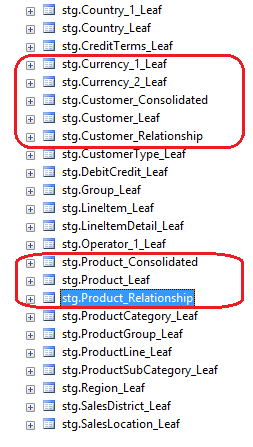

# Overview: Importing Data from Tables (Master Data Services)
  Once you've created a model for your data in [!INCLUDE[ssMDSshort](../includes/ssmdsshort-md.md)], you can start adding data and make changes to data.   You use [!INCLUDE[ssMDSshort](../includes/ssmdsshort-md.md)] staging tables, stored procedures and Master Data Manager .  
  
 For instructions on how to add and modify data, see [Import Data from Tables &#40;Master Data Services&#41;](../master-data-services/import-data-from-tables-master-data-services.md).  
  
> [!NOTE]  
>  You can also use the [!INCLUDE[ssNoVersion](../includes/ssnoversion-md.md)][!INCLUDE[ssMDSshort](../includes/ssmdsshort-md.md)][!INCLUDE[ssMDSXLS](../includes/ssmdsxls-md.md)], to add data to the MDS repository ([!INCLUDE[ssMDSshort](../includes/ssmdsshort-md.md)] database) from Excel. For more information, see [Overview: Importing Data from Excel &#40;MDS Add-in for Excel&#41;](../master-data-services/microsoft-excel-add-in/overview-importing-data-from-excel-mds-add-in-for-excel.md).  
  
 When you add and modify data, you can do the following.  
  
-   Load and update members, and update attribute values  
  
-   Deactivate and delete members  
  
-   Move explicit hierarchy members  
  
 Adding and updating data  includes the following main tasks.  
  
1.  Load data into the staging tables in the [!INCLUDE[ssMDSshort](../includes/ssmdsshort-md.md)] database.  
  
2.  Load the data from the staging tables into the appropriate [!INCLUDE[ssMDSshort](../includes/ssmdsshort-md.md)] tables.  
  
     You use staging stored procedures or [!INCLUDE[ssMDSmdm](../includes/ssmdsmdm-md.md)] to load the data.  
  
> [!NOTE]  
>  In [!INCLUDE[ssSQL15](../includes/sssql15-md.md)], support for the [!INCLUDE[ssKilimanjaro](../includes/sskilimanjaro-md.md)] staging processes is deprecated.  
  
## Deactivating and Deleting Members (MDS)  
 Deactivating means the member can be reactivated. If you reactivate a member, its attributes and its membership in hierarchies and collections are restored. All previous transactions are intact. Deactivation transactions are visible to administrators in the **Version Management** functional area of the Master Data Manager.  
  
 Deleting means purging the member from the system permanently. All transactions for the member, all relationships, and all attributes are permanently deleted.  
  
> [!NOTE]  
>  You cannot use staging to reactivate members. You must do it manually in the Master Data Manager. For more information, see [Reactivate a Member or Collection &#40;Master Data Services&#41;](../master-data-services/reactivate-a-member-or-collection-master-data-services.md).  
>   
>  You cannot use staging to delete or deactivate collections. For more information on manually deactivating collections, see [Delete a Member or Collection &#40;Master Data Services&#41;](../master-data-services/delete-a-member-or-collection-master-data-services.md).  
  
## Moving explicit hierarchy members (MDS)  
 When you move the location of members in explicit hierarchies in bulk, you can designate the following.  
  
-   A consolidated member as a parent of a consolidated member.  
  
-   A consolidated member as a parent of a leaf member.  
  
-   A leaf member as a sibling of a leaf or consolidated member.  
  
-   A consolidated member as a sibling of a leaf or consolidated member.  
  
## Staging Tables and Stored Procedures (MDS)  
 The [!INCLUDE[ssMDSshort](../includes/ssmdsshort-md.md)] database includes the following types of staging tables that you can populate with your  data.  
  
-   [Leaf Member Staging Table &#40;Master Data Services&#41;](../master-data-services/leaf-member-staging-table-master-data-services.md)  
  
-   [Consolidated Member Staging Table &#40;Master Data Services&#41;](../master-data-services/consolidated-member-staging-table-master-data-services.md)  
  
-   [Relationship Staging Table &#40;Master Data Services&#41;](../master-data-services/relationship-staging-table-master-data-services.md)  
  
 For each entity in the model, there is a staging table. The table name indicates the corresponding entity, and the entity type such as leaf member. The following image shows the staging tables for the currency, customer, and product entities.  
  
   
  
 The name of the  table is specified when an entity is created and cannot be changed. If the staging table name contains a _1 or other number, another table of that name already existed when the entity was created.  
  
 The [!INCLUDE[ssMDSshort](../includes/ssmdsshort-md.md)] includes the following types of staging stored procedures.  
  
-   stg.udp_\<name>_Leaf  
  
-   stg.udp_\<name>_Consolidated  
  
-   stg.udp_\<name>_Relationship  
  
 For each entity in the model, there are three stored procedures that correspond to the leaf member, consolidated member, and relationship staging tables.  The following image shows the staging stored procedures for the currency, customer, and product entities.  
  
   
  
 For more information on the stored procedures, see [Staging Stored Procedure &#40;Master Data Services&#41;](../master-data-services/staging-stored-procedure-master-data-services.md).  
  
## Logging Transactions (MDS)  
 All transactions that occur when data or relationships are imported or updated can be logged. An option in the stored procedure allows this logging. If you initiate the staging process using [!INCLUDE[ssMDSmdm](../includes/ssmdsmdm-md.md)], no logging occurs.  
  
 In [!INCLUDE[ssMDScfgmgr](../includes/ssmdscfgmgr-md.md)], the **Log staging transactions** setting does not apply to this method of staging data.  
  
## Related Content  
  
-   [Validation &#40;Master Data Services&#41;](../master-data-services/validation-master-data-services.md)  
  
-   [Business Rules &#40;Master Data Services&#41;](../master-data-services/business-rules-master-data-services.md)  
  
  