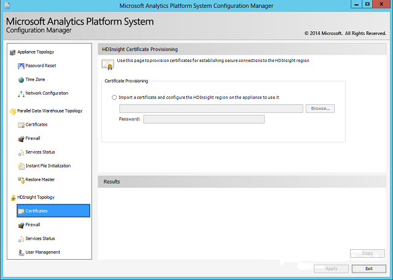

# HDInsight Certificate Provisioning (Analytics Platform System)
The **Certificates** page of the Analytics Platform System**Configuration Manager** imports or removes the certificate on the HDInsight region of the Analytics Platform System. Using a certificate to encrypt connections can help secure communication that connect to Analytics Platform System.  
  
## Before You Begin  
Analytics Platform System supports using a certificate to encrypt connections to HDInsight. Use a certificate to help secure connections to the HDInsight gateway on port 443 and the HDInsight Developer dashboard on port 81. For more information about connecting to the Developer dashboard, see [HDInsight Region Developer Dashboard &#40;Analytics Platform System&#41;](../hdinsight/hdinsight-region-developer-dashboard-analytics-platform-system.md).  
  
If you are using the [Microsoft Hive ODBC Driver](http://www.microsoft.com/en-us/download/details.aspx?id=40886) to connect to HDInsight from BI, analytics, and reporting tools, a trusted certificate is required.  
  
1.  For security reasons, obtain a trusted certificate that is issued to HSN01 (Secure Gateway and HDI Developer Dashboard). For more information about how to obtain a secure certificate, contact Microsoft Support.  
  
2.  Save the certificate to the Control node (CTL01) in a password-protected PFX file.  The Configuration Manager will expect the certificate to be located on the Control node and will import the certificate to HSN01.  
  
## Import or Remove the Certificate  
The following instructions show how to use the Configuration Manager to import or remove the appliance certificate.  This is the only supported way to manage the certificate.  
  
> [!IMPORTANT]  
> We don't support using Windows HTTP Services Certificate Configuration Tool (**winHttpCertCfg.exe**) to manage the certificate.  
  
### To import the certificate  
  
1.  Launch the Configuration Manager. For more information, see [Launch the Configuration Manager &#40;Analytics Platform System&#41;](../management/launch-the-configuration-manager-analytics-platform-system.md).  
  
2.  In the left pane of the **Configuration Manager**, expand **HDInsight Topology**, and then click **Certificates**.  
  
3.  Select **Import a certificate and configure the appliance to use it**, and then click **Browse** to browse to and select the certificate file.  
  
4.  Enter the password for the certificate in the **Password** field.  
  
5.  Click **Apply** to configure the certificate for the appliance.  
  
Analytics Platform System will not encrypt current connection by using the imported certificate, but will use the certificate for new connections.  
  
### To remove the previously imported certificate  
  
1.  Launch the **Configuration Manager**. For more information, see [Launch the Configuration Manager &#40;Analytics Platform System&#41;](../management/launch-the-configuration-manager-analytics-platform-system.md).  
  
2.  In the left pane of the **Configuration Manager**, expand **HDInsight Topology**, and then click **Certificates**.  
  
3.  Select **Remove any certificate provisioned in the appliance**.  
  
4.  Click **Apply** to remove the previously imported certificate from the appliance.  
  
Analytics Platform System will continue to encrypt current connections, but will not use the removed certificate for new connections.  
  
  
  
## See Also  
[Launch the Configuration Manager &#40;Analytics Platform System&#41;](../management/launch-the-configuration-manager-analytics-platform-system.md)  
  
