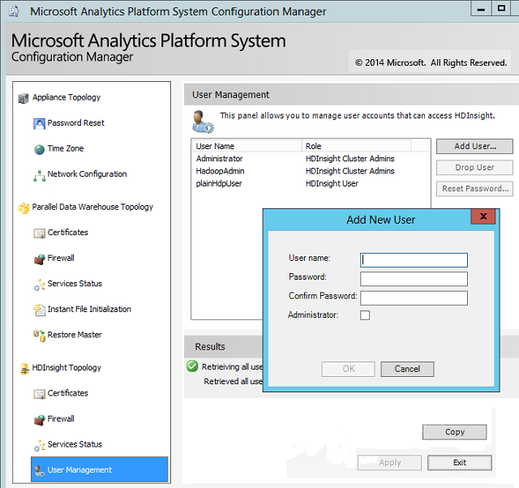

# HDInsight User Management (Analytics Platform System)
Use the HDInsight **User Management** page in the MicrosoftAnalytics Platform System Configuration Manager to manage user for the HDInsight Region. For more information about selecting the right type of HDInsight user for your purpose, see the user definitions in the **HDInsight Security Model Overview** section of [Understanding the Security Model of the HDInsight Region &#40;Analytics Platform System&#41;](../hdinsight/understanding-the-security-model-of-the-hdinsight-region-analytics-platform-system.md).  
  
#### To manage HDInsight users  
  
1.  Start the Configuration Manager tool.  
  
    For information about starting the Configuration Manager, see [Launch the Configuration Manager &#40;Analytics Platform System&#41;](../management/launch-the-configuration-manager-analytics-platform-system.md).  
  
2.  Click **HDInsight Topology**.  
  
3.  Click **User Management**.  
  
4.  On the **HDInsight User Management** page, manage users by clicking **Add User**, **Drop User**, or **Reset password**.  
  
  
  
### Creating Additional Administrator Accounts  
Administrators can create additional user accounts in the **HDInsight Cluster Admin** role. Members of that role can remotely connect to cluster nodes and use Hadoop command line tools. To gain full permissions in the Hadoop cluster additional steps are needed. The first time a new administrator connects to the server, the new administrator should create a home folder in HDFS. Complete the following steps to create a home folder.  
  
1.  Remotely connect to the head node. This is a two-step process that first connects to the **HSN01** node. For more information, see [Connecting to HDInsight Using Remote Desktop &#40;Analytics Platform System&#41;](../hdinsight/connecting-to-hdinsight-using-remote-desktop-analytics-platform-system.md).  
  
2.  Open the Hadoop command line tool, located at **<OS drive>\hadoop-<HDP version>\bin\hadoop.cmd**  
  
3.  Issue the following command using your user name: **hadoop fs -mkdir /user/<user name>/**  
  
## See Also  
[Understanding the Security Model of the HDInsight Region &#40;Analytics Platform System&#41;](../hdinsight/understanding-the-security-model-of-the-hdinsight-region-analytics-platform-system.md)  
[Appliance Configuration &#40;Analytics Platform System&#41;](../management/appliance-configuration-analytics-platform-system.md)  
  
