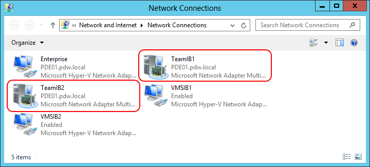
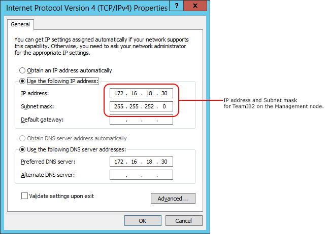
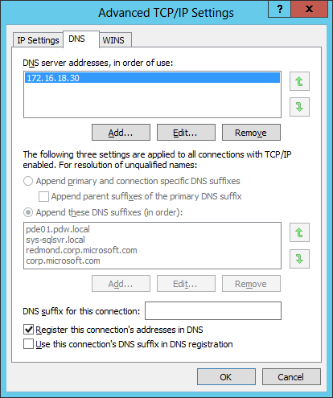

# Configure InfiniBand Network Adapters (SQL Server PDW)
Describes how to configure the InfiniBand network adapters on a non-appliance client server to connect to the Control node on SQL Server PDW. Use these instructions for basic connectivity and for high availability, so that loading, backup, and other processes will automatically connect to the active InfiniBand network.  
  
## Contents  
  
-   [Basics](#Basics)  
  
-   [Before You Begin](#BeforeBegin)  
  
-   [Step 1: Obtain the Appliance InfiniBand Network Settings](#Sec1)  
  
-   [Step 2: Configure the InfiniBand Network Adapter Settings on Your Client Server](#Sec2)  
  
## Description  
These instructions show you how to find and then set the correct InfiniBand IP addresses and subnet masks on your InfiniBand-connected server.  They also explain how to set your server to use the SQL Server PDW DNS so that your connection will resolve to the active InfiniBand network.  
  
For high availability, SQL Server PDW has two InfiniBand networks, one active and one passive. Each InfiniBand network has a different IP address for the Control node. If the active InfiniBand network goes down, the passive InfiniBand network becomes the active network. When this happens a script or process should automatically connect to the active InfiniBand network without changing the script parameters.  
  
Specifically, in this topic you will:  
  
1.  Find the InfiniBand IP addresses of the SQL Server PDW appliance DNS servers (***appliance_domain*-AD01** and ***appliance_domain*-AD02**). To do this you will log into the AD01 and AD02 servers and get the IP addresses for each InfiniBand network. The InfiniBand IP addresses on the AD node are the DNS IP addresses. Find the InfiniBand IP addresses of the Analytics Platform System DNS servers (***appliance_domain*-AD01** and ***appliance_domain*-AD02**). To do this you will log into both **AD01** and **AD02** servers and determine the IP addresses for each InfiniBand network. The InfiniBand IP addresses on the **AD01** and **AD02** servers are the DNS Server IP addresses.  
  
2.  Configure each network adapter to use an available IP address on the Analytics Platform System InfiniBand networks.  
  
    1.  If you have two InfiniBand network adapters, you will configure one adapter with an available IP address in the first InfiniBand network which is called TeamIB1, and the other adapter with an available IP address in the second InfiniBand network which is called TeamIB2. Use the ***appliance_domain*-AD01** TeamIB1 IP address as the preferred DNS server and ***appliance_domain*-AD02** TeamIB1 IP address as the alternate DNS server for TeamIB1 network adapter. Use the ***appliance_domain*-AD01** TeamIB2 IP address as the preferred DNS server and ***appliance_domain*-AD02** TeamIB2 IP address as the alternate DNS server for TeamIB2 network adapter.  
  
    2.  If you have only one InfiniBand network adapter, you will configure the adapter with an available IP address from one of the InfiniBand networks. Then you will configure the preferred and the alternate DNS servers on this adapter using either ***appliance_domain*-AD01** TeamIB1 and ***appliance_domain*-AD02** TeamIB1 or using ***appliance_domain*-AD01** TeamIB2 and ***appliance_domain*-AD02** TeamIB2 whichever is on the same network as the configured adapter as the preferred and the alternate DNS servers respectively.  
  
3.  Configure your InfiniBand network adapter to use Analytics Platform System DNS servers to resolve your connection to the active InfiniBand network.  
  
    1.  To configure this you will use the advanced TCP/IP settings to add the  **appliance domain** DNS suffix to the beginning of the list of DNS suffixes on your client server. This only needs to be configured on one of the network adapters; the setting will apply to both adapters.  
  
After configuring your InfiniBand network adapters, client processes can connect to the Control node on the InfiniBand network by using `PDW_region-SQLCTL01` for the address of the server. Your server will append the Analytics Platform System DNS suffix, or you can enter the complete address which is `PDW_region-SQLCTL01.appliance_domain.pdw.local`.  
  
For example, if your PDW region name is MyPDW and the appliance name is MyAPS, the dwloader server specification for loading data will either of the following:  
  
-   `dwloader –S MYPDW-SQLCTL01.MyAPS.pdw.local`  
  
-   `dwloader –S MYPDW-SQLCTL01`  
  
## Before You Begin  
  
### Requirements  
You will need an Analytics Platform System appliance domain account to login to the AD01 node. For example, ***F12345*\Administrator**.  
  
You will need a Windows account on the client server that has permission to configure the network adapters.  
  
### Prerequisites  
These instructions assume the client server is already racked and cabled to the appliance InfiniBand network. For racking and cabling instructions, see [Acquire and Configure a Loading Server &#40;SQL Server PDW&#41;](../sqlpdw/acquire-and-configure-a-loading-server-sql-server-pdw.md).  
  
### General Remarks  
By using **SQLCTL01**, the Analytics Platform System DNS will connect your client server to the Control node by using the active InfiniBand network. This applies only to getting connected; if the InfiniBand network goes down during a load or backup, you will need to restart the process.  
  
To meet your own business requirements, you can also join the client server to your own non-appliance workgroup or Windows domain.  
  
## Step 1: Obtain the Appliance InfiniBand Network Settings  
*To obtain the appliance InfiniBand network settings*  
  
1.  Login to the appliance AD01 node by using the ***appliance_domain*\Administrator** account.  
  
2.  On the appliance AD01 node, open the **Control Panel**, select **Network and Internet**, select **Network and Sharing Center**, and then select **Change Adapter Settings**.  
  
3.  In the **Network Connections** window, right-click on **Team IB1** and select **Properties**.  
  
      
  
4.  From the Internet Protocol Version 4 (TCP/IPv4) Properties window, write down the values for the **IP address** and **Subnet mask**.  The IP address of the ***appliance_domain*-AD01** node is the IP address of the Analytics Platform System DNS server.  
  
5.  Repeat steps 1-5 above for the TeamIB1 adapter on ***appliance_domain*-AD02** server.  
  
      
  
6.  Click **Cancel** to close the window.  
  
7.  Find an unused IP address on the **TeamIB1** network, and write it down.  
  
    1.  To find an unused IP address, open a command window and try to ping IP addresses within the range of addresses for your appliance. In this example, the IP address of the TeamIB1 network is 172.16.14.30. Find an IP address that starts with 172.16.14 that is not used. For example, from the command-line enter "ping 172.16.14.254". If the ping request is unsuccessful, the IP address is available.  
  
8.  Do the same thing for **TeamIB2**. In the **Network Connections** window, right-click on **Team IB2** and select **Properties**.  
  
9. From the Internet Protocol Version 4 (TCP/IPv4) Properties window, write down the values for the **IP address** and **Subnet mask** for **TeamIB2**.  
  
10. Repeat steps 8-9 above for the TeamIB2 adapter on ***appliance_domain*-AD02** server.  
  
      
  
11. Find an unused IP address on the **TeamIB2** network, and write it down.  
  
    1.  To find an unused IP address, open a command window and try to ping IP addresses within the range of addresses for your appliance. In this example, the IP address of the TeamIB2 network is 172.16.18.30. Find an IP address that starts with 172.16.18 that is not used. For example, from the command-line enter "ping 172.16.18.254". If the ping request is unsuccessful, the IP address is available.  
  
## Step 2: Configure the InfiniBand Network Adapter Settings on Your Client Server  
**Notes:**  
  
While performing these instructions:  
  
-   You will register your server with Analytics Platform System DNS servers.  
  
-   To meet your own network needs, you can also join the client server to your own non-appliance workgroup or Windows domain.  
  
-   The instructions step through configuring two network adapters on each server.  If you only have one network adapter, pick one of the networks to configure on the network adapter, and then add the second DNS IP address as an alternate DNS server.  
  
*To configure the InfiniBand network adapter settings on your client server*  
  
1.  Login as a Windows administrator to your loading, backup, or other client server on the appliance InfiniBand network.  
  
2.  Open the **Control Panel**, select **Network and Sharing Center**, and then select **Change Adapter Settings**.  
  
*To configure the first network adapter*  
  
1.  In the **Network Connections** window, right-click on one of the unidentified network slots for the **Mellanox Adapter** and select **Properties**.  
  
      
  
2.  In the Properties window  
  
    1.  On the **General** tab, set the **IP address** to the IP address that you verified as free in the ping test for **TeamIB1**. For the example values used in this topic, you would enter 172.16.14.254.  
  
    2.  Set the subnet mask to the subnet mask you wrote down for **TeamIB1**.  
  
    3.  Set the **Preferred DNS server** to the IP address of TeamIB1 that you wrote down earlier from the ***appliance_domain*-AD01** node.  
  
    4.  Set the **Alternate DNS server** to the IP address of TeamIB1 that you wrote down earlier from the ***appliance_domain*-AD02** node.  
  
          
  
    5.  Click **OK** to apply the changes.  
  
*To configure the second network adapter*  
  
1.  Skip this section if you only have one network adapter.  
  
2.  In the **Network Connections** window, right-click on the second unidentified network slot for the **Mellanox Adapter** and select **Properties**.  
  
      
  
3.  In the **Properties** window  
  
    1.  On the **General** tab, set the **IP address** to the IP address that you verified as free in the ping test for **TeamIB2**. For the example values used in this topic, you would enter 172.16.18.254.  
  
    2.  Set the subnet mask to the subnet mask you wrote down for **TeamIB2**.  
  
    3.  Set the **Preferred DNS server** to the IP address of TeamIB2 that you wrote down earlier from the ***appliance_domain*-AD01** node.  
  
    4.  Set the **Alternate DNS server** to the IP address of TeamIB2 that you wrote down earlier from the ***appliance_domain*-AD02** node.  
  
        > [!NOTE]  
        > If you only have one network adapter, configure the preferred and the alternate DNS servers using either the appliance AD01 TeamIB1 and appliance AD02 TeamIB1 as the preferred and the alternate DNS servers respectively, or use the appliance AD01 TeamIB2 and appliance AD02 TeamIB2 as the preferred and the alternate DNS servers depending on if the AD virtual machine has failed over.  
  
          
  
    5.  Click **OK** to apply the changes.  
  
*To configure the DNS suffix*  
  
1.  In the **Network Connections** window, right-click on one of the network slots for the **Mellanox Adapter** and select **Properties**.  
  
2.  Click on the **Advanced…** button.  
  
3.  In the **Advanced TCP/IP Settings** window, if the **Append these DNS Suffixes (in order)** option is not greyed out, check the box called **Append these DNS suffixes (in order):**, select the appliance domain suffix, and click **Add…**. The appliance domain suffix will be `appliance_domain.local`  
  
4.  If the **Append these DNS suffixes (in order):** option is greyed out, you can add the Analytics Platform System domain to this server by modifying the registry key HKEY_LOCAL_MACHINE\SOFTWARE\Policies\Microsoft\Windows NT\DNSClient.  
  
      
  
5.  For faster address resolution, we recommend moving the appliance suffix to the top of the list.  
  
6.  Click **OK**.  
  
7.  Now, you can connect to the appliance Infiniband network by using `PDW_region-SQLCTL01.appliance_domain.local`, or simply `appliance_domain-SQLCTL01`. The connection might be established faster if you connect with the full name and DNS suffix.  
  
    Examples for an appliance named named MyAPS with a MyPDW PDW region:  
  
    -   MyPDW-SQLCTL01.MyAPS.local  
  
    -   MyPDW-SQLCTL01  
  
## See Also  
[Acquire and Configure a Loading Server &#40;SQL Server PDW&#41;](../sqlpdw/acquire-and-configure-a-loading-server-sql-server-pdw.md)  
  
