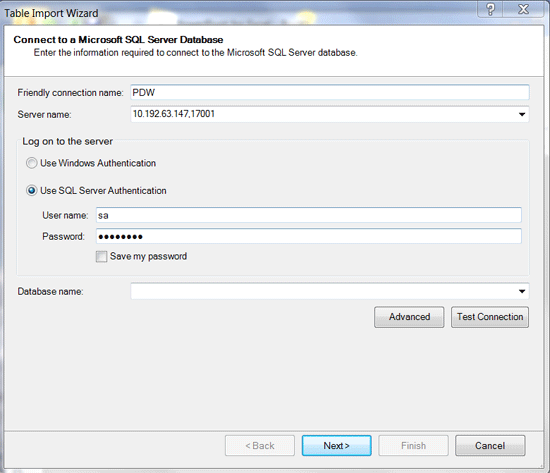

# Connect With PowerPivot for Excel (SQL Server PDW)
This topic describes how to connect to SQL Server PDW with PowerPivot for Excel. PowerPivot for Excel is a free download that significantly expands the data analysis capabilities of Excel.  
  
## Contents  
  
-   [Before You Begin](#BeforeBegin)  
  
-   [Connect With PowerPivot for Excel](#Connect1)  
  
## Before You Begin  
**Software Prerequisites**  
  
SQL Server Native Client 10.0. See [Install SQL Server Native Client &#40;SQL Server PDW&#41;](../sqlpdw/install-sql-server-native-client-sql-server-pdw.md)  
  
.NET Framework 3.5 SP1 or higher. For installation details, see the [Microsoft .NET Framework 3.5 Service Pack 1](http://www.microsoft.com/downloads/en/confirmation.aspx?familyId=ab99342f-5d1a-413d-8319-81da479ab0d7&displayLang=en) page on the Microsoft Download Center. If you have Windows 7, you already have this.  
  
Microsoft Excel 2010 (64-bit recommended) with the PowerPivot add-in installed. For installation instructions, see [PowerPivot: Install the PowerPivot Add-In for Excel](http://social.technet.microsoft.com/wiki/contents/articles/714.powerpivot-install-the-powerpivot-add-in-for-excel.aspx) on Technet.  
  
## Connect With PowerPivot for Excel  
The following steps explain how to connect by using ADO.NET and the .NET Framework Data Provider for SQL Server (SqlClient).  
  
To connect, follow these steps:  
  
1.  Launch Excel. You must be using Excel 2010, and must have the PowerPivot add-on installed.  
  
2.  Click the **PowerPivot** tab.  
  
3.  Click **PowerPivot Window Launch**.  
  
4.  On the **Home** tab,  
  
5.  On the **Home** tab, in the Get External Data options, click **From Database**, and select **From SQL Server**.  
  
      
  
6.  In the Table Import Wizard,  
  
    -   For **Friendly connection name**, enter a connection name.  
  
    -   For **User name** and **Password** fields, enter your SQL Server PDW login and password.  
  
    -   In the **Database Name** drop-down, select the name of the target database.  
  
    -   For **Server name**, enter the IP address of the Control node cluster, followed by a comma (,), and port 17001. For example: 10.192.63.147,17001 .  
  
    -   For **Log on to the server**, choose **Use Windows Authentication**, or choose **Use SQL Server Authentication** and enter your **login** and **password**.  
  
          
  
    -   Click **Next** to connect.  
  
7.  The connection to SQL Server PDW is finished. Continue through the Wizard to select the rows to import.  
  
## See Also  
[Connect With Applications &#40;SQL Server PDW&#41;](../sqlpdw/connect-with-applications-sql-server-pdw.md)  
  
