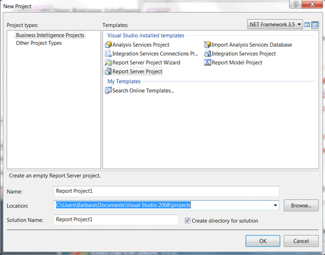

# Connect With SQL Server Reporting Services (SQL Server PDW)
This topic describes how to connect to SQL Server PDW Version 2 from SQL Server 2014Reporting Services and from SQL Server 2008 R2 Reporting Services.  
  
## Contents  
  
-   [Before You Begin](#BeforeBegin)  
  
-   [Create a Data Source (SQL Server 2008 R2 Reporting Services)](#DataSource2)  
  
-   [Create a Data Source (SQL Server 2012 Reporting Services)](#DataSource3)  
  
## Before You Begin  
**Software Prerequisites for SQL Server 2008 R2 Reporting Services**  
  
-   SQL Server 2008 R2Reporting Services  
  
-   Business Intelligence Development Studio (BIDS). For more information, see [Introducing Business Intelligence Development Studio](http://msdn.microsoft.com/en-us/library/ms173767(v=sql11).aspx).  
  
-   SQL Server Native Client (SNAC) 10.0. For installation instructions, see [Install SQL Server Native Client &#40;SQL Server PDW&#41;](../sqlpdw/install-sql-server-native-client-sql-server-pdw.md).  
  
**Software Prerequisites for SQL Server 2012 Reporting Services**  
  
-   SQL Server 2012 Reporting Services  
  
-   SQL Server Data Tools \(SSDT\). For more information, see [Reporting Services in SQL Server Data Tools (SSDT)](assetId:///0903c7b2-ac59-45f1-b7d0-922ecd9d76f8).  
  
-   SQL Server Native Client (SNAC) 11.0. For installation instructions, see [Install SQL Server Native Client &#40;SQL Server PDW&#41;](../sqlpdw/install-sql-server-native-client-sql-server-pdw.md).  
  
## Create a Data Source (SQL Server 2008 R2 Reporting Services)  
To create a Reporting Services data source that connects to your SQL Server PDW appliance  
  
1.  Open SQL Server Business Intelligence Studio. To do this, in Windows click **Start**, choose **All Programs**, choose **SQL Server 2008 R2** , and then select **SQL Server Business Intelligence Development Studio**.  
  
2.  Open a new Reporting Services project. To do this, on the **File** menu, select **New**, and choose **Project**.  
  
3.  In the **New Project** window, for **Project type**, select **Business Intelligence Projects**, and then select the template, **Report Server Project**. Click OK.  
  
      
  
4.  In Solution Explorer, you will see your new Report project. Under your project, right-click the **Shared Data Sources** folder, and select **Add New Data Source**.  
  
5.  In the **Shared Data Source Properties** dialog box, type a name for the new data source. For type, select **Microsoft SQL Server**.  
  
6.  Click **Edit** to create the connection string.  
  
      
  
7.  In the Connection Properties window, make the following selections:  
  
    -   **Data source:** Microsoft SQL Server (SqlClient)  
  
    -   **Server name:** Enter the IP address of the Control node cluster, followed by a comma, followed by the port name of 17001. For example 10.192.63.147,17001.  
  
    -   Choose **Use Windows Authentication**, or choose **Use SQL Server Authentication**.  
  
    -   **User name** and **Password** fields: enter your SQL Server PDW login and password if using SQL Server Authentication.  
  
    -   **Select or enter a Database Name**: Select or enter the name of the target database.  
  
          
  
8.  Click **Test Connection** to verify that the new data source is available.  
  
9. Click OK.  
  
10. You can now view your connection string in the Data Source Properties windows.  
  
      
  
11. Click **OK** to return to the Report Builder window.  
  
12. In the **Solution Explorer** pane, view your new connection listed under Shared Data Sources.  
  
      
  
## Create a Data Source (SQL Server 2012 Reporting Services)  
To create a Reporting Services data source that connects to your SQL Server PDW appliance  
  
1.  Open SQL Server Data Tools \(SSDT\). To do this, in Windows click **Start**, choose **All Programs**, choose **SQL Server 2012**, and then select **SQL Server Data Tools**.  
  
2.  Open a new Reporting Services project. To do this, on the **File** menu, select **New**, and choose **Project**.  
  
3.  In the **New Project** window, click **Business Intelligence**, click **Reporting Services**, click **Report Server Project**, and then click **OK**.  
  
4.  In Solution Explorer, you will see your new Report project. Under your project, right-click the **Shared Data Sources** folder, and select **Add New Data Source**.  
  
5.  In the **Shared Data Source Properties** dialog box, type a name for the new data source. For type, select **Microsoft SQL Server**.  
  
6.  Click **Edit** to create the connection string.  
  
      
  
7.  In the **Connection Properties** window, make the following selections:  
  
    -   **Data source:** Microsoft SQL Server (SqlClient)  
  
    -   **Server name:** Enter the IP address of the Control node cluster, followed by a comma, followed by the port name of 17001. For example 10.192.63.147,17001.  
  
    -   Choose **Use Windows Authentication**, or choose **Use SQL Server Authentication**.  
  
    -   **User name** and **Password** fields: enter your SQL Server PDW login and password if using SQL Server Authentication.  
  
    -   **Select or enter a Database Name**: Select or enter the name of the target database.  
  
          
  
8.  Click **Test Connection** to verify that the new data source is available.  
  
9. Click **OK**.  
  
10. You can now view your connection string in the **Shared Data Source Properties** windows.  
  
      
  
11. Click **OK** to return to the Report Builder window.  
  
12. In the **Solution Explorer** pane, view your new connection listed under Shared Data Sources.  
  
      
  
## See Also  
[Connect With Applications &#40;SQL Server PDW&#41;](../sqlpdw/connect-with-applications-sql-server-pdw.md)  
[Client Tools and Applications &#40;SQL Server PDW&#41;](../sqlpdw/client-tools-and-applications-sql-server-pdw.md)  
  
