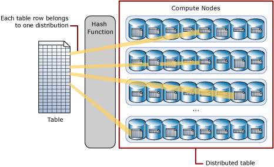

# Distributed and Replicated Tables (SQL Server PDW)
Describes distributed tables and replicated table concepts and provides links to database design best practices for SQL Server PDW databases. Designing SQL Server PDW databases to use distributed and replicated tables effectively will help you to achieve the storage and query processing benefits of the MPP architecture. A small number of database design choices can have a big impact on improving query performance.  
  
## Contents  
  
-   [Understanding Distributed Tables](#Distributed)  
  
-   [Understanding Replicated Tables](#Replicated)  
  
-   [Best Practices](#BestPractices)  
  
## Understanding Distributed Tables  
  
### Distributed table  
A *distributed table* is a table whose rows are dispersed across multiple storage locations. Each storage location contains a group of one or more rows, called a *distribution*.  
  
The following diagram depicts how a full (non-distributed table) gets stored as a distributed table.  
  
  
  
-   The distributions are stored on the Compute nodes; the appliance has eight distributions per compute node.  
  
-   Each row belongs to one and only one distribution.  
  
-   SQL Server PDW uses a deterministic hash algorithm to assign each row to a distribution.  
  
-   The number of table rows per distribution can vary as shown by the different sizes of tables.  
  
### Distribution  
The set of table rows, from one or more distributed tables that are stored together in the same storage location. To improve parallel query performance, the rows that will be joined together in queries should be stored together in the same distributions; this avoids transferring data among the distributions before running parallel query operations.  
  
A deterministic function assigns each row to belong to one and only one distribution. SQL Server PDW uses the value in the distribution column to assign each row to a distribution.  
  
To embrace the shared nothing architecture, each distribution is stored on its own set of disks.  
  
In SQL Server PDW, each Compute node has eight distributions. For example, if there are eight Compute nodes, there will be 64 distributions (8 nodes x 8 distributions/node).  
  
### Distribution column  
The column that SQL Server PDW uses to assign a distributed table row to a distribution. Each distributed table has one column designated as the *distribution column*.  
  
There are performance considerations for the selection of a distribution column, such as distinctness, data skew, and the types of queries run on the system.  
  
### Data skew  
*Data skew* is a condition that occurs when the rows of a distributed table are not spread uniformly across all of the distributions. When the number of rows in each distribution varies, this can negatively impact query performance.  
  
*Avoiding data skew* means you want to avoid having a disproportionately large number of table rows in one distribution in comparison to the number of rows in other distributions. Since queries rely on all distributions, even if queries finish fast in smaller distributions, you will still need to wait for the queries to finish on all distributions before you can get the query result.  
  
> [!NOTE]  
> A parallel query performs as slow as the ‘slowest’ distribution.  
  
## Understanding Replicated Tables  
  
### Replicated table  
A *replicated table* is a table that is stored in its entirety on each Compute node. Replicating a table removes the need to transfer its table rows among Compute nodes before performing a JOIN operation. Replicated tables are only feasible with small tables because of the extra storage required to store the full table on each compute node.  
  
The following diagram shows a replicated table that is stored on each Compute node. The replicated table is stored across all of the disks assigned to the Compute node. This is implemented by using SQL Server filegroups.  
  
  
  
## Best Practices  
For more information about best practices for designing SQL Server PDW tables, see the following wiki articles on Technet. If you cannot access these links, see [NIB Join Our Communities  (Analytics Platform System)](../Topic/NIB%20Join%20Our%20Communities%20%20(Analytics%20Platform%20System).md)  
  
-   [Choosing Distributed Versus Replicated Tables in SQL Server PDW](http://go.microsoft.com/fwlink/?LinkId=247627)  
  
-   [Minimize Data Movement When Choosing a Distribution Column &#40;SQL Server PDW&#41;](../../mpp/sqlpdw/minimize-data-movement-when-choosing-a-distribution-column-sql-server-pdw.md)  
  
-   [Minimize Data Skew When Choosing a Distribution Column &#40;SQL Server PDW&#41;](../../mpp/sqlpdw/minimize-data-skew-when-choosing-a-distribution-column-sql-server-pdw.md)  
  
-   [None of the Existing Columns Are a Good Choice for the Distribution Column &#40;SQL Server PDW&#41;](../../mpp/sqlpdw/none-of-the-existing-columns-are-a-good-choice-for-the-distribution-column-sql-server-pdw.md)  
  
