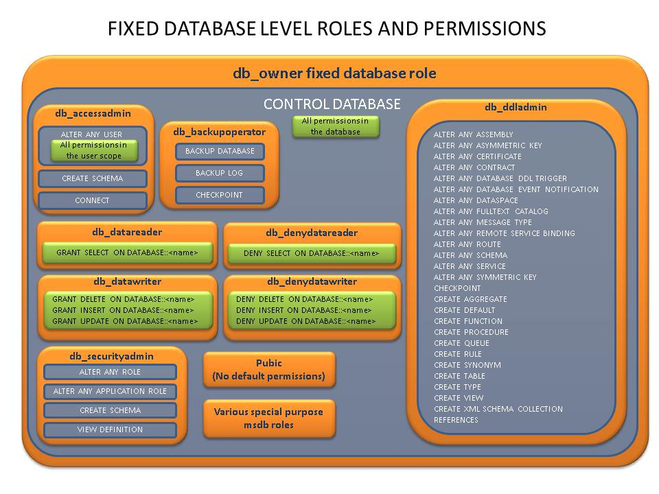

# Fixed Database Roles (SQL Server PDW)
SQL Server provides pre-configured (fixed) database-level roles to help you manage the permissions on a server. The pre-configured roles are fixed in that you cannot change the permissions assigned to them. User-defined database roles can also be created. You can change the permissions assigned to user-defined database roles.  
  
Roles are security principals that group other principals. Database roles are database-wide in their permissions scope. Database users and other database roles can be added as members of database roles. The fixed database roles cannot be added to each other. (*Roles* are like *groups* in the Windows operating system.)  
  
## Fixed Database Roles  
There are 9 fixed database roles.  
  
-   **db_owner**  
  
-   **db_securityadmin**  
  
-   **db_accessadmin**  
  
-   **db_backupoperator**  
  
-   **db_ddladmin**  
  
-   **db_datawriter**  
  
-   **db_datareader**  
  
-   **db_denydatawriter**  
  
-   **db_denydatareader**  
  
## Permissions of the Fixed Database Roles  
The system of fixed server roles and fixed database roles is a legacy system originated in the 1980's. Fixed roles are still supported and are useful in environments where there are few users and the security needs are simple. Beginning with SQL Server 2005, a more detailed system of granting permission was created. This new system is more granular, providing many more options for both granting and denying permissions. The extra complexity of the more granular system makes it harder to learn, but most enterprise systems should grant permissions instead of using the fixed roles. The permissions are discussed and listed in the topic [Permissions: GRANT, DENY, REVOKE &#40;SQL Server PDW&#41;](../sqlpdw/permissions-grant-deny-revoke-sql-server-pdw.md). The following chart shows the permissions that are associated with each fixed database role. All permissions in this SQL Server graphic are not available (or necessary) in APS.  
  
  
  
## Related Content  
  
-   To create user-defined roles, see [CREATE ROLE &#40;SQL Server PDW&#41;](../sqlpdw/create-role-sql-server-pdw.md).  
  
## See Also  
[Common Metadata Query Examples &#40;SQL Server PDW&#41;](../sqlpdw/common-metadata-query-examples-sql-server-pdw.md)  
  
