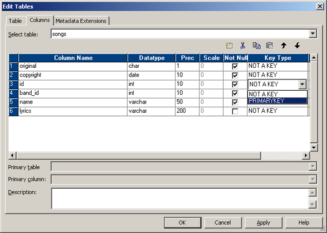

# Using SQL Server PDW tables as Informatica Sources and Targets (SQL Server PDW)
By using the SQL Server PDW Informatica Connector, Informatica can use PDW tables as source and target tables. The following procedures configure PDW tables to appear in the Informatica Designer.  
  
Make sure that Informatica and Microsoft SQL Server PDW Informatica Connector are successfully installed on the specified system and the plug-in is registered in the Informatica Admin Console.  
  
## Import Table from SQL Server PDW into Informatica Source  
The following steps configure PDW as a source.  
  
  
  
1.  Open the Informatica PowerCenter Designer and connect to the desired repository.  
  
2.  On the **Tools** menu, click **Source Analyzer**.  
  
3.  On the **Sources** menu, click **Import from Microsoft SQL Server PDW**.  
  
4.  Select a SQL Server data source.  
  
5.  Enter a valid **Username**.  
  
6.  Enter a valid **Password**.  
  
7.  Click **Connect**.  
  
8.  Click the **+** sign to expand **Tables**.  
  
9. Select the tables which you want to import.  
  
10. Click **OK**.  
  
11. Under the **Repository** folder, **Sources** section, verify **SQL Server PDW**.  
  
## Import Table from PDW into Informatica Target  
The following steps configure PDW as a target.  
  
  
  
1.  Open the Informatica PowerCenter Designer and connect to the desired repository.  
  
2.  On the **Tools** menu, click **Target Designer**.  
  
3.  On the **Targets** menu, click **Import from Microsoft SQL Server PDW**.  
  
4.  Select a SQL Server data source.  
  
5.  Enter a valid **Username**.  
  
6.  Enter a valid **Password**.  
  
7.  Click **Connect**.  
  
8.  Click the **+** sign to expand **Tables**.  
  
9. Select the tables which you want to import to the target.  
  
10. Click **OK**.  
  
11. Under the **Repository** folder, **Targets** section, verify the **Imported tables**.  
  
## Adding an Update Strategy Transformation  
The user must specify a column used as a primary key if the **update strategy transformation** is going to be used in the mapping.  
  
  
  
1.  Right-click a table and select **Edit**.  
  
2.  In the **Column Name** section, select the column that is a primary key. In the **Key Type** section, select **PRIMARYKEY** for that column.  
  
## See Also  
[Installing the Informatica Connector &#40;SQL Server PDW&#41;](../../mpp/sqlpdw/installing-the-informatica-connector-sql-server-pdw.md)  
[Using Informatica to create SQL Server PDW connections in workflow manager &#40;SQL Server PDW&#41;](../../mpp/sqlpdw/using-informatica-to-create-sql-server-pdw-connections-in-workflow-manager-sql-server-pdw.md)  
[Creating Sessions and Workflows in Informatica &#40;SQL Server PDW&#41;](../../mpp/sqlpdw/creating-sessions-and-workflows-in-informatica-sql-server-pdw.md)  
  
