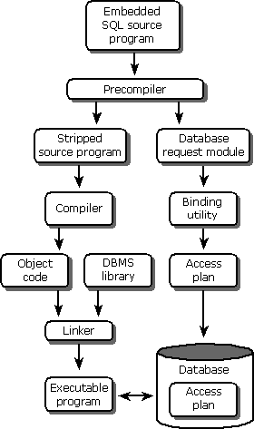

# Compiling an Embedded SQL Program
Because an embedded SQL program contains a mix of SQL and host language statements, it cannot be submitted directly to a compiler for the host language. Instead, it is compiled through a multistep process. Although this process differs from product to product, the steps are roughly the same for all products.  
  
 This illustration shows the steps necessary to compile an embedded SQL program.  
  
   
  
 Five steps are involved in compiling an embedded SQL program:  
  
1.  The embedded SQL program is submitted to the SQL precompiler, a programming tool. The precompiler scans the program, finds the embedded SQL statements, and processes them. A different precompiler is required for each programming language supported by the DBMS. DBMS products typically offer precompilers for one or more languages, including C, Pascal, COBOL, Fortran, Ada, PL/I, and various assembly languages.  
  
2.  The precompiler produces two output files. The first file is the source file, stripped of its embedded SQL statements. In their place, the precompiler substitutes calls to proprietary DBMS routines that provide the run-time link between the program and the DBMS. Typically, the names and the calling sequences of these routines are known only to the precompiler and the DBMS; they are not a public interface to the DBMS. The second file is a copy of all the embedded SQL statements used in the program. This file is sometimes called a database request module, or DBRM.  
  
3.  The source file output from the precompiler is submitted to the standard compiler for the host programming language (such as a C or COBOL compiler). The compiler processes the source code and produces object code as its output. Note that this step has nothing to do with the DBMS or with SQL.  
  
4.  The linker accepts the object modules generated by the compiler, links them with various library routines, and produces an executable program. The library routines linked into the executable program include the proprietary DBMS routines described in step 2.  
  
5.  The database request module generated by the precompiler is submitted to a special binding utility. This utility examines the SQL statements, parses, validates, and optimizes them, and then produces an access plan for each statement. The result is a combined access plan for the entire program, representing an executable version of the embedded SQL statements. The binding utility stores the plan in the database, usually assigning it the name of the application program that will use it. Whether this step takes place at compile time or run time depends on the DBMS.  
  
 Notice that the steps used to compile an embedded SQL program correlate very closely with the steps described earlier in [Processing an SQL Statement](../../odbc/reference/processing-a-sql-statement.md). In particular, notice that the precompiler separates the SQL statements from the host language code, and the binding utility parses and validates the SQL statements and creates the access plans. In DBMSs where step 5 takes place at compile time, the first four steps of processing an SQL statement take place at compile time, while the last step (execution) takes place at run time. This has the effect of making query execution in such DBMSs very fast.
