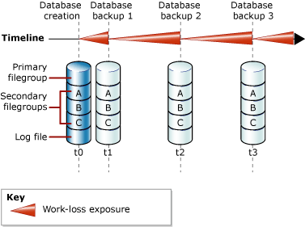
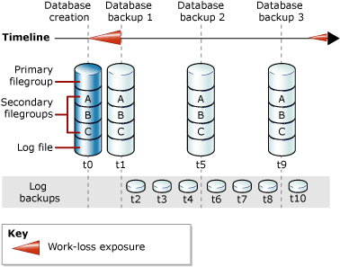

# Full Database Backups (SQL Server)
[!INCLUDE[appliesto-ss-xxxx-xxxx-xxx-md](../../includes/appliesto-ss-xxxx-xxxx-xxx-md.md)]
  A full database backup backs up the whole database. This includes part of the transaction log so that the full database can be recovered after a full database backup is restored. Full database backups represent the database at the time the backup finished.  
  
> [!TIP]  
>  As a database increases in size full database backups take more time to finish and require more storage space. Therefore, for a large database, you might want to supplement a full database backup with a series of *differential database backups*. For more information, see [Differential Backups &#40;SQL Server&#41;](../../relational-databases/backup-restore/differential-backups-sql-server.md).  
  
> [!IMPORTANT]  
>  TRUSTWORTHY is set to OFF on a database backup. For information about how to set TRUSTWORTHY to ON, see [ALTER DATABASE SET Options &#40;Transact-SQL&#41;](../../t-sql/statements/alter-database-transact-sql-set-options.md).  
  
 **In This Topic:**  
  
-   [Database Backups Under the Simple Recovery Model](#DbBuRMs)  
  
-   [Database Backups Under the Full Recovery Model](#DbBuRMf)  
  
-   [Use a Full Database Backup to Restore the Database](#RestoreDbBu)  
  
-   [Related Tasks](#RelatedTasks)  
  
##  <a name="DbBuRMs"></a> Database Backups Under the Simple Recovery Model  
 Under the simple recovery model, after each backup, the database is exposed to potential work loss if a disaster were to occur. The work-loss exposure increases with each update until the next backup, when the work-loss exposure returns to zero and a new cycle of work-loss exposure starts. Work-loss exposure increases over time between backups. The following illustration shows the work-loss exposure for a backup strategy that uses only full database backups.  
  
   
  
### Example ([!INCLUDE[tsql](../../includes/tsql-md.md)])  
 The following example shows how to create a full database backup by using WITH FORMAT to overwrite any existing backups and create a new media set.  
  
```  
-- Back up the AdventureWorks2012 database to new media set.  
BACKUP DATABASE AdventureWorks2012  
    TO DISK = 'Z:\SQLServerBackups\AdventureWorksSimpleRM.bak'   
    WITH FORMAT;  
GO  
```  
  
##  <a name="DbBuRMf"></a> Database Backups Under the Full Recovery Model  
 For databases that use full and bulk-logged recovery, database backups are necessary but not sufficient. Transaction log backups are also required. The following illustration shows the least complex backup strategy that is possible under the full recovery model.  
  
   
  
 For information about how to create log backups, see [Transaction Log Backups &#40;SQL Server&#41;](../../relational-databases/backup-restore/transaction-log-backups-sql-server.md).  
  
### Example ([!INCLUDE[tsql](../../includes/tsql-md.md)])  
 The following example shows how to create a full database backup by using WITH FORMAT to overwrite any existing backups and create a new media set. Then, the example backs up the transaction log. In a real-life situation, you would have to perform a series of regular log backups. For this example, the [!INCLUDE[ssSampleDBobject](../../includes/sssampledbobject-md.md)] sample database is set to use the full recovery model.  
  
```  
USE master;  
ALTER DATABASE AdventureWorks2012 SET RECOVERY FULL;  
GO  
-- Back up the AdventureWorks2012 database to new media set (backup set 1).  
BACKUP DATABASE AdventureWorks2012  
  TO DISK = 'Z:\SQLServerBackups\AdventureWorks2012FullRM.bak'   
  WITH FORMAT;  
GO  
--Create a routine log backup (backup set 2).  
BACKUP LOG AdventureWorks2012 TO DISK = 'Z:\SQLServerBackups\AdventureWorks2012FullRM.bak';  
GO  
```  
  
##  <a name="RestoreDbBu"></a> Use a Full Database Backup to Restore the Database  
 You can re-create a whole database in one step by restoring the database from a full database backup to any location. Enough of the transaction log is included in the backup to let you recover the database to the time when the backup finished. The restored database matches the state of the original database when the database backup finished, minus any uncommitted transactions. Under the full recovery model, you should then restore all subsequent transaction log backups. When the database is recovered, uncommitted transactions are rolled back.  
  
 For more information, see [Complete Database Restores &#40;Simple Recovery Model&#41;](../../relational-databases/backup-restore/complete-database-restores-simple-recovery-model.md) or [Complete Database Restores &#40;Full Recovery Model&#41;](../../relational-databases/backup-restore/complete-database-restores-full-recovery-model.md).  
  
##  <a name="RelatedTasks"></a> Related Tasks  
 **To create a full database backup**  
  
-   [Create a Full Database Backup &#40;SQL Server&#41;](../../relational-databases/backup-restore/create-a-full-database-backup-sql-server.md)  
  
-   <xref:Microsoft.SqlServer.Management.Smo.Backup.SqlBackup%2A> (SMO)  
  
 **To schedule backup jobs**  
  
 [Use the Maintenance Plan Wizard](../../relational-databases/maintenance-plans/use-the-maintenance-plan-wizard.md)  
  
## See Also  
 [Back Up and Restore of SQL Server Databases](../../relational-databases/backup-restore/back-up-and-restore-of-sql-server-databases.md)   
 [Backup Overview &#40;SQL Server&#41;](../../relational-databases/backup-restore/backup-overview-sql-server.md)   
 [Backup and Restore of Analysis Services Databases](../../analysis-services/multidimensional-models/backup-and-restore-of-analysis-services-databases.md)  
  
  
