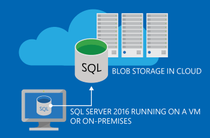

# SQL Server Backup and Restore with Microsoft Azure Blob Storage Service
[!INCLUDE[tsql-appliesto-ss2016-xxxx-xxxx-xxx_md](../../includes/tsql-appliesto-ss2016-xxxx-xxxx-xxx-md.md)]

    
  
 This topic introduces [!INCLUDE[ssNoVersion](../../includes/ssnoversion-md.md)] backups to and restoring from the [Microsoft Azure Blob storage service](http://www.windowsazure.com/develop/net/how-to-guides/blob-storage/). It also provides a summary of the benefits of using the Microsoft Azure Blob service to store [!INCLUDE[ssNoVersion](../../includes/ssnoversion-md.md)] backups.  
  
 SQL Server supports storing backups to the Microsoft Azure Blob storage service in the following ways:  
  
-   **Manage your backups to Microsoft Azure:** Using the same methods used to backup to DISK and TAPE, you can now back up to Microsoft Azure storage by specifying URL as the backup destination. You can use this feature to manually backup or configure your own backup strategy like you would for a local storage or other off-site options. This feature is also referred to as **SQL Server Backup to URL**. For more information, see [SQL Server Backup to URL](../../relational-databases/backup-restore/sql-server-backup-to-url.md). This feature is available in SQL Server 2012 SP1 CU2 or later. This feature has been enhanced in [!INCLUDE[ssSQL15](../../includes/sssql15-md.md)] to provide increased performance and functionality through the use of block blobs, Shared Access Signatures, and striping.  
  
    > [!NOTE]  
    >  For SQL Server versions previous to SQL Server 2012 SP1 CU2, you can use the add-in SQL Server Backup to Microsoft Azure Tool to quickly and easily create backups to Microsoft Azure storage. For more information, see [download center](http://go.microsoft.com/fwlink/?LinkID=324399).  
  
-   **File-Snapshot Backups for Database Files in Azure Blob Storage** Through the use of Azure snapshots, [!INCLUDE[ssNoVersion](../../includes/ssnoversion-md.md)] File-Snapshot Backups provide nearly instantaneous backups and restores for database files stored using the Azure Blob storage service. This capability enables you to simplify your backup and restore policies, and it supports for point in time restore. For more information, see [File-Snapshot Backups for Database Files in Azure](../../relational-databases/backup-restore/file-snapshot-backups-for-database-files-in-azure.md). This feature is available in SQL Server 2016 or later.  
  
-   **Let SQL Server Manage backups to Microsoft Azure:** Configure SQL Server to manage the backup strategy and schedule backups for a single database, or several databases, or set defaults at the instance level. This feature is referred to as **[!INCLUDE[ss_smartbackup](../../includes/ss-smartbackup-md.md)]**. For more information see [SQL Server Managed Backup to Microsoft Azure](../../relational-databases/backup-restore/sql-server-managed-backup-to-microsoft-azure.md). This feature is available in SQL Server 2014 or later.  
  
## Benefits of Using the Microsoft Azure Blob Service for [!INCLUDE[ssNoVersion](../../includes/ssnoversion-md.md)] Backups  
  
-   Flexible, reliable, and limitless off-site storage: Storing your backups on Microsoft Azure Blob service can be a convenient, flexible, and easy to access off-site option. Creating off-site storage for your [!INCLUDE[ssNoVersion](../../includes/ssnoversion-md.md)] backups can be as easy as modifying your existing scripts/jobs. Off-site storage should typically be far enough from the production database location to prevent a single disaster that might impact both the off-site and production database locations. By choosing to geo replicate the Blob storage you have an extra layer of protection in the event of a disaster that could affect the whole region. In addition, backups are available from anywhere and at any time and can easily be accessed for restores.  
  
    > [!IMPORTANT]  
    >  Through the use of block blobs in [!INCLUDE[ssSQL15](../../includes/sssql15-md.md)], you can stripe your backup set to support backup files sizes up to 12.8 TB.  
  
-   Backup Archive: The Microsoft Azure Blob Storage service offers a better alternative to the often used tape option to archive backups. Tape storage might require physical transportation to an off-site facility and measures to protect the media. Storing your backups in Microsoft Azure Blob Storage provides an instant, highly available, and a durable archiving option.  
  
-   No overhead of hardware management: There is no overhead of hardware management with Microsoft Azure services. Microsoft Azure services manage the hardware and provide geo-replication for redundancy and protection against hardware failures.  
  
-   Currently for instances of [!INCLUDE[ssNoVersion](../../includes/ssnoversion-md.md)] running in a Microsoft Azure Virtual Machine, backing up to Microsoft Azure Blob storage services can be done by creating attached disks. However, there is a limit to the number of disks you can attach to a Microsoft Azure Virtual Machine. This limit is 16 disks for an extra large instance and fewer for smaller instances. By enabling a direct backup to Microsoft Azure Blob Storage, you can bypass the 16 disk limit.  
  
     In addition, the backup file which now is stored in the Microsoft Azure Blob storage service is directly available to either an on-premises [!INCLUDE[ssNoVersion](../../includes/ssnoversion-md.md)] or another [!INCLUDE[ssNoVersion](../../includes/ssnoversion-md.md)] running in a Microsoft Azure Virtual Machine, without the need for database attach/detach or downloading and attaching the VHD.  
  
-   Cost Benefits: Pay only for the service that is used. Can be cost-effective as an off-site and backup archive option. See the [Microsoft Azure Billing Considerations](#Billing) section for more information and links.  
  
##   Microsoft Azure Billing Considerations:  
 Understanding Microsoft Azure storage costs enables you to forecast the cost of creating and storing backups in Microsoft Azure.  
  
 The [Microsoft Azure pricing calculator](http://go.microsoft.com/fwlink/?LinkId=277060) can help estimate your costs.  
  
 **Storage:** Charges are based on the space used and are calculated on a graduated scale and the level of redundancy. For more details, and up-to-date information, see the **Data Management** section of the [Pricing Details](http://go.microsoft.com/fwlink/?LinkId=277059) article.  
  
 **Data Transfers:** Inbound data transfers to Microsoft Azure are free. Outbound transfers are charged for the bandwidth use and calculated based on a graduated region-specific scale. For more details, see the [Data Transfers](http://go.microsoft.com/fwlink/?LinkId=277061) section of the Pricing Details article.  
  
## See Also  

[SQL Server Backup to URL Best Practices and Troubleshooting](../../relational-databases/backup-restore/sql-server-backup-to-url-best-practices-and-troubleshooting.md)   

[Back Up and Restore of System Databases &#40;SQL Server&#41;](../../relational-databases/backup-restore/back-up-and-restore-of-system-databases-sql-server.md)   

[Tutorial: Using the Microsoft Azure Blob storage service with SQL Server 2016 databases](../tutorial-use-azure-blob-storage-service-with-sql-server-2016.md)

[SQL Server Backup to URL](../../relational-databases/backup-restore/sql-server-backup-to-url.md)  
  
  
