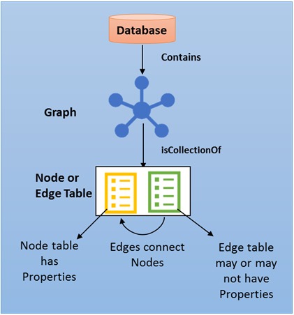
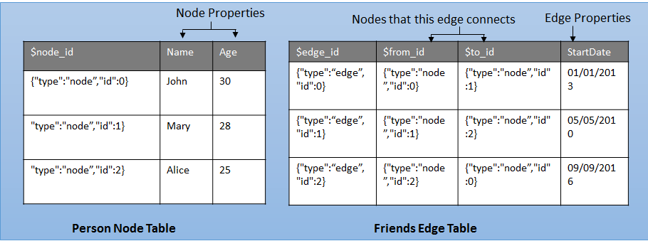

# SQL Graph Architecture  
[!INCLUDE[tsql-appliesto-ssvNxt-xxxx-xxxx-xxx_md](../../includes/tsql-appliesto-ssvNxt-xxxx-xxxx-xxx-md.md)]

Learn how SQL Graph is architected. Knowing the basics will make it easier to understand other SQL Graph articles.
 
## SQL Graph Database
Users can create one graph per database. A graph is a collection of Node and Edge tables. Node or Edge tables can be created under any schema in the database, but they all belong to one logical graph. A node table is collection of similar type of nodes. For example, a Person Node table will hold all the Person Nodes belonging to a graph. Similarly, an edge table is a collection of similar type of edges. Since Nodes and Edges are stored in tables, most of the operations supported on regular tables are supported on Node or Edge tables. 
 
 
   
Figure 1: SQL Graph database architecture
 
## Node Table
A node table represents an entity in your graph schema. Every time a node table is created, along with the user defined columns, an implicit $node_id column is created, which uniquely identifies a given node in the database. The values in $node_id are automatically generated and is a combination of object_id of that table and an internally generated bigint value. It is recommended that users create a unique constraint or index on the $node_id column at the time of creation of node table, but if one is not created, we will create a unique, non-clustered index on it by default. 
 
### Node Table DDL
The CREATE TABLE DDL is now extended to support creating a table AS NODE table. Users can create indexes on a node table for faster lookups. All index types are supported on Node table, including clustered and non-clustered columnstore indexes. ALTER, DELETE and TRUNCATE is supported just the way it is on regular tables. However, users will not be able to ALTER internal graph columns. 
 
### Node Table DML
DML operations on a node table will work the way they work on a regular relational table, with the exception of MERGE DML, which is not supported in the first release. It is recommended that you delete all the edges connected to a given node, before deleting that node from the node table. Cascade deletion of edges upon node deletion is not supported in the first release. 
 
## Edge Table
An edge table represents a relationship in your graph schema. Edges are always directed and they go from one node to another. An edge table enables users to model many-to-many relationships in their graph. For example, the same 'likes' edge in a social network graph like LinkedIn can connect a Person to another Person, a Person to an Organization or a Person to an Article. An edge table may or may not have any user defined attributes in it. Every time an edge table is created, along with the user defined attributes, three implicit columns are created in the edge table:
•	$edge_id, which uniquely identifies a given edge in the database.
•	$from_id which stores the $node_id of the node, this edge starts from. 
•	$to_id, which stores $node_id of the node, this edge goes to.  
Similar to the $node_id column, it is recommended that users create a unique index or constraint on the $edge_id column at the time of creation of the edge table, but if one is not created, a default unique, non-clustered index is created on this column. The nodes that a given edge can connect is governed by the data inserted in the $from_id and $to_id columns. In this release, there are no constraints defined on the edge table, that will restrict it from connecting any two type of nodes. That is, an edge can connect any node to any node in your graph, you will just need to enter correct $node_id values in the $from_id and $to_id columns.
We also recommend users to create indexes on ($from_id, $to_id) columns, for faster lookups in the direction of the edge. If your application often needs to perform traversals in reverse direction of an edge, you might want to consider creating an index on ($to_id, $from_id) combination as well. 
 
### Edge Table DDL
The CREATE TABLE DDL is now extended to support creating a table AS EDGE table. Users can create indexes on an edge table for faster lookups. All index types are supported on edge table, including clustered and non-clustered columnstore indexes. 
 
### Edge Table DML
DML operations are exactly same as that on regular tables, with the exception of MERGE DML, which is not supported in first release. Here are some points to consider while performing DML operations on an edge table.
1.	Users will need to provide $node_id values for the nodes a given edge connects while INSERTING into the edge table. For example, to insert an edge that connects John to Mary in the example shown in Figure 2, the following insert statement can be used:  
```
INSERT INTO Friends ($from_id, $to_id, startdate) 
VALUES ((SELECT $node_id FROM Person WHERE Name = 'John'),
      (SELECT $node_id FROM Person WHERE Name = 'Mary'), 
      '01/01/2013'
    );
```   
2.	The $from_id and $to_id values cannot be updated using an UPDATE DML statement. If you need to perform such operation, you will have to insert a new edge and delete the one that is not required. For example, if an edge connects nodes A and B in your graph and now you would like the same edge to connect node A to node C instead of node B, you will need to insert a new edge that connects nodes A and C and delete the one that connects A and B. 
3.	 It is recommended that before deleting a node, users delete all the incoming and outgoing edges to maintain integrity of their graph. Similarly, if you are dropping a node table, it is recommended that you delete all the incoming and outgoing edges connected to any node in that node table.
 

   
Figure 2: Node and edge table representation
 
## Metadata
Use these metadata view to see attributes of a Node or Edge table.
 
### SYS.TABLES
Following new, bit type, columns will be added to SYS.TABLES. If is_node is set to 1, that will indicate that the table is a node table and if is_edge is set to 1, that will indicate that the table is an edge table.
 
|Column Name |Data Type |Description |
|--- |---|--- |
|is_node |bit |1 = this is a node table |
|is_edge |bit |1 = this is an edge table |
 
### SYS.COLUMNS`
The `sys.columns view will contain additional bit columns`“is_from_id`, `is_to_id`, “is_system_generated” that indicate the type of the column in node and edge tables.
 
|Column Name |Data Type |Description |
|--- |---|--- |
|is_from_id |Bit/int (with set of values) |1 = this is the ‘from’ node |
|is_to_id |Bit/int (with set of values) |1 = this is the ‘to’ node |
|Is_system_generated |bit |1 = id is system generated |
 
`sys.columns` will also store information about implicit columns created in node or edge tables. Following information can be retrieved from sys.columns. Users will be able to select these columns in a query, but they will not be able to modify them.
Name	Type	is_computed	is_hidden	Comment
edge_id_<hex_string>	BIGINT	0	1	internal identity column
$edge_id_<hex_string>	NVARCHAR	1	0	external edge id column
from_object_id_<hex_string>	INT	0	1	internal from node object id
from_node_id_<hex_string>	BIGINT	0	1	Internal from node id
$from_id_<hex_string>	NVARCHAR	1	0	external from node id
to_object_id_<hex_string>	INT	0	1	internal to node object id
to_node_id_<hex_string>	BIGINT	0	1	Internal to node id
$to_id_<hex_string>	NVARCHAR	1	0	external to node id
node_id_<hex_string>	BIGINT	0	1	Internal identity column
$node_id_<hex_string>	NVARCHAR	1	0	External node id column
 
### System Functions
Following built-in functions are added. These will help users extract part of information from the generated columns. Note that, these methods will not validate the input from the user, that is, if the user specifies an invalid sys.node_id the method will extract the appropriate part and return to the user. For example, OBJECT_ID_FROM_NODE_ID will take ‘$node_id’ as input and will return the object_id of the table, this node belongs to. 
 
Built-in	Description
OBJECT_ID_FROM_NODE_ID	Extract object_id from node_id
IDENTITY_FROM_NODE_ID	Extract identity from node_id
NODE_ID_FROM_PARTS	Construct node_id from object_id and identity
OBJECT_ID_FROM_EDGE_ID	Extract object_id from edge_id
IDENTITY_FROM_EDGE_ID	Extract identity from edge_id
EDGE_ID_FROM_PARTS	Construct edge_id from object_id and identity
 
## Next Steps
For guidance on creating and querying your graph database, see <TBD - SQL Graph database - create and query guidance>
 

