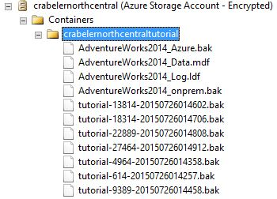

# Lesson 6: Generate activity and backup log using file-snapshot backup
[!INCLUDE[appliesto-ss-xxxx-xxxx-xxx-md](../includes/appliesto-ss-xxxx-xxxx-xxx-md.md)]
In this lesson, you will generate activity in the AdventureWorks2014 database and periodically create transaction log backups using file-snapshot backups. For more information on using file snapshot backups, see [File-Snapshot Backups for Database Files in Azure](../relational-databases/backup-restore/file-snapshot-backups-for-database-files-in-azure.md).  
  
To generate activity in the AdventureWorks2014 database and periodically create transaction log backups using file-snapshot backups, follow these steps:  
  
1.  Connect to SQL Server Management Studio.  
  
2.  Open two new query windows and connect each to the SQL Server 2016 instance of the database engine in your Azure virtual machine.  
  
3.  Copy, paste and execute the following Transact-SQL script into one of the query windows. Notice that the Production.Location table has 14 rows before we add new rows in step 4.  
  
    ```  
  
    -- Verify row count at start  
    SELECT COUNT (*) from AdventureWorks2014.Production.Location;  
  
    ```  
  
4.  Copy and paste the following two Transact-SQL scripts into the two separate query windows. Modify the URL appropriately for your storage account name and the container that you specified in Lesson 1 and then execute these scripts simultaneously in separate query windows. These scripts will take about seven minutes to complete.  
  
    ```  
    -- Insert 30,000 new rows into the Production.Location table in the AdventureWorks2014 database in batches of 75  
    DECLARE @count INT=1, @inner INT;  
    WHILE @count < 400  
       BEGIN  
          BEGIN TRAN;  
             SET @inner =1;  
                WHILE @inner <= 75  
                   BEGIN;  
                      INSERT INTO AdventureWorks2014.Production.Location    
                         (Name, CostRate, Availability, ModifiedDate)   
                            VALUES (NEWID(), .5, 5.2, GETDATE());  
                      SET @inner = @inner + 1;  
                   END;  
          COMMIT;  
       WAITFOR DELAY '00:00:01';   
       SET @count = @count + 1;  
       END;  
    SELECT COUNT (*) from AdventureWorks2014.Production.Location;  
  
    ```  
  
    ```  
    --take 7 transaction log backups with FILE_SNAPSHOT, one per minute, and include the row count and the execution time in the backup file name   
    DECLARE @count INT=1, @device NVARCHAR(120), @numrows INT;  
    WHILE @count <= 7  
       BEGIN  
             SET @numrows = (SELECT COUNT (*) FROM AdventureWorks2014.Production.Location);  
             SET @device = 'https://<mystorageaccountname>.blob.core.windows.net/<mystorageaccountcontainername>/tutorial-' + CONVERT (varchar(10),@numrows) + '-' + FORMAT(GETDATE(), 'yyyyMMddHHmmss') + '.bak';  
             BACKUP LOG AdventureWorks2014 TO URL = @device WITH FILE_SNAPSHOT;  
             SELECT * from sys.fn_db_backup_file_snapshots ('AdventureWorks2014');  
          WAITFOR DELAY '00:1:00';   
             SET @count = @count + 1;  
       END;  
    ```  
  
5.  Review the output of the first script and notice that final row count is now 29,939.  
  
      
  
6.  Review the output of the second script and notice that each time the BACKUP LOG statement is executed that   two new file snapshots are created, one file snapshot of the log file and one file snapshot of the data file - for a total of two file snapshots for each database file. After the second script completes, notice that there are now a total of 16 file snapshots, 8 for each database file - one from the BACKUP DATABASE statement and one for each execution of the BACKUP LOG statement.  
  
      
  
      
  
      
  
7.  In Object Explorer, connect to Azure storage.  
  
8.  Expand Containers,  expand the container that your created in Lesson 1 and verify that 7 new backup files appear, along with the blobs from the previous lessons (refresh the node as needed).  
  
      
  
**Next Lesson:**  
  
[Lesson 7: Restore a database to a point in time](../relational-databases/lesson-7-restore-a-database-to-a-point-in-time.md)  
  
  
  
