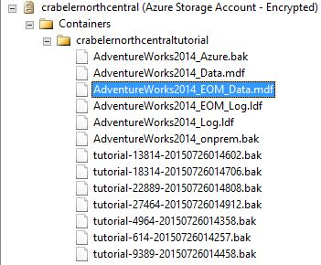

# Lesson 8. Restore as new database from log backup
[!INCLUDE[appliesto-ss-xxxx-xxxx-xxx-md](../includes/appliesto-ss-xxxx-xxxx-xxx-md.md)]
In this lesson, you will restore the AdventureWorks2014 database as a new database from a file-snapshot transaction log backup.  
  
In this scenario, you are performing a restore to a SQL Server instance on a different virtual machine for the purposes of business  analysis and reporting. Restoring to a different instance on a different virtual machine offloads the workload to a virtual machine dedicated and sized for this purpose, removing its resource requirements from the transactional system.  
  
Restore from a transaction log backup with file-snapshot backup is very quick, substantially quicker than with traditional streaming backups. With traditional streaming backups, you would  need to use the full database backup, perhaps a differential backup, and some or all of the transaction log backups (or a new full database backup). However, with file-snapshot log backups, you only need the most recent log backup (or any other log backup or any two adjacent log backups for point in time restore to a point between two log backup times). To be clear, you only need one log file-snapshot backup set because each file-snapshot log backup creates a file snapshot of each database file (each data file and the log file).  
  
To restore a database to a new database from a transaction log backup using file snapshot backup, follow these steps:  
  
1.  Connect to SQL Server Management Studio.  
  
2.  Open a new query window and connect to the SQL Server 2016 instance of the database engine in an Azure virtual machine.  
  
    > [!NOTE]  
    > If this is a different Azure virtual machine than you have been using for the previous lessons, make sure you have followed the steps in [Lesson 2: Create a SQL Server credential using a shared access signature](../relational-databases/lesson-2-create-a-sql-server-credential-using-a-shared-access-signature.md). If you wish to restore to a different container, follow the steps in [Lesson 1: Create a stored access policy and a shared access signature  on an Azure container](../relational-databases/lesson-1-create-stored-access-policy-and-shared-access-signature.md) and [Lesson 2: Create a SQL Server credential using a shared access signature](../relational-databases/lesson-2-create-a-sql-server-credential-using-a-shared-access-signature.md) for the new container.  
  
3.  Copy and paste the following Transact-SQL script into the query window. Select the log backup file you wish to use. Modify the URL appropriately for your storage account name and the container that you specified in Lesson 1, provide the log backup file name and then execute this script.  
  
    ```  
  
    -- restore as a new database from a transaction log backup file  
    RESTORE DATABASE AdventureWorks2014_EOM   
        FROM URL = 'https://<mystorageaccountname>.blob.core.windows.net/<mystorageaccountcontainername>/<logbackupfile.bak'    
        WITH MOVE 'AdventureWorks2014_data' to 'https://<mystorageaccountname>.blob.core.windows.net/<mystorageaccountcontainername>/AdventureWorks2014_EOM_Data.mdf'  
       , MOVE 'AdventureWorks2014_log' to 'https://<mystorageaccountname>.blob.core.windows.net/<mystorageaccountcontainername>/AdventureWorks2014_EOM_Log.ldf'  
       , RECOVERY  
    --, REPLACE  
  
    ```  
  
4.  Review the output to verify the restore was successful.  
  
5.  In Object Explorer, connect to  Azure storage.  
  
6.  Expand Containers, expand the container that your created in Lesson 1 (refresh if necessary) and verify that the new data and log  files appear in the container, along with the blobs from the previous lessons.  
  
      
  
[Lesson 9: Manage backup sets and file-snapshot backups](../relational-databases/lesson-9-manage-backup-sets-and-file-snapshot-backups.md)  
  
  
  
