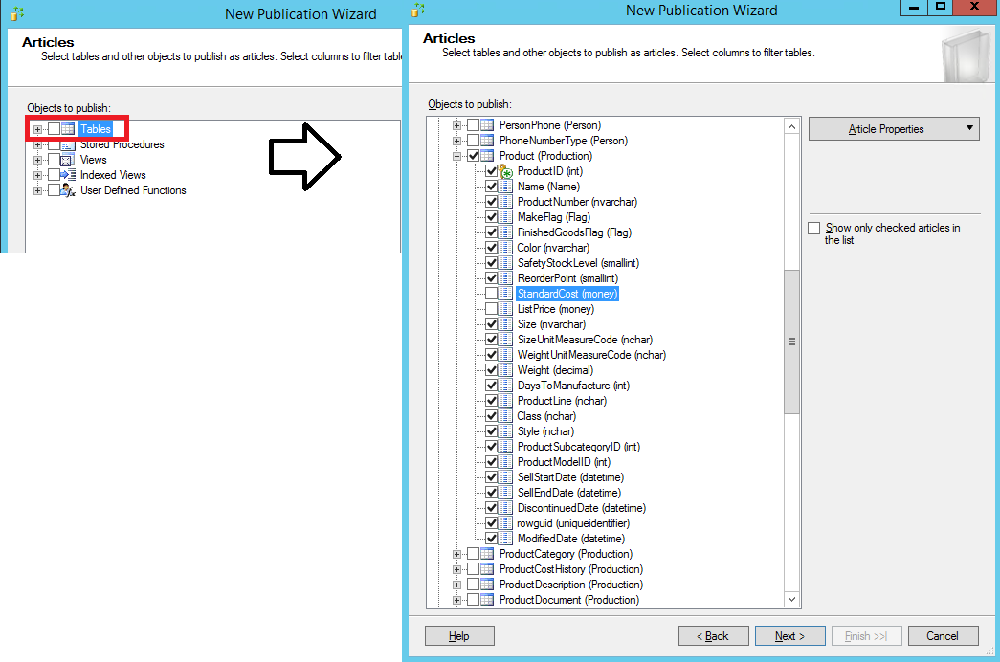
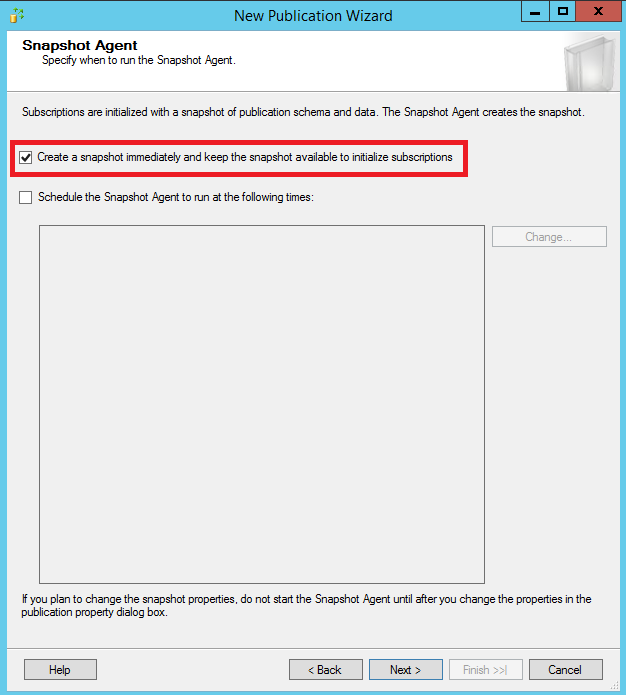
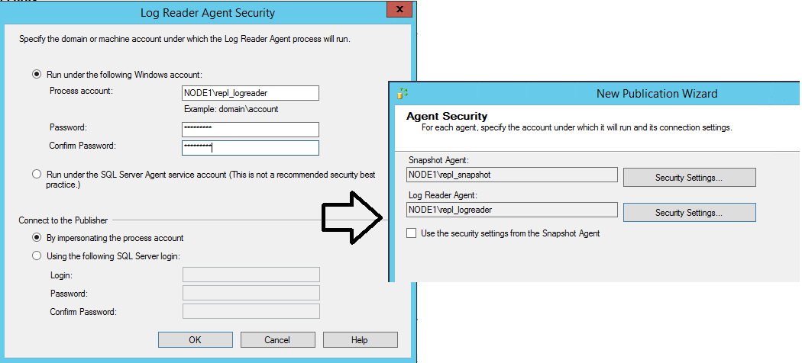
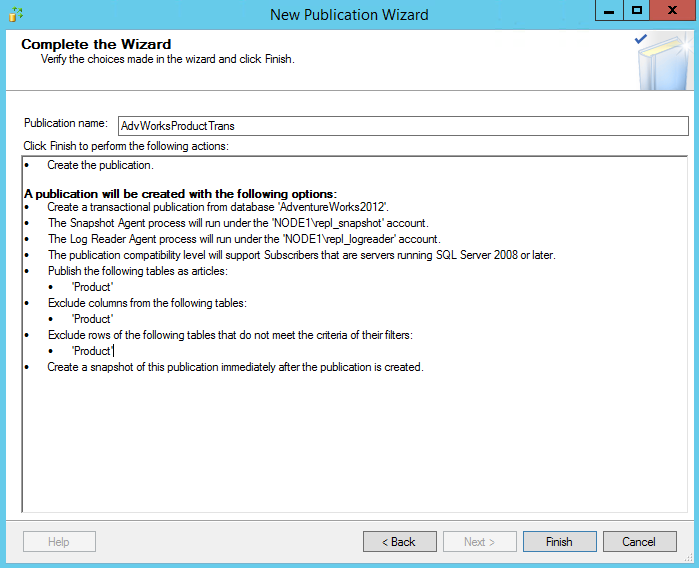

# Tutorial: Configuring Transactional Replication Beetween Continuously Connected Servers
[!INCLUDE[appliesto-ss-xxxx-xxxx-xxx-md](../../includes/appliesto-ss-xxxx-xxxx-xxx-md.md)]
Replication is a good solution to the problem of moving data between continuously connected servers. Using replication's wizards, you can easily configure and administer a replication topology. This tutorial shows you how to configure a replication topology for continuously connected servers.  
  
## What You Will Learn  
This tutorial will show you how to publish data from one database to another using transactional replication. 

In this tutorial, you will learn how to:
> [!div class="checklist"]
> * Publish data using Transactional Replication
> * Create a subscription to the Transactional publication
> * Validate the Subscription and measure latency
  
  
## Requirements  
This tutorial is intended for users who are familiar with basic database operations, but who have limited experience with replication. This tutorial requires that you have completed the previous tutorial, [Preparing the Server for Replication](../../relational-databases/replication/tutorial-preparing-the-server-for-replication.md).  
  
To use this tutorial, your system must have the following SQL Server Management studio and these components:  
  
-   At the Publisher server (source):  
  
    -   Any edition of [!INCLUDE[ssNoVersion](../../includes/ssnoversion-md.md)], except Express ([!INCLUDE[ssExpress](../../includes/ssexpress-md.md)]) or [!INCLUDE[ssEW](../../includes/ssew-md.md)]. These editions cannot be replication Publishers.  
  
    -   [!INCLUDE[ssSampleDBUserInputNonLocal](../../includes/sssampledbuserinputnonlocal-md.md)] sample database. To enhance security, the sample databases are not installed by default.  
  
-   Subscriber server (destination):  
  
    -   Any edition of [!INCLUDE[ssNoVersion](../../includes/ssnoversion-md.md)], except [!INCLUDE[ssEW](../../includes/ssew-md.md)]. [!INCLUDE[ssEW](../../includes/ssew-md.md)] cannot be a Subscriber in transactional replication.  
  
- Install [SQL Server Management Studio](https://docs.microsoft.com/en-us/sql/ssms/download-sql-server-management-studio-ssms).
- Install [SQL Server 2017 Developer Edition](https://www.microsoft.com/en-us/sql-server/sql-server-downloads)
- Download an [AdventureWorks Sample Databases](https://github.com/Microsoft/sql-server-samples/releases). 
    - Instructions for restoring databases in SSMS can be found here: [Restoring a Database](https://docs.microsoft.com/en-us/sql/relational-databases/backup-restore/restore-a-database-backup-using-ssms). 
    >[!NOTE]
  > - Replication is not supported on SQL Servers that are more than two versions apart. For more information, please see [Supported SQL Versions in Repl Topology](https://blogs.msdn.microsoft.com/repltalk/2016/08/12/suppported-sql-server-versions-in-replication-topology/)
  > - In [!INCLUDE[ssManStudioFull](../../includes/ssmanstudiofull-md.md)], you must connect to the Publisher and Subscriber using a login that is a member of the **sysadmin** fixed server role  
  
  
**Estimated time to complete this tutorial: 30 minutes.**  
  
## Publish data using Transactional Replication
In this secton, you will create a transactional publication using [!INCLUDE[ssManStudioFull](../../includes/ssmanstudiofull-md.md)] to publish a filtered subset of the **Product** table in the [!INCLUDE[ssSampleDBobject](../../includes/sssampledbobject-md.md)] sample database. You will also add the SQL Server login used by the Distribution Agent to the publication access list (PAL). Before starting this tutorial, you should have completed the previous tutorial, [Preparing the Server for Replication](../../relational-databases/replication/tutorial-preparing-the-server-for-replication.md).


### Create a publication and define articles
1.  Connect to the Publisher in [!INCLUDE[ssManStudioFull](../../includes/ssmanstudiofull-md.md)], and then expand the server node.  
  
2.  Expand the **Replication** folder, right-click the **Local Publications** folder, and click **New Publication**.  This will launch the Publication Configuration Wizard. 

    
  
  
3.  On the Publication Database page, select [!INCLUDE[ssSampleDBobject](../../includes/sssampledbobject-md.md)], and then click **Next**.  
  
4.  On the Publication Type page, select **Transactional publication**, and then click **Next**.  

    
  
5.  On the Articles page, expand the **Tables** node, select the **Product** check box, then expand **Product** and clear the **ListPrice** and **StandardCost** check boxes. Click **Next**.  

    
  
6.  On the Filter Table Rows page, click **Add**.  
  
7.  In the **Add Filter** dialog box, click the **SafetyStockLevel** column, click the right arrow to add the column to the Filter statement WHERE clause of the filter query. Then manually type in the WHERE clause modifier as follows:  
  
    ```sql  
    WHERE [SafetyStockLevel] < 500  
    ```  

    
  
8.  Click **OK**, and then click **Next**.  
  
9. Select the **Create a snapshot immediately and keep the snapshot available to initialize subscriptions** check box, and click **Next**.  

    
  
10. On the Agent Security page, clear **Use the security settings from the Snapshot Agent** check box.  
  
11. Click **Security Settings** for the Snapshot Agent, enter \<*Machine_Name>***\repl_snapshot** in the **Process account** box, supply the password for this account, and then click **OK**.  

    
  
12. Repeat the previous step to set repl_logreader as the process account for the Log Reader Agent, and then click **Finish**.  

       

  
13. On the Complete the Wizard page, type **AdvWorksProductTrans** in the **Publication name** box, and click **Finish**.  

    
  
14. After the publication is created, click **Close** to complete the wizard.  
  
### To view the status of snapshot generation  
  
1.  Connect to the Publisher in [!INCLUDE[ssManStudioFull](../../includes/ssmanstudiofull-md.md)], expand the server node, and then expand the **Replication** folder.  
  
2.  In the **Local Publications** folder, right-click **AdvWorksProductTrans**, and then click **View Snapshot Agent Status**.  
  
3.  The current status of the Snapshot Agent job for the publication is displayed. Verify that the snapshot job has succeeded before you continue to the next lesson.  
  
### To add the Distribution Agent login to the PAL  
  
1.  Connect to the Publisher in [!INCLUDE[ssManStudioFull](../../includes/ssmanstudiofull-md.md)], expand the server node, and then expand the **Replication** folder.  
  
2.  In the **Local Publications** folder, right-click **AdvWorksProductTrans**, and then click **Properties**.  
  
    The **Publication Properties** dialog box is displayed.  
  
3.  Select the **Publication Access List** page, and click **Add**.  
  
4.  \In the **Add Publication Access** dialog box, select *<Machine_Name>***\repl_distribution** and click **OK**. Click **OK**.  
  


## Create a subscription to the Transactional publication
## Validate the Subscription and measure latency


**See Also**  
[Replication Programming Concepts](../../relational-databases/replication/concepts/replication-programming-concepts.md)  
  
  
  
