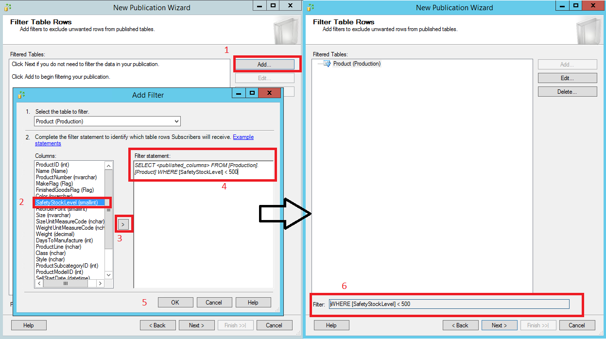
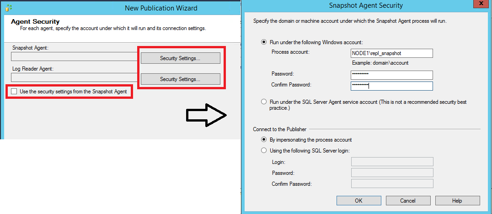
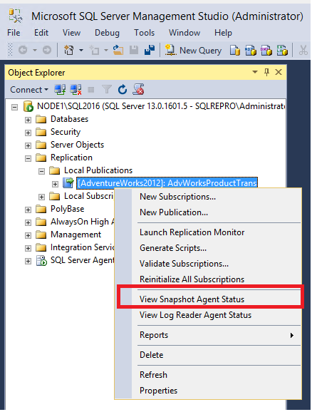
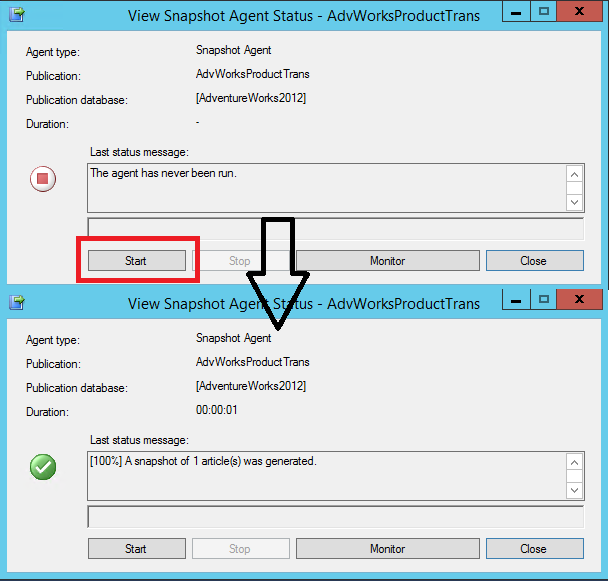
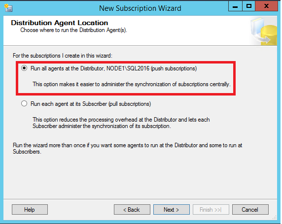
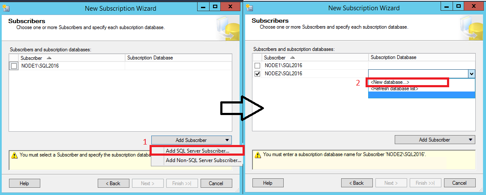
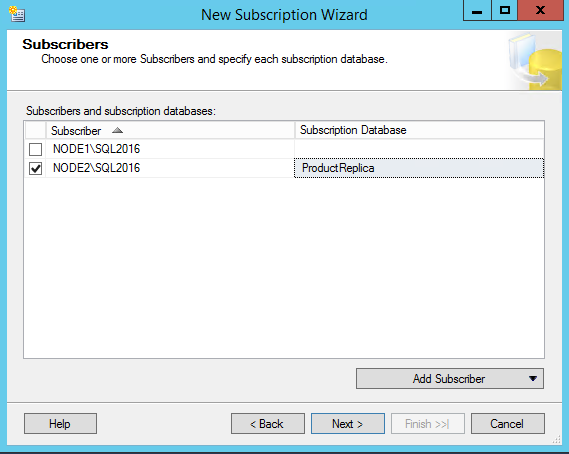
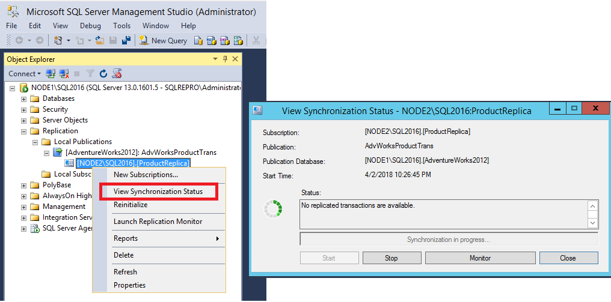
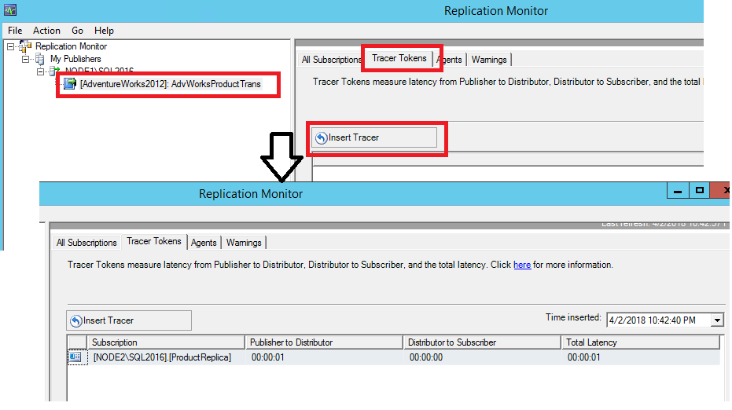
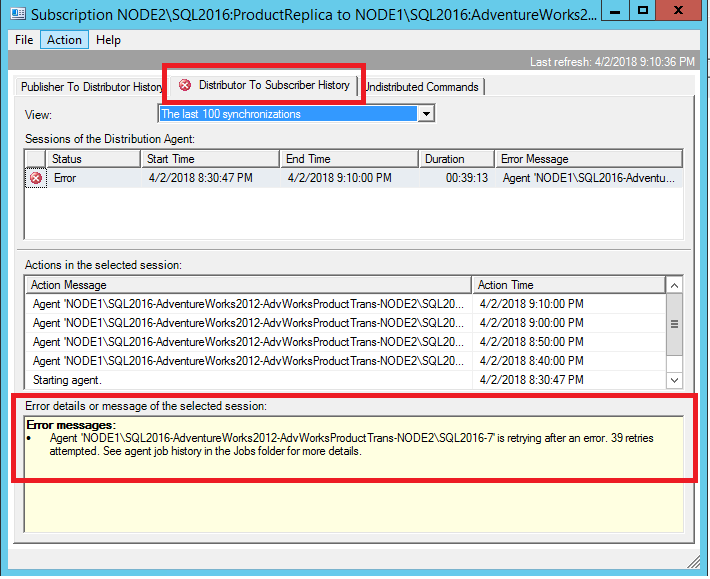

# Tutorial: Configure replication between two fully connected servers (transactional)
[!INCLUDE[appliesto-ss-xxxx-xxxx-xxx-md](../../includes/appliesto-ss-xxxx-xxxx-xxx-md.md)]
Transactional replication is a good solution to the problem of moving data between continuously connected servers. By using the Replication Wizard, you can easily configure and administer a replication topology. 

This tutorial shows you how to configure a transactional replication topology for continuously connected servers. For more information about how transactional replication works, see the [Transactional replication overview](https://docs.microsoft.com/en-us/sql/relational-databases/replication/transactional/transactional-replication). 
  
## What you will learn  
This tutorial will show you how to publish data from one database to another using transactional replication. 

In this tutorial, you will learn how to:
> [!div class="checklist"]
> * Create a publisher via transactional replication.
> * Create a subscriber for the transactional publisher.
> * Validate the subscription and measure latency.
> * Troubleshoot errors.
  
  
## Prerequisites  
This tutorial is for users who are familiar with basic database operations, but who have limited experience with replication. This tutorial requires that you have completed the previous tutorial, [Preparing the server for replication](../../relational-databases/replication/tutorial-preparing-the-server-for-replication.md).  
  
To use this tutorial, make sure that your system has these products and components:  
  
- At the publisher server (source), install:  
  
   - Any edition of [!INCLUDE[ssNoVersion](../../includes/ssnoversion-md.md)], except SQL Server Express or SQL Server Compact. These editions cannot be replication publishers.   
   - An [!INCLUDE[ssSampleDBUserInputNonLocal](../../includes/sssampledbuserinputnonlocal-md.md)] sample database. To enhance security, the sample databases are not installed by default.  
  
- At the subscriber server (destination), install any edition of [!INCLUDE[ssNoVersion](../../includes/ssnoversion-md.md)], except [!INCLUDE[ssEW](../../includes/ssew-md.md)]. [!INCLUDE[ssEW](../../includes/ssew-md.md)] cannot be a subscriber in transactional replication.  
  
- Install [SQL Server Management Studio (SSMS)](https://docs.microsoft.com/en-us/sql/ssms/download-sql-server-management-studio-ssms).
- Install [SQL Server 2017 Developer edition](https://www.microsoft.com/en-us/sql-server/sql-server-downloads).
- Download an [AdventureWorks sample database](https://github.com/Microsoft/sql-server-samples/releases). For instructions on restoring a database in SSMS, see [Restoring a database](https://docs.microsoft.com/en-us/sql/relational-databases/backup-restore/restore-a-database-backup-using-ssms). 
 
>[!NOTE]
> - Replication is not supported on SQL Server instances that are more than two versions apart. For more information, see [Supported SQL Server Versions in Replication Topology](https://blogs.msdn.microsoft.com/repltalk/2016/08/12/suppported-sql-server-versions-in-replication-topology/).
> - In [!INCLUDE[ssManStudioFull](../../includes/ssmanstudiofull-md.md)], you must connect to the publisher and subscriber by using a login that is a member of the **sysadmin** fixed server role. For more information on this role, see [Server-level roles](https://docs.microsoft.com/en-us/sql/relational-databases/security/authentication-access/server-level-roles).  
  
  
**Estimated time to complete this tutorial: 60 minutes**  
  
## Configure the publisher for transactional replication
In this section, you create a transactional publication by using [!INCLUDE[ssManStudioFull](../../includes/ssmanstudiofull-md.md)] to publish a filtered subset of the **Product** table in the [!INCLUDE[ssSampleDBobject](../../includes/sssampledbobject-md.md)] sample database. You also add the SQL Server login used by the Distribution Agent to the publication access list (PAL).


### Create a publication and define articles
1. Connect to the publisher in [!INCLUDE[ssManStudioFull](../../includes/ssmanstudiofull-md.md)], and then expand the server node.  
  
2. Right-click **SQL Server Agent** and select **Start**. The SQL Server Agent should be running before you create the publication. If this step does not start your agent, you'll need to do so manually from SQL Server Configuration Manager. 
3. Expand the **Replication** folder, right-click the **Local Publications** folder, and select **New Publication**. This step starts the New Publication Wizard:  

   
  
  
3. On the **Publication Database** page, select [!INCLUDE[ssSampleDBobject](../../includes/sssampledbobject-md.md)], and then select **Next**.  
  
4. On the **Publication Type** page, select **Transactional publication**, and then select **Next**:  

   
  
5. On the **Articles** page, expand the **Tables** node and select the **Product** check box. Then expand **Product** and clear the check boxes next to  **ListPrice** and **StandardCost**. Select **Next**.  

   
  
6. On the **Filter Table Rows** page, select **Add**.   
  
7. In the **Add Filter** dialog box, select the **SafetyStockLevel** column. Select the right arrow to add the column to the filter statement WHERE clause of the filter query. Then manually type in the WHERE clause modifier as follows:  
  
   ```sql  
   WHERE [SafetyStockLevel] < 500  
   ```
  
   
  
8. Select **OK**, and then select **Next**.  
  
9. Select the **Create a snapshot immediately and keep the snapshot available to initialize subscriptions** check box, and select **Next**:  

   
  
10. On the **Agent Security** page, clear the **Use the security settings from the Snapshot Agent** check box.   
  
    Select **Security Settings** for the Snapshot Agent, enter <*Publisher_Machine_Name*>**\repl_snapshot** in the **Process account** box, supply the password for this account, and then select **OK**:  

    
  
12. Repeat the previous step to set <*Publisher_Machine_Name*>**\repl_logreader** as the process account for the Log Reader Agent. Then select **OK**.  

       

  
13. On the **Complete the Wizard** page, type **AdvWorksProductTrans** in the **Publication name** box, and select **Finish**:  

    
  
14. After the publication is created, select **Close** to complete the wizard. 

You might encounter the following error if your SQL Server Agent is not running when  you attempt to create the publication. This is an indication that your publication was created successfully, but your Snapshot Agent was unable to start. If this happens, you'll need to start the SQL Server Agent, and then manually start the Snapshot Agent. The next section gives instructions. 


    
  
### View the status of snapshot generation  
  
1. Connect to the Publisher in [!INCLUDE[ssManStudioFull](../../includes/ssmanstudiofull-md.md)], expand the server node, and then expand the **Replication** folder.  
  
2. In the **Local Publications** folder, right-click **AdvWorksProductTrans**, and then select **View Snapshot Agent Status**:  
   
  
3. The current status of the Snapshot Agent job for the publication is displayed. Verify that the snapshot job has succeeded before you continue to the next section.
          
If your SQL Server Agent was not running when you created the publication, you'll see that the Snapshot Agent was never run when you check the Snapshot Agent status for your publication. If that's the case, select **Start** to start your Snapshot Agent: 


     
If you see an error here, see [Troubleshoot errors with the Snapshot Agent](#troubleshoot-errors-with-the-snapshot-agent). 

  
### Add the Distribution Agent login to the PAL  
  
1. Connect to the publisher in [!INCLUDE[ssManStudioFull](../../includes/ssmanstudiofull-md.md)], expand the server node, and then expand the **Replication** folder.  
  
2. In the **Local Publications** folder, right-click **AdvWorksProductTrans**, and then select **Properties**.  The **Publication Properties** dialog box appears.    
  
   a. Select the **Publication Access List** page, and select **Add**.  
   b. In the **Add Publication Access** dialog box, select <*Publisher_Machine_Name*>**\repl_distribution**, and select **OK**.

   
   

For more information, see [Replication Programming Concepts](../../relational-databases/replication/concepts/replication-programming-concepts.md).  
  

## Create a subscription to the transactional publication
In this section, you add a subscriber to the publication that you previously created. This tutorial uses a remote subscriber (NODE2\SQL2016), but you can also add a subscription locally to the publisher. 

### Create the subscription  
  
1. Connect to the publisher in [!INCLUDE[ssManStudioFull](../../includes/ssmanstudiofull-md.md)], expand the server node, and then expand the **Replication** folder.  
  
2. In the **Local Publications** folder, right-click the **AdvWorksProductTrans** publication, and then select **New Subscriptions**. The New Subscription Wizard starts: 
 
        
  
3. On the **Publication** page, select **AdvWorksProductTrans**, and then select **Next**:  

   
  
4. On the **Distribution Agent Location** page, select **Run all agents at the Distributor**, and then select **Next**.  For more information on pull and push subscriptions, see [Subscribe to publications](https://docs.microsoft.com/en-us/sql/relational-databases/replication/subscribe-to-publications):

   
  
5. On the **Subscribers** page, if the name of the subscriber instance is not displayed, select **Add Subscriber**, and then select **Add SQL Server Subscriber** from the drop-down list. This step opens the **Connect to Server** dialog box. Enter the subscriber instance name and then select **Connect**.  
    
   After the subscriber has been added, select the check box next to the instance name of your subscriber. Then select **New Database** under **Subscription Database**.   

   

7. The **New Database** dialog box appears. Enter **ProductReplica** in the **Database name** box, select **OK**, and then select **Next**: 
  
   
  
8. On the **Distribution Agent Security** page, select the ellipsis (**…**) button. Enter <*Publisher_Machine_Name*>**\repl_distribution** in the **Process account** box, enter the password for this account, select **OK**, and then select **Next**:

   
  
9. Select **Finish** to accept the default values on the remaining pages and complete the wizard.  
  
### Set database permissions at the subscriber  
  
1. Connect to the subscriber in [!INCLUDE[ssManStudioFull](../../includes/ssmanstudiofull-md.md)]. Expand **Security**, right-click **Logins**, and then select **New Login**.     
  
   a. On the **General** page, under **Login Name**, select **Search** and add the login for <*Subscriber_Machine_Name*>**\repl_distribution**.

   b. On the **User Mappings** page, grant the login **db_owner** for the **ProductReplica** database. 

   

2. Select **OK** to close the **New Login** dialog box. 

  
### View the synchronization status of the subscription  
  
1. Connect to the publisher in [!INCLUDE[ssManStudioFull](../../includes/ssmanstudiofull-md.md)]. Expand the server node, and then expand the **Replication** folder.  
  
2. In the **Local Publications** folder, expand the **AdvWorksProductTrans** publication, right-click the subscription in the **ProductReplica** database, and then select **View Synchronization Status**. The current synchronization status of the subscription appears:

   
3. If the subscription is not visible under **AdvWorksProductTrans**, select the F5 key to refresh the list.  
  
For more information, see:  
[Initialize a Subscription with a Snapshot](../../relational-databases/replication/initialize-a-subscription-with-a-snapshot.md)  
[Create a Push Subscription](../../relational-databases/replication/create-a-push-subscription.md)  
[Subscribe to Publications](../../relational-databases/replication/subscribe-to-publications.md)  

## Measure replication latency
In this section, you use tracer tokens to verify that changes are being replicated to the subscriber and to determine latency. Latency is the time it takes for a change made at the publisher to appear to the subscriber.
  
1. Connect to the publisher in [!INCLUDE[ssManStudioFull](../../includes/ssmanstudiofull-md.md)]. Expand the server node, right-click the **Replication** folder, and then select **Launch Replication Monitor**:

   

2. Expand a publisher group in the left pane, expand the publisher instance, and then select the **AdvWorksProductTrans** publication.  
  
   a. Select the **Tracer Tokens** tab.  
   b. Select **Insert Tracer**.    
   c. View elapsed time for the tracer token in the following columns: **Publisher to Distributor**, **Distributor to Subscriber**, **Total Latency**. A value of **Pending** indicates that the token has not reached a specified point.

   


For more information, see [Measure Latency and Validate Connections for Transactional Replication](../../relational-databases/replication/monitor/measure-latency-and-validate-connections-for-transactional-replication.md).

## Error troubleshooting methodology
This section teaches you how to troubleshoot basic replication synchronization failures by using the replication components. The actual errors that you encounter might be different from what's discussed here--and might need a different resolution. If that's the case, further troubleshooting is necessary and is outside the scope of this tutorial. 


### Troubleshoot errors with the Snapshot Agent
The Snapshot Agent generates the snapshot and writes it to the specified snapshot folder. 

1. To view the status of your snapshot agent, expand the **Local Publication** node under replication, right-click your publication **AdvWorksProductTrans** > **View Snapshot Agent Status**. 
2. If an error is reported in the Snapshot Agent status, you can find more details in the **Snapshot Agent** job history. To access the job history, expand **SQL Server Agent** in **Object Explorer** and open **Job Activity Monitor**. 

   a. Sort by **Category** and identify the **Snapshot Agent** by the category **REPL-Snapshot**. 

   b. Right-click the **Snapshot Agent** and select **View History**. 

   
    
1. In the Snapshot Agent history, select the relevant log entry. This will usually be a line or two *before* the entry that's reporting the error. (The red X indicates the errors.) Review the message text in the box below the logs: 

   

       The replication agent had encountered an exception. 
       Exception Message: Access to path '\\node1\repldata.....' is denied.


   If your windows permissions are not configured correctly for your snapshot folder, you'll see an "access is denied" error for the Snapshot Agent. You'll need to verify permissions for the <*Publisher_Machine_Name*>**\repl_snapshot** account on your repldata folder. For more information, see [Create a share for the snapshot folder and assign permissions](tutorial-preparing-the-server-for-replication.md#create-a-share-for-the-snapshot-folder-and-assign-permissions).

### Troubleshoot errors with the Log Reader Agent
The Log Reader Agent connects to  your publisher database and scans the transaction log for any transactions that are marked for replication. It then adds those transactions to the Distribution database. 

1. Connect to the publisher in [!INCLUDE[ssManStudioFull](../../includes/ssmanstudiofull-md.md)]. Expand the server node, right-click the **Replication** folder, and then select **Launch Replication Monitor**:  

   
  
   Replication Monitor opens: 
   
    
   
2. The red X is an indication that the publication is not synchronizing. Expand **My Publishers** on the left side, and then expand the relevant publisher server.  
  
3. Select the **AdvWorksProductTrans** publication on the left, and then look for the red X on one of the tabs to identify where the problem is. In this case, the red X is on the **Agents** tab, indicating that one of the agents is running into an error: 

   

4. Select the **Agents** tab to identify which agent is encountering the error: 

   


5. This view shows you two agents, the Snapshot Agent and the Log Reader Agent. The one that's encountering an error will have the red X. In this case, the Log Reader Agent has the Red X. 

   Double-click the line that's reporting the error--in this case, **Log Reader Agent**. The agent history appears for the agent that you've selected. In this case, it's the Log Reader Agent history. It provides more information about the error: 
    
   

       Status: 0, code: 20011, text: 'The process could not execute 'sp_replcmds' on 'NODE1\SQL2016'.'.
       The process could not execute 'sp_replcmds' on 'NODE1\SQL2016'.
       Status: 0, code: 15517, text: 'Cannot execute as the database principal because the principal "dbo" does not exist, this type of principal cannot be impersonated, or you do not have permission.'.
       Status: 0, code: 22037, text: 'The process could not execute 'sp_replcmds' on 'NODE1\SQL2016'.'.        

6. The publication error typically happens when the owner of the publisher database is not set correctly after a database is restored. Expand **Databases** in **Object Explorer** > right-click **AdventureWorks2012** > **Properties**. Verify that an owner exists under the **Files** page. If this box is blank, then this is the likely cause of your problem: 

   

7. If the owner is blank on the **Files** page, open a **New Query** window within the context of the **AdventureWorks2012** database. Run the following T-SQL code snippet:

   ```sql
   -- set the owner of the database to 'sa' or a specific user account, without the brackets. 
   EXEC sp_changedbowner '<useraccount>'
   -- example for sa: exec sp_changedbowner 'sa'
   -- example for user account: exec sp_changedbowner 'sqlrepro\administrator' 
   ```

8. Restart the Log Reader Agent. To do this, expand the **SQL Server Agent** node in **Object Explorer** and open **Job Activity Monitor**. Sort by **Category** and identify the Log Reader Agent by the **REPL-LogReader** category. Right-click the **Log Reader Agent** job and select **Start Job at Step**. 

   

9. Validate that your publication is now synchronizing by opening Replication Monitor again. If it's not already open, you can find it by right-clicking **Replication** in Object Explorer. 
10. Select the **AdvWorksProductTrans** publication, select the **Agents** tab, and double-click **Log Reader Agent** to open the agent history. You should now see that the Log Reader Agent is running and either replicating commands, or that it has "no replicated transactions":

    

### Troubleshoot errors with the Distribution Agent
The Distribution Agent finds data in the Distribution database and then applies it to the subscriber. 

1. Connect to the publisher in [!INCLUDE[ssManStudioFull](../../includes/ssmanstudiofull-md.md)]. Expand the server node, right-click the **Replication** folder, and then select **Launch Replication Monitor**.  
2. In Replication Monitor, select the **AdvWorksProductTrans** publication, and select the **All Subscriptions** tab. Right-click the subscription and select **View Details**:

   

2. The **Distributor To Subscriber History** tab box opens and clarifies what error the agent is encountering: 

    
    
        Error messages:
        Agent 'NODE1\SQL2016-AdventureWorks2012-AdvWorksProductTrans-NODE2\SQL2016-7' is retrying after an error. 89 retries attempted. See agent job history in the Jobs folder for more details.

3. The error indicates that the **Distribution Agent** is retrying. To get more information, expand **SQL Server Agent** in Object Explorer > **Job Activity Monitor**. Sort the jobs by **Category**. 

   Identify the **Distribution Agent** by the category **REPL-Distribution**. Right-click the agent and select **View History**.

   

5. Select one of the error entries and view the error text at the bottom of the window:  

   
    
        Message:
        Unable to start execution of step 2 (reason: Error authenticating proxy NODE1\repl_distribution, system error: The user name or password is incorrect.)

6. This error indicates that the password that the Distribution Agent used is incorrect. To resolve this, expand the **Replication** node in **Object Explorer**, right-click the subscription > **Properties**. Select the ellipsis (**...**) next to **Agent Process Account** and modify the password.

   

7. Check Replication Monitor again. You can find it by right-clicking **Replication** in Object Explorer. A red X under **All Subscriptions** indicates that the Distribution Agent is still encountering an error. Open the **Distribution To Subscriber History** tab by right-clicking the subscription in **Replication Monitor** > **View Details**. Here, the error is now different: 

   
           
        Connecting to Subscriber 'NODE2\SQL2016'        
        Agent message code 20084. The process could not connect to Subscriber 'NODE2\SQL2016'.
        Number:  18456
        Message: Login failed for user 'NODE2\repl_distribution'.

8. This error indicates that the **Distribution Agent** could not connect to the subscriber, because the login failed for the user **NODE2\repl_distribution**. To investigate further, connect to the subscriber and open the *current* SQL Server error log under the **Management** node in Object Explorer: 

   
    
   If you're seeing this error, the login is missing on the subscriber. To resolve this problem, see [Set database permissions at the subscriber](#set-database-permissions-at-the-subscriber).

9. After you resolve the login error, check Replication Monitor again. If all problems have been fixed, you should see a green arrow next to the publication name and a status of **Running** under **All Subscriptions**. 

   Right-click the subscription to open the **Distributor To Subscriber History** tab and verify success. If this is your first time running the Distribution Agent, you can see that the snapshot has been bulk copied to the subscriber: 

      

## Next steps
You have successfully configured both your publisher and your subscriber for transactional replication. You can now insert, update, or delete data in the **Product**  table at the publisher. Then you can query the **Product** table at the subscriber to view the replicated changes. 

The next article will teach you how to configure merge replication:  

> [!div class="nextstepaction"]
> [Tutorial: Configure replication between a server and mobile clients (merge)](tutorial-replicating-data-with-mobile-clients.md)

  
