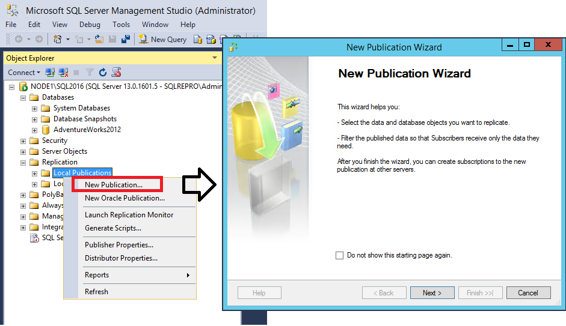
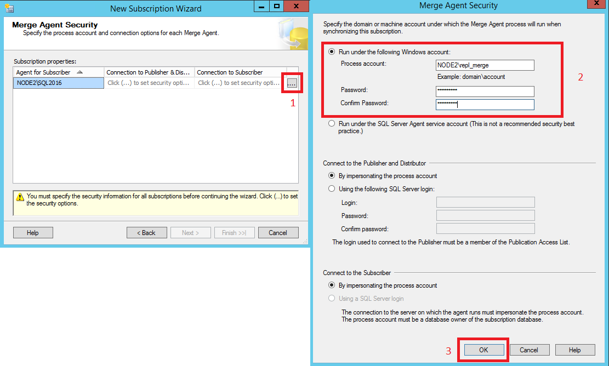
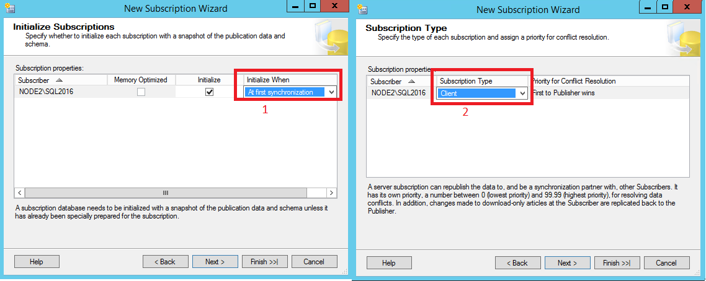
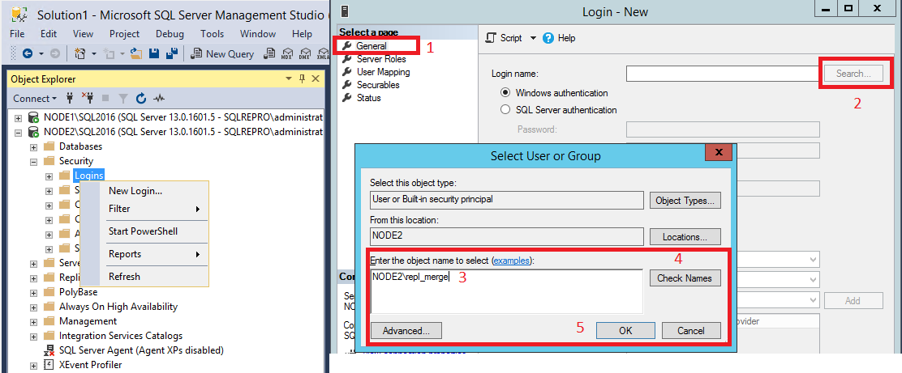
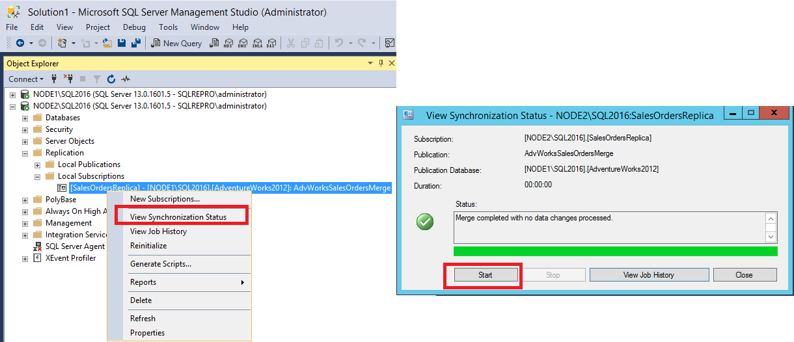

# Tutorial: Configure Replication between a Server and Mobile Clients (Merge)
[!INCLUDE[appliesto-ss-xxxx-xxxx-xxx-md](../../includes/appliesto-ss-xxxx-xxxx-xxx-md.md)]
Merge replication is a good solution to the problem of moving data between a central server and mobile clients that are only occasionally connected. Using replication's wizards, you can easily configure and administer a Merge Replication topology. This tutorial shows you how to configure a replication topology for mobile clients.  For more information about Merge Replication, please see [An Overview of Merge Replication](https://docs.microsoft.com/en-us/sql/relational-databases/replication/merge/merge-replication)
  
## What You Will Learn  
This Tutorial teaches you to use Merge Replication to publish data from a central database to one or more mobile users so that each user gets a uniquely filtered subset of the data. 

In this tutorial, you will learn how to:
> [!div class="checklist"]
> * Configure a Publisher for Merge Replication
> * Add a mobile Subscriber for Merge Publication
> * Synchronize the Subscription to the Merge Publication
  
## Prerequisites  
This Tutorial is intended for users familiar with fundamental database operations, but who have limited experience with replication. Before you start this Tutorial, you must complete [Tutorial: Preparing the Server for Replication](../../relational-databases/replication/tutorial-preparing-the-server-for-replication.md).  
  
To use this tutorial, your system must have SQL Server Management Studio and the following components installed:  
  
-   At the Publisher server (source):  
  
    -   Any edition of SQL Server, except for SQL Server Express or SQL Server Compact. These editions cannot be a replication Publisher.  
  
    -   The [!INCLUDE[ssSampleDBobject](../../includes/sssampledbobject-md.md)] sample database. To enhance security, the sample databases are not installed by default.  
  
-   Subscriber server (destination):  
  
    -   Any edition of SQL Server, except for [!INCLUDE[ssEW](../../includes/ssew-md.md)]. [!INCLUDE[ssEW](../../includes/ssew-md.md)] is not supported by the publication created in this tutorial.  
  
    > [!NOTE]  
    > - Replication is not installed by default on [!INCLUDE[ssExpress](../../includes/ssexpress-md.md)].  
    > - In [!INCLUDE[ssManStudioFull](../../includes/ssmanstudiofull-md.md)], you must connect to the Publisher and Subscriber using a login that is a member of the sysadmin fixed server role. 
  
  
**Estimated time to complete this tutorial: 60 minutes.**  
  
## Configure a Publisher for Merge Replication
[!INCLUDE[appliesto-ss-xxxx-xxxx-xxx-md](../../includes/appliesto-ss-xxxx-xxxx-xxx-md.md)]
In this section, you will create a Merge publication using [!INCLUDE[ssManStudioFull](../../includes/ssmanstudiofull-md.md)] to publish a subset of the **Employee**, **SalesOrderHeader**, and **SalesOrderDetail** tables in the [!INCLUDE[ssSampleDBobject](../../includes/sssampledbobject-md.md)] sample database. These tables are filtered with parameterized row filters so that each subscription contains a unique partition of the data. You will also add the [!INCLUDE[ssNoVersion](../../includes/ssnoversion-md.md)] login used by the Merge Agent to the publication access list (PAL).  
  
### Create Merge Publication and define articles  
  
1.  Connect to the Publisher in [!INCLUDE[ssManStudioFull](../../includes/ssmanstudiofull-md.md)], and then expand the server node.  
  
2. Start the **SQL Server Agent** by right-clicking it in **Object Explorer** and selecting **Start**. If this doesn't start the Agent, you'll need to manually do so from the **SQL Server Configuration Manager**.  
3. Expand the **Replication** folder, right-click **Local Publications**, and select **New Publication**.  The Publication Configuration Wizard launches.  

    
  
3.  On the Publication Database page, select [!INCLUDE[ssSampleDBobject](../../includes/sssampledbobject-md.md)], and then select **Next**. 

      
4.  On the Publication Type page, select **Merge publication**, and then select **Next**.  
    a. On the Subscriber Types page, ensure that only [!INCLUDE[ssKatmai](../../includes/sskatmai-md.md)] or later is selected, and then select **Next**. 

    
  
   
6.  On the Articles page, expand the **Tables** node, and select the following three tables: **Employee**, **SalesOrderHeader**, and **SalesOrderDetail**. Select **Next**.  

    

    >[!NOTE]
    > The Employee table contains a column (OrganizationNode) that has the hierarchyid data type, which is only supported for replication in SQL 2017. If you're using a build lower than SQL 2017, you'll see a message  at the bottom of the screen notifying you of potential data loss for using this column in bi-directional replication. For the purpose of this tutorial, this message can be ignored. However, this datatype should not be replicated in a production environment unless you're using the supported build. For more inforamtion about replicating the hierarchyid datatype, please see [Using Hierarchyid Columns in Replication](https://docs.microsoft.com/en-us/sql/t-sql/data-types/hierarchyid-data-type-method-reference#using-hierarchyid-columns-in-replicated-tables)
    
  
7.  On the Filter Table Rows page, select **Add** and then select **Add Filter**.  
  
8.  In the **Add Filter** dialog box, select **Employee (HumanResources)** in **Select the table to filter**. Select the **LoginID** column, select the right arrow to add the column to the WHERE clause of the filter query, and modify the WHERE clause as follows:  
  
    ```sql 
    WHERE [LoginID] = HOST_NAME()  
    ```  
  
    a. Select **A row from this table will go to only one subscription**, and select **OK**.  
 
    

    
  
10. On the **Filter Table Rows** page, select **Employee (Human Resources)**, select **Add,** and then select **Add Join to Extend the Selected Filter**.  
  
    a. In the **Add Join** dialog box, select **Sales.SalesOrderHeader** under **Joined table**. Select **Write the join statement manually**, and complete the join statement as follows:  
  
    ```sql  
    ON [Employee].[BusinessEntityID] =  [SalesOrderHeader].[SalesPersonID] 
    ```  
  
    b. In **Specify join options**, select **Unique key**, and then select **OK**.

    

  
13. On the Filter Table Rows page, select **SalesOrderHeader**, select **Add**, and then select **Add Join to Extend the Selected Filter**.  
  
    a. In the **Add Join** dialog box, select **Sales.SalesOrderDetail** under **Joined table**.    
    b. Select **Use the Builder to create the statement**.  
    c. In the **Preview** box, confirm that the join statement is as follows:  
  
    ```sql  
    ON [SalesOrderHeader].[SalesOrderID] = [SalesOrderDetail].[SalesOrderID] 
    ```  
  
    d. In **Specify join options**, select **Unique key**, and then select **OK**. Select **Next**. 

       
  
21. Select **Create a snapshot immediately**, clear **Schedule the snapshot agent to run at the following times**, and select **Next**.  

    
  
22. On the Agent Security page, select **Security Settings**, type \<*Publisher_Machine_Name>***\repl_snapshot** in the **Process account** box, supply the password for this account, and then select **OK**. Select **Next**.  

    
  
23. On the **Complete the Wizard** page, enter **AdvWorksSalesOrdersMerge** in the **Publication name** box and select **Finish**.  

    
  
24. After the publication is created, select **Close**. Under the **Replication** node in **Object Explorer**, right-click **Local Publications** and **Refresh** to view your new Merge Replication.  
  
### To view the status of snapshot generation  
  
1.  Connect to the Publisher in [!INCLUDE[ssManStudioFull](../../includes/ssmanstudiofull-md.md)], expand the server node, and then expand the **Replication** folder.  
  
2.  In the Local Publications folder, right-click **AdvWorksSalesOrdersMerge**, and then select **View Snapshot Agent Status**.  

    
  
3.  The current status of the Snapshot Agent job for the publication is displayed. Ensure that the snapshot job has succeeded before you continue to the next lesson.  
  
### To add the Merge Agent login to the PAL  
  
1.  Connect to the Publisher in [!INCLUDE[ssManStudioFull](../../includes/ssmanstudiofull-md.md)], expand the server node, and then expand the **Replication** folder.  
  
2.  In the Local Publications folder, right-click **AdvWorksSalesOrdersMerge**, and then select **Properties**.  
  
    a. Select the **Publication Access List** page, and select **Add**.  
  
    a. In the Add Publication Access dialog box, select \<*Publisher_Machine_Name>***\repl_merge** and select **OK**. Select **OK**. 

     

  
**See Also**:  
[Filter Published Data](../../relational-databases/replication/publish/filter-published-data.md)  
[Parameterized Row Filters](../../relational-databases/replication/merge/parameterized-filters-parameterized-row-filters.md)  
[Define an Article](../../relational-databases/replication/publish/define-an-article.md)  
  
  
## Creating a Subscription to the Merge Publication
In this section, you will add a subscription to the Merge Publication you created previously. This tutorial uses the remote subscriber (NODE2\SQL2016). You will then set permissions on the subscription database and manually generate the filtered data snapshot for the new subscription.   
  
### Add a Subscriber for Merge Publication
  
1.  Connect to the Subscriber in [!INCLUDE[ssManStudioFull](../../includes/ssmanstudiofull-md.md)], expand the server node. Expand the **Replication** folder, right-click the **Local Subscriptions** folder, and then select **New Subscriptions**. The New Subscription Wizard launches.

    
  
2.  On the **Publication** page, select **Find SQL Server Publisher** in the **Publisher** list.  
  
    a. In the **Connect to Server** dialog box, enter the name of the Publisher instance in the **Server name** box, and select **Connect**. 

    
  
4.  Select **AdvWorksSalesOrdersMerge**, and select **Next**.  
  
5.  On the Merge Agent Location page, select **Run each agent at its Subscriber**, and then select **Next**.  

    
  
6.  On the Subscribers page, select the instance name of the Subscriber server, and under **Subscription Database**, select **New Database** from the list.  
  
    a. In the **New Database** dialog box, enter **SalesOrdersReplica** in the **Database name** box, select **OK**, and then select **Next**.  

    
  
8.  On the Merge Agent Security page, select the ellipsis (**…**) button, enter \<*Subscriber_Machine_Name>***\repl_merge** in the **Process account** box, supply the password for this account, select **OK**, select **Next**, and then select **Next** again.  

    

9. On the **Synchronization Schedule**, set the **Agent Schedule** to **Run on demand only**. Select **Next**.  

    
  
9. On the Initialize Subscriptions page, select **At first synchronization** from the **Initialize When** list, select **Next**, and then select **Next** again.  

    

10. On the HOST_NAME Values page, enter a value of **adventure-works\pamela0** in the **HOST_NAME Value** box, and then select **Finish**.  

    
  
11. Select **Finish** again, and after the subscription is created, select **Close**.  

### Setting server permissions at the Subscriber  
  
1.  Connect to the Subscriber in [!INCLUDE[ssManStudioFull](../../includes/ssmanstudiofull-md.md)], expand **Security**, right-click **Logins**, and then select **New Login**.  
  
    a. On the **General** page, select **Search** and then enter \<*Subscriber_ Machine_Name>***\repl_merge** in the **Enter the Object Name** field, select **Check Names**, select **OK**. 
    
    
  
1. On the **User Mapping** page, select the **SalesOrdersReplica** database and select the **db_owner** role.  On the **Securables** page, grant the 'Explicit' permission to **Alter Trace**. Select **OK**.

    
  
### To create the filtered data snapshot for the subscription  
  
1.  Connect to the Publisher in [!INCLUDE[ssManStudioFull](../../includes/ssmanstudiofull-md.md)], expand the server node, and then expand the **Replication** folder.  
  
2.  In the **Local Publications** folder, right-click the **AdvWorksSalesOrdersMerge** publication, and then select **Properties**.  
   
    a. Select the **Data Partitions** page, and select **Add**.   
    b. In the **Add Data Partition** dialog box, type **adventure-works\pamela0** in the **HOST_NAME Value** box, and then select **OK**.  
    c. Select the newly added partition, select **Generate the selected snapshots now**, and then select **OK**. 

    
  
  
**See Also**:  
[Subscribe to Publications](../../relational-databases/replication/subscribe-to-publications.md)  
[Create a Pull Subscription](../../relational-databases/replication/create-a-pull-subscription.md)  
[Snapshots for Merge Publications with Parameterized Filters](../../relational-databases/replication/snapshots-for-merge-publications-with-parameterized-filters.md)  

## Synchronize the Subscription to the Merge Publication

In this section, you will start the Merge Agent to initialize the subscription using [!INCLUDE[ssManStudioFull](../../includes/ssmanstudiofull-md.md)]. You also use this procedure to synchronize with the Publisher.   
  
### To start synchronization and initialize the subscription  
  
1.  Connect to the Subscriber in [!INCLUDE[ssManStudioFull](../../includes/ssmanstudiofull-md.md)].  
2. Make sure the **SQL Server Agent** is running. If it's not, right-click the **SQL Server Agent** in **Object Explorer** and select **Start**. If this fails to start your Agent, you'll need to do so manually using the **SQL Server Configuration Manager**. 
  
2.  Expand the **Replication** node. In the **Local Subscriptions** folder, right-click the subscription in the **SalesOrdersReplica** database, and then select **View Synchronization Status**.  
  
    a. Select **Start** to initialize the subscription. 

    
    

    
  
### Next Steps  
You have successfully configured both your Publisher and your Subscriber for your Merge Replication.  You can also insert, update, or delete data in the **SalesOrderHeader** or **SalesOrderDetail** tables at the Publisher or Subscriber, repeat this procedure when network connectivity is available to synchronize data between the Publisher and the Subscriber, and then query the **SalesOrderHeader** or **SalesOrderDetail** tables at the other server to view the replicated changes.  
  
**See Also**:   
[Initialize a Subscription with a Snapshot](../../relational-databases/replication/initialize-a-subscription-with-a-snapshot.md)  
[Synchronize Data](../../relational-databases/replication/synchronize-data.md)  
[Synchronize a Pull Subscription](../../relational-databases/replication/synchronize-a-pull-subscription.md)  
  
  
  
  
