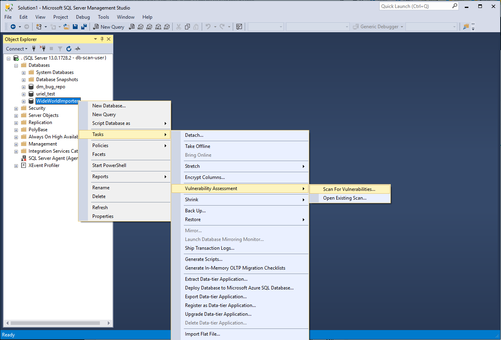

---
title: "SQL Vulnerability Assessment | Microsoft Docs"
ms.custom: ""
ms.date: "11/30/2017"
ms.prod: sql
ms.prod_service: "database-engine, sql-database"
ms.component: "security"
ms.reviewer: ""
ms.suite: "sql"
ms.technology: 
  - "dbe-security"
ms.tgt_pltfrm: ""
ms.topic: conceptual
helpviewer_keywords: 
  - "SQL Vulnerability Assessment"
caps.latest.revision: 7
author: "yualan"
ms.author: "alayu"
manager: craigg
monikerRange: "= azuresqldb-current || >= sql-server-2016 || = sqlallproducts-allversions"
---
# SQL Vulnerability Assessment

[!INCLUDE[appliesto-ss-asdb-xxxx-xxx-md](../../includes/appliesto-ss-asdb-xxxx-xxx-md.md)]

SQL Vulnerability Assessment is an easy to use tool that can help you discover, track, and remediate potential database vulnerabilities. Use it to proactively improve your database security.

Vulnerability Assessment is **supported for SQL Server 2012 and later**, and can also be run on [Azure SQL Database](https://docs.microsoft.com/en-us/azure/sql-database/sql-vulnerability-assessment).

## Vulnerability Assessment features
SQL Vulnerability Assessment (VA) is a service that provides visibility into your security state, and includes actionable steps to resolve security issues and enhance your database security. It can help you:
- Meet compliance requirements that require database scan reports. 
- Meet data privacy standards.
- Monitor a dynamic database environment where changes are difficult to track.

The VA service runs a scan directly on your database. The service employs a knowledge base of rules that flag security vulnerabilities and highlight deviations from best practices, such as misconfigurations, excessive permissions, and unprotected sensitive data. The rules are based on Microsoft’s recommended best practices, and focus on the security issues that present the biggest risks to your database and its valuable data. These rules also represent many of the requirements from various regulatory bodies to meet their compliance standards.

Results of the scan include actionable steps to resolve each issue and provide customized remediation scripts where applicable. An assessment report can be customized for your environment, by setting an acceptable baseline for permission configurations, feature configurations and database settings. 

## Prerequisites
This feature is only available on SQL Server Management Studio (SSMS) v17.4 or later. Please make sure you are using the latest version. You can find the latest version [here](https://docs.microsoft.com/en-us/sql/ssms/download-sql-server-management-studio-ssms).

## Getting started
To get started with running a Vulnerability Assessment on your database, follow these steps:
   1.	Open **SQL Server Management Studio**.

   2.	Connect to an instance of the SQL Server Database Engine or localhost.

   3.	Expand **Databases**, right-click a database, point to **Tasks**, select **Vulnerability Assessment**, and click on **Scan for Vulnerabilities…**

   4.	You can run a scan that checks for server-level issues by scanning one of the system databases. Expand **System Databases**, right-click the **master** database, point to **Tasks**, select **Vulnerability Assessment**, and click on **Scan for Vulnerabilities…**

   

## Tutorial
Use the following steps to run and manage vulnerability assessments on your databases.

### 1. Run a scan

The Scan For Vulnerabilities dialog allows you to specify the location where scans will be saved. You can leave the default location or click **Browse…** to save the scan results to a different location.

When you are ready to scan, click **OK** to scan your database for vulnerabilities.

  > [!NOTE]   
  > The scan is lightweight and safe. It takes a few seconds to run, and is entirely read-only. It does not make any changes to your database.

### 2. View the report

When your scan is complete, your scan report is automatically displayed in the primary SSMS pane. The report presents an overview of your security state; how many issues were found, and their respective severities. Results include warnings on deviations from best practices, as well as a snapshot of your security-related settings, such as database principals and roles and their associated permissions. The scan report also provides a map of sensitive data discovered in your database, and includes recommendations of the built-in methods available to protect it.

### 3. Analyze the results and resolve issues

Review your results and determine which findings in the report are true security issues in your environment. Drill-down to each failed result to understand the impact of the finding, and why each security check failed. Use the actionable remediation information provided by the report to resolve the issue.

### 4. Set your Baseline

As you review your assessment results, you can mark specific results as being an acceptable **Baseline** in your environment. The baseline is essentially a customization of how the results are reported. Results that match the baseline are considered as passing in subsequent scans. 

Once you have established your baseline security state, VA only reports on deviations from the baseline, and you can focus your attention on the relevant issues.

### 5. Run a new scan to see your customized tracking report

After you complete setting up your **Rule Baselines**, run a new scan to view the customized report. VA now reports only failing security issues that deviate from your approved baseline state.

### 6. Open a previously run scan

You can view the results of previously run Vulnerability Assessments at any time by opening an existing scan. Do so by right-clicking a database, pointing to **Tasks**, selecting **Vulnerability Assessment**, and clicking on **Open Existing Scan…**  Select the scan results file you would like to view and click **Open**. 

You can also open an existing scan result via the **File->Open** menu. Select **Vulnerability Assessment…** and open the **scans** directory to find the scan result you wish to view.

VA can now be used to monitor that your databases maintain a high level of security at all times, and that your organizational policies are met. If compliance reports are required, VA reports can be helpful to facilitate the compliance process.
  
## Next steps
Learn more about SQL Vulnerability Assessment using the following resources:
- [Running a Vulnerability Assessment on Azure SQL Database](https://docs.microsoft.com/en-us/azure/sql-database/sql-vulnerability-assessment) 
- [Channel 9 video demonstrating the use of Vulnerability Assessment](https://channel9.msdn.com/Shows/Data-Exposed/Track-and-remediate-potential-database-vulnerabilities-with-SQL-Vulnerability-Assessment)
  
