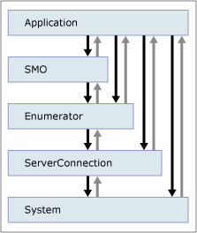

# Handling SMO Exceptions
[!INCLUDE[appliesto-ss-asdb-asdw-xxx-md](../../includes/appliesto-ss-asdb-asdw-xxx-md.md)]

  In managed code, exceptions are thrown when an error occurs. SMO methods and properties do not report success or failure in the return value. Instead, exceptions can be caught and handled by an exception handler.  
  
 Different exception classes exist in the SMO. Information about the exception can be extracted from the exception properties such as the **Message** property that gives a text message about the exception.  
  
 The exception handling statements are specific to the programming language. For example, in [!INCLUDE[msCoName](../../../includes/msconame-md.md)] Visual Basic it is the **Catch** statement.  
  
## Inner Exceptions  
 Exceptions can either be general or specific. General exceptions contain a set of specific exceptions. Several **Catch** statements can be used to handle anticipated errors and let remaining errors fall through to general exception handling code. Exceptions often occur in a cascading sequence. Frequently, an SMO exception might have been caused by an SQL exception. The way to detect this is to use the **InnerException** property successively to determine the original exception that caused the final, top-level exception.  
  
> [!NOTE]  
>  The **SQLException** exception is declared in the **System.Data.SqlClient** namespace.  
  
   
  
 The diagram shows the flow of exceptions through the layers of the application.  
  
## Example  
 To use any code example that is provided, you will have to choose the programming environment, the programming template, and the programming language in which to create your application. For more information, see [Create a Visual C&#35; SMO Project in Visual Studio .NET](../../../relational-databases/server-management-objects-smo/how-to-create-a-visual-csharp-smo-project-in-visual-studio-net.md).
  
## Catching an Exception in Visual Basic  
 This code example shows how to use the **Try…Catch…Finally**[!INCLUDE[vbprvb](../../../includes/vbprvb-md.md)] statement to catch a SMO exception. All SMO exceptions have the type SmoException, and are listed in the SMO reference. The sequence of inner exceptions is displayed to show the root of the error. For more information, see the [!INCLUDE[vbprvb](../../../includes/vbprvb-md.md)] .NET documentation.  
  
```VBNET
'This sample requires the Microsoft.SqlServer.Management.Smo.Agent namespace is included.
'Connect to the local, default instance of SQL Server.
Dim srv As Server
srv = New Server
'Define an Operator object variable by supplying the parent SQL Agent and the name arguments in the constructor.
'Note that the Operator type requires [] parenthesis to differentiate it from a Visual Basic key word.
Dim op As [Operator]
op = New [Operator](srv.JobServer, "Test_Operator")
op.Create()
'Start exception handling.
Try
    'Create the operator again to cause an SMO exception.
    Dim opx As OperatorCategory
    opx = New OperatorCategory(srv.JobServer, "Test_Operator")
    opx.Create()
    'Catch the SMO exception
Catch smoex As SmoException
    Console.WriteLine("This is an SMO Exception")
    'Display the SMO exception message.
    Console.WriteLine(smoex.Message)
    'Display the sequence of non-SMO exceptions that caused the SMO exception.
    Dim ex As Exception
    ex = smoex.InnerException
    Do While ex.InnerException IsNot (Nothing)
        Console.WriteLine(ex.InnerException.Message)
        ex = ex.InnerException
    Loop
    'Catch other non-SMO exceptions.
Catch ex As Exception
    Console.WriteLine("This is not an SMO exception.")
End Try
``` 
  
## Catching an Exception in Visual C#  
 This code example shows how to use the **Try…Catch…Finally** Visual C# statement to catch a SMO exception. All SMO exceptions have the type SmoException, and are listed in the SMO reference. The sequence of inner exceptions is displayed to show the root of the error. For more information, see the Visual C# documentation.  
  
```csharp  
{   
//This sample requires the Microsoft.SqlServer.Management.Smo.Agent namespace to be included.   
//Connect to the local, default instance of SQL Server.   
Server srv;   
srv = new Server();   
//Define an Operator object variable by supplying the parent SQL Agent and the name arguments in the constructor.   
//Note that the Operator type requires [] parenthesis to differentiate it from a Visual Basic key word.   
op = new Operator(srv.JobServer, "Test_Operator");   
op.Create();   
//Start exception handling.   
try {   
    //Create the operator again to cause an SMO exception.   
    OperatorCategory opx;   
    opx = new OperatorCategory(srv.JobServer, "Test_Operator");   
    opx.Create();   
}   
//Catch the SMO exception   
catch (SmoException smoex) {   
    Console.WriteLine("This is an SMO Exception");   
   //Display the SMO exception message.   
   Console.WriteLine(smoex.Message);   
   //Display the sequence of non-SMO exceptions that caused the SMO exception.   
   Exception ex;   
   ex = smoex.InnerException;   
   while (!object.ReferenceEquals(ex.InnerException, (null))) {   
      Console.WriteLine(ex.InnerException.Message);   
      ex = ex.InnerException;   
    }   
    }   
   //Catch other non-SMO exceptions.   
   catch (Exception ex) {   
      Console.WriteLine("This is not an SMO exception.");   
}   
}  
```  
  
  
