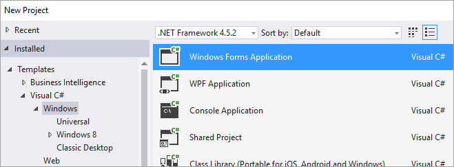
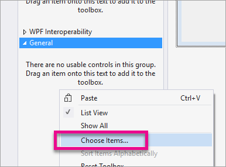
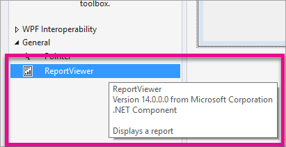

# Integrating Reporting Services Using ReportViewer Controls - Get Started

Learn how developers can embed paginated reports in ASP.NET web sites, and Windows Forms apps, through the Reporting Services 2016 ReportViewer Control. You can add the control to a new project, or update an existing project.

## Adding the ReportViewer control to a new web project

1. Create a new **ASP.NET Empty Web Site** or open an existing ASP.NET project.

    

2. Install the ReportViewer 2016 control nuget package via the **Nuget package manager console**.

    ```
    Install-Package Microsoft.ReportingServices.ReportViewerControl.WebForms
    ```
3. Add a new .aspx page to the project and register the ReportViewer control assembly for use within the page.

    ```
    <%@ Register assembly="Microsoft.ReportViewer.WebForms, Version=14.0.0.0, Culture=neutral, PublicKeyToken=89845dcd8080cc91" namespace="Microsoft.Reporting.WebForms" tagprefix="rsweb" %>
    ```
    
4. Add a **ScriptManagerControl** to the page.

5. Add the ReportViewer control to the page. The snippet below can be updated to reference a report hosted on a remote report server.

    ```
    <rsweb:ReportViewer ID="ReportViewer1" runat="server" ProcessingMode="Remote">
      <ServerReport ReportPath="" ReportServerUrl="" />
    </rsweb:ReportViewer>
    ```
    
The final page should look like the following.

```
<%@ Page Language="C#" AutoEventWireup="true" CodeBehind="WebForm1.aspx.cs" Inherits="Sample" %>

<%@ Register assembly="Microsoft.ReportViewer.WebForms, Version=14.0.0.0, Culture=neutral, PublicKeyToken=89845dcd8080cc91" namespace="Microsoft.Reporting.WebForms" tagprefix="rsweb" %>

<!DOCTYPE html>

<html xmlns="http://www.w3.org/1999/xhtml">
<head runat="server">
    <meta http-equiv="X-UA-Compatible" content="IE=edge" /> 
    <title></title>
</head>
<body>
    <form id="form1" runat="server">
    <asp:ScriptManager runat="server"></asp:ScriptManager>        
        <rsweb:ReportViewer ID="ReportViewer1" runat="server" ProcessingMode="Remote">
            <ServerReport ReportServerUrl="http://AContosoDepartment/ReportServer" ReportPath="/LatestSales" />
        </rsweb:ReportViewer>
    </form>
</body>
</html>

```

## Updating an existing project to use the ReportViewer control

To make use of the ReportViewer 2016 control in an existing project, add the control via Nuget and update the assembly references to version *14.0.0.0*. This will include updating the project's web.config and all .aspx pages that reference the ReportViewer control.

### Sample web.config changes

```
<?xml version="1.0"?>
<!--
  For more information on how to configure your ASP.NET application, please visit
  http://go.microsoft.com/fwlink/?LinkId=169433
  -->
<configuration>
  <system.web>
    <compilation debug="true" targetFramework="4.5.2">
      <assemblies>
        <!-- All assemblies updated to version 14.0.0.0. -->
        <add assembly="Microsoft.ReportViewer.Common, Version=14.0.0.0, Culture=neutral, PublicKeyToken=89845DCD8080CC91"/>
        <add assembly="Microsoft.ReportViewer.DataVisualization, Version=14.0.0.0, Culture=neutral, PublicKeyToken=89845DCD8080CC91"/>
        <add assembly="Microsoft.ReportViewer.Design, Version=14.0.0.0, Culture=neutral, PublicKeyToken=89845DCD8080CC91"/>
        <add assembly="Microsoft.ReportViewer.ProcessingObjectModel, Version=14.0.0.0, Culture=neutral, PublicKeyToken=89845DCD8080CC91"/>
        <add assembly="Microsoft.ReportViewer.WebDesign, Version=14.0.0.0, Culture=neutral, PublicKeyToken=89845DCD8080CC91"/>
        <add assembly="Microsoft.ReportViewer.WebForms, Version=14.0.0.0, Culture=neutral, PublicKeyToken=89845DCD8080CC91"/>
        <add assembly="Microsoft.ReportViewer.WinForms, Version=14.0.0.0, Culture=neutral, PublicKeyToken=89845DCD8080CC91"/>
      </assemblies>
      <buildProviders>
        <!-- Version updated to 14.0.0.0. -->
        <add extension=".rdlc"
          type="Microsoft.Reporting.RdlBuildProvider, Microsoft.ReportViewer.WebForms, Version=14.0.0.0, Culture=neutral, PublicKeyToken=89845DCD8080CC91"/>
      </buildProviders>
    </compilation>
    <httpRuntime targetFramework="4.5.2"/>
    <httpHandlers>
      <!-- Version updated to 14.0.0.0 -->
      <add path="Reserved.ReportViewerWebControl.axd" verb="*"
        type="Microsoft.Reporting.WebForms.HttpHandler, Microsoft.ReportViewer.WebForms, Version=14.0.0.0, Culture=neutral, PublicKeyToken=89845DCD8080CC91"
        validate="false"/>
    </httpHandlers>
  </system.web>
  <system.webServer>
    <validation validateIntegratedModeConfiguration="false"/>
    <modules runAllManagedModulesForAllRequests="true"/>
    <handlers>
      <!-- Version updated to 14.0.0.0 -->
      <add name="ReportViewerWebControlHandler" verb="*" path="Reserved.ReportViewerWebControl.axd" preCondition="integratedMode"
        type="Microsoft.Reporting.WebForms.HttpHandler, Microsoft.ReportViewer.WebForms, Version=14.0.0.0, Culture=neutral, PublicKeyToken=89845DCD8080CC91"/>
    </handlers>
  </system.webServer>
</configuration>
```

### Sample .aspx

```
<%@ Page Language="C#" AutoEventWireup="true" CodeBehind="WebForm1.aspx.cs" Inherits="SampleAspx" %>

<!-- Update version to 14.0.0.0 -->
<%@ Register assembly="Microsoft.ReportViewer.WebForms, Version=14.0.0.0, Culture=neutral, PublicKeyToken=89845dcd8080cc91" namespace="Microsoft.Reporting.WebForms" tagprefix="rsweb" %>

<!DOCTYPE html>
```

## Adding the ReportViewer control to a new Windows Forms project

1. Create a new **Windows Forms Application** or open an existing project.

    

2. Install the ReportViewer 2016 control nuget package via the **Nuget package manager console**.

    ```
    Install-Package Microsoft.ReportingServices.ReportViewerControl.WinForms
    ```
3. Add a new control from code or [add the control to the toolbox](##adding-control-to-visual-studio-toolbar).

    ```
    private Microsoft.Reporting.WinForms.ReportViewer reportViewer1;
    
    private void InitializeComponent()
    {
        this.reportViewer1 = new Microsoft.Reporting.WinForms.ReportViewer();
        this.SuspendLayout();
        // 
        // reportViewer1
        // 
        this.reportViewer1.Location = new System.Drawing.Point(168, 132);
        this.reportViewer1.Name = "reportViewer1";
        this.reportViewer1.ServerReport.BearerToken = null;
        this.reportViewer1.Size = new System.Drawing.Size(396, 246);
        this.reportViewer1.TabIndex = 0;
        // 
        // Form1
        // 
        this.Controls.Add(this.reportViewer1);
    }
    ```

## How to set 100% height on the Report Viewer 2016 control

The new Report Viewer 2016 control is optimized for HTML5 Standards mode pages and works on all modern browsers. In the past, with the old RVC control, when you set the 100% height property, it worked even if none of the ancestors had height specified. This behavior has changed in HTML5. When you set this property on the new RVC control, it will work correctly only if the parent element has a defined height, i.e. not a value of auto, or all the ancestors of RVC have 100% height too.

Below are the two examples to do this.

### By setting the height of all the parent elements to 100%

```
<!DOCTYPE html>
<html xmlns="http://www.w3.org/1999/xhtml">
<head runat="server">
    <style>
        html,body,form,#div1 {
            height: 100%; 
        }
    </style>
   </head>
<body>
    <form id="form1" runat="server">
    <div id="div1" >
            <asp:ScriptManager runat="server"></asp:ScriptManager>
        <rsweb:ReportViewer ID="ReportViewer1" runat="server" ProcessingMode="Remote" Height="100%" Width="100%">
            <ServerReport ReportServerUrl="http://test/ReportServer" ReportPath="/testreport" />
        </rsweb:ReportViewer>
    </div>
    </form>
</body>
</html>

```

### By setting the style height attribute on the parent of the reportviewer control

For more information about viewport percentage lengths, see [Viewport-percentage lengths](https://www.w3.org/TR/css3-values/#viewport-relative-lengths).

```
<!DOCTYPE html>
<html xmlns="http://www.w3.org/1999/xhtml">
<head runat="server">
</head>
<body>
    <form id="form1" runat="server">
    <div style="height:100vh;">
            <asp:ScriptManager runat="server"></asp:ScriptManager>
        <rsweb:ReportViewer ID="ReportViewer1" runat="server" ProcessingMode="Remote" Height="100%" Width="100%">
            <ServerReport ReportServerUrl="http://test/ReportServer" ReportPath="/testreport" />
        </rsweb:ReportViewer>
    </div>
    </form>
</body>
</html>

```

## Adding control to Visual Studio toolbar

The Report Viewer Control is now shipped as a NuGet package. Because of this, you will not see the Report Viewer Control show up in the Visual Studio toolbox by default. You can add the control to the toolbox by doing the following.

1. Install the NuGet package for either the WinForms or WebForms as mentioned above.

2. Remove the ReportViewer Control that is listed in the toolbox. This is the the control with a version of 12.x.

    

3. Right click in anywhere in the toolbox and then select **Choose Items...**.

    
    
4. On the **.NET Framework Components**, select **Browse**.

    

5. Select the **Microsoft.ReportViewer.WinForms.dll** or **Microsoft.ReportViewer.WebForms.dll** from the NuGet package you installed.

    > [!NOTE] 
    > The NuGet package will be installed in the solution directory of your project. The path to the dll will be similar to the following: `{Solution Directory}\packages\Microsoft.ReportingServices.ReportViewerControl.Winforms.{version}\lib\net40` or `{Solution Directory}\packages\Microsoft.ReportingServices.ReportViewerControl.WebForms.{version}\lib\net40`.

6. The new control should display within the toolbox. You can then move it to another tab within the toolbox if you wish.

    

### Things to be aware of

- This will add a reference to the installed NuGet package within your current project. The item in the toolbox will persist to other projects. When you install the NuGet package in a new solution/project, the toolbox item may be referencing an older version. 

- The control will remain in the toolbox even if the assembly is not available any longer. If that project was deleted, Visual Studio will throw an error if you try and add the control from the toolbox. To correct this error, remove the control from the toolbox and re-add it using the steps above.


## Common issues
    
- The ReportViewer 2016 control is designed to be used with modern browsers. The control may not function if browsers render the web page in an IE compatibility mode. Intranet sites may require a meta tag to override setting which encourage rendering intranet pages in compatibility mode.

    ```
    <meta http-equiv="X-UA-Compatible" content="IE=edge" />
    ```
      
## Providing feedback

Let the team know about issues you encounter with the control on the [Reporting Services MSDN forums](https://social.msdn.microsoft.com/Forums/sqlserver/home?forum=sqlreportingservices) or via email at [RVCFeedback@microsoft.com](mailto:RVCFeedback@microsoft.com).

## See also

[Data collection in the 2016 ReportingViewer control](../../reporting-services/application-integration/integrating-reporting-services-using-reportviewer-controls-data-collection.md)  
More questions? [Try the Reporting Services forum](http://go.microsoft.com/fwlink/?LinkId=620231)

