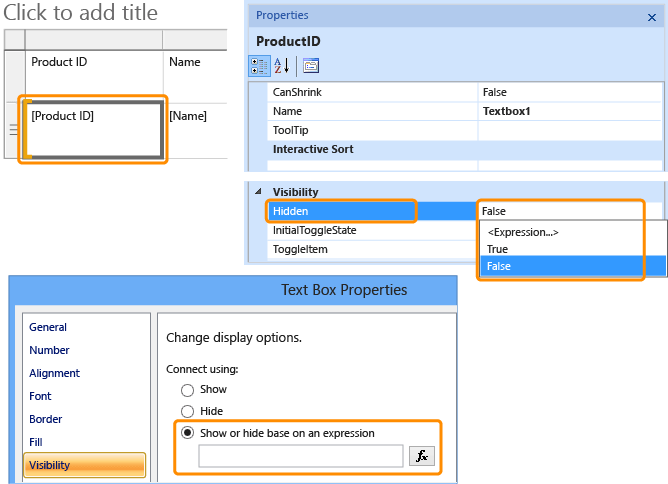

# Hide an Item (Report Builder and SSRS)
  Set the visibility of a report item when you want to conditionally hide an item based on a report parameter or some other expression that you specify.  
  
 You can also design a report to allow the user to toggle the visibility of report items based on clicking text boxes in the report, for example, for a drilldown report. For more information, see [Add an Expand or Collapse Action to an Item &#40;Report Builder and SSRS&#41;](../../reporting-services/report-design/add-an-expand-or-collapse-action-to-an-item-report-builder-and-ssrs.md).  
  
 The following procedures describe how to show or hide a report item in a rendered report based on a constant or an expression.  
  
> [!NOTE]  
>  [!INCLUDE[ssRBRDDup](../../includes/ssrbrddup-md.md)]  
  
### To hide a report item  
  
1.  In report design view, right-click the report item and open its **Properties** page.  
  
    > [!NOTE]  
    >  To select an entire table or matrix data region, click in the data region to select it, right-click a row, column, or corner handle, and then click **Tablix Properties**.  
  
2.  Click **Visibility.**  
  
3.  In **When the report is initially run**, specify whether to hide the item when you first view the report:  
  
    -   To display the item, click **Show**.  
  
    -   To hide the item, click **Hide**.  
  
    -   To specify an expression that is evaluated at run-time, click **Show or hide based on an expression**. Type the expression or click the expression (**fx**) button to create the expression in the **Expression** dialog box.  
  
        > [!NOTE]  
        >  When you specify an expression for visibility, you are setting the Hidden property of the report item, as shown in the following image. The evaluated expression shows the report item when the value is False, and hides the report item when the value is True.   
        >   
  
4.  Click **OK** twice.  
  
### To hide static rows in a table, matrix, or list  
  
1.  In report design view, click the table, matrix, or list to display the row and column handles.  
  
2.  Right-click the row handle, and then click **Row Visibility**. The **Row Visibility** dialog box opens.  
  
3.  To set the visibility, follow steps 3 and 4 in the first procedure.  
  
### To hide static columns in a table, matrix, or list  
  
1.  In Design view, select the table, matrix, or list to display the row and column handles.  
  
2.  Right-click the column handle, and then click **Column Visibility**.  
  
3.  In the **Column Visibility** dialog box, follow steps 3 and 4 in the first procedure.  
  
## See Also  
 [Drilldown Action &#40;Report Builder and SSRS&#41;](../../reporting-services/report-design/drilldown-action-report-builder-and-ssrs.md)   
 [Add an Expand or Collapse Action to an Item &#40;Report Builder and SSRS&#41;](../../reporting-services/report-design/add-an-expand-or-collapse-action-to-an-item-report-builder-and-ssrs.md)   
 [Expression Examples &#40;Report Builder and SSRS&#41;](../../reporting-services/report-design/expression-examples-report-builder-and-ssrs.md)  
  
  
