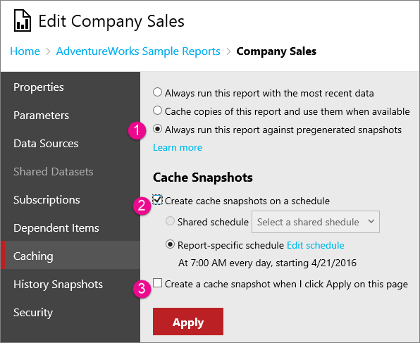
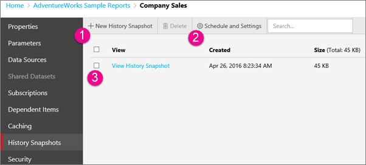

# Working with snapshots (web portal)

[!INCLUDE[ssrs-appliesto-sql2016-xpreview](../includes/ssrs-appliesto-sql2016-xpreview.md)]

You can control if snapshots are created for a report by selecting the **ellipsis (…)** of a report, selecting **Manage** and selecting **Caching** or **History Snapshots**.  
  
> [!NOTE]
> The SQL Server Agent service needs to be started.  
   
You can create a cache snapshot, to allow for faster loading of specific execution properties. You can also work with history snapshots to capture points in time.  
  
## Creating a cache snapshot  
  
You can create a snapshot by doing the following.  
  
  
  
1.  On the **Caching** page, select **Always run this report against pregenerated snapshots** to enable the options for creating a snapshot.  
  
2.  Select **Create Cache snapshots on a schedule** if you want to schedule a recurring snapshot. You can then use a shared schedule, or define a custom schedule to refresh the snapshot.  
  
3.  Select **Create a cache snapshot when I click Apply on this page** if you want to create a cache snapshot right now. If you select only this option, the snapshot will not be refreshed.  
  
## Create, Modify, and Delete history snapshots  
  
To work with history snapshots, manage a report and select **History Snapshots**.  
  
Use the **History Snapshots** page to view report snapshots that are generated and stored over time. Depending on options that are set on the report server, the history may contain only the more recent snapshots.  
  
Report history is always viewed within the context of the report from which it originates. You cannot view the history of all reports on a report server in one place.  
  
To generate a history snapshot, the report must be able to run unattended (that is, it must use stored credentials; parameterized reports must contain default parameter values for all parameters). Report history can be generated manually or as a scheduled operation. History properties on the report determine the ways in which report history can be created.  
  
  
   
1.  To create a history snapshot, select **+ New History Snapshot**. This will process the report and add an entry to the list.  
  
2.  You can go into the settings to define schedules and retention policies.  
  
3.  You can select a history snapshot to view it. Snapshots that appear in report history are distinguished only by the date and time at which they were created. There is no visual indication to distinguish whether a snapshot was generated in response to a schedule or a manual operation.  
  
### Schedule and settings  
  
Selecting **Schedule and Settings** will provide additional options to schedule and control retention of created snapshots.  
  
  
   
You can optionally create a schedule for the snapshots to get created. You can also prevent other people from creating new snapshots. Unchecking **Allow people to create snapshots manually** will disable the **+ New Snapshot History button**.  
  
You can also define how you want to retain snapshots.  
  
**Save cache snapshots in report history as well**  
  
Selecting this will copy a report snapshot that you generate based on report execution properties to report history. You can set report execution properties to run a report from a generated snapshot. By setting this report history property, you can keep a record of all reports snapshots that are generated over time by placing copies of them in report history.

## Next steps

[Web portal](../reporting-services/web-portal-ssrs-native-mode.md)  
[Working with paginated reports](working-with-paginated-reports-web-portal.md)  
[Work with Shared Datasets](../reporting-services/work-with-shared-datasets-web-portal.md)

More questions? [Try asking the Reporting Services forum](http://go.microsoft.com/fwlink/?LinkId=620231)