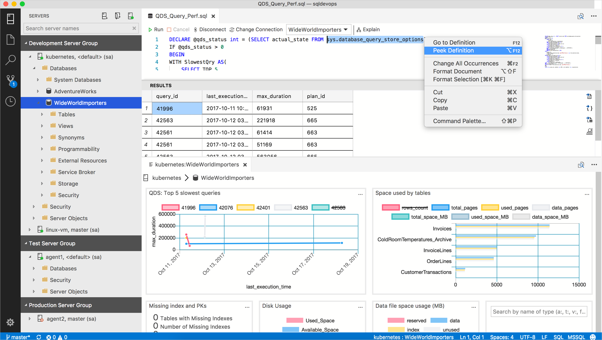

# Manage servers and databases with Insight widgets in Carbon

Insight widgets take the SQL queries you use to monitor servers & databases and turns them into insightful visualizations. 

Insights are customizable charts and graphs that you add to server and database monitoring dashboards. View at-a-glance insights of your servers and databases, then drill into more details, and launch management actions that you define. 

You can build awesome server and database management dashboards that are even better than the following example!

To jump in and start creating different types of Insight widgets, check out the following tutorials:

- [**Build a custom Insight widget**](tutorial-build-custom-insight-sql-server.md)
- [**Monitor query performance**](tutorial-monitoring-sql-server.md)
- [**Monitor space used by all database tables**](tutorial-table-space-sql-server.md)
- [**Monitor status of backups**](tutorial-backup-status-sql-server.md)

## SQL Queries 

Carbon tries to avoid introducing yet another language or heavy UI so it tries to use SQL as much as possible with minimal JSON configuration. Configuring Insight widgets with SQL leverages the countless number of existing sources of useful SQL queries that can be turned into Insight widgets.

Insight widgets are composed of one or two SQL queries:
* *Insight widget query* is mandatory, and is the query that returns the data that appears in the widget.
* *Insight details query* is only required if you are creating an Insight Details flyout.

Insight widget query defines a dataset that renders a count, chart, or graph. Insight details query is used to list relevant insight detail information in a tabular format in the Insight Details flyout. 

Carbon executes insight widget query and maps the query result set to a chart's dataset then renders it. When users open up an insight detail flyout, Carbon executes the insight details query and prints out the result in a grid view within the dialog.

The basic idea is to write a SQL query in a way so it can be used as a dataset of a count, chart, and graph widget. 

## Summary

T-SQL query and its result set itself determines the insight widget behavior. Writing a query for a chart type or mapping a right chart type for existing query is the key consideration to build an effective Insight widget.

## Additional resources
- [Query Editor](tutorial-modern-code-flow-sql-server.md)
- [Create some Insight widgets](tutorial-monitoring-sql-server.md)

