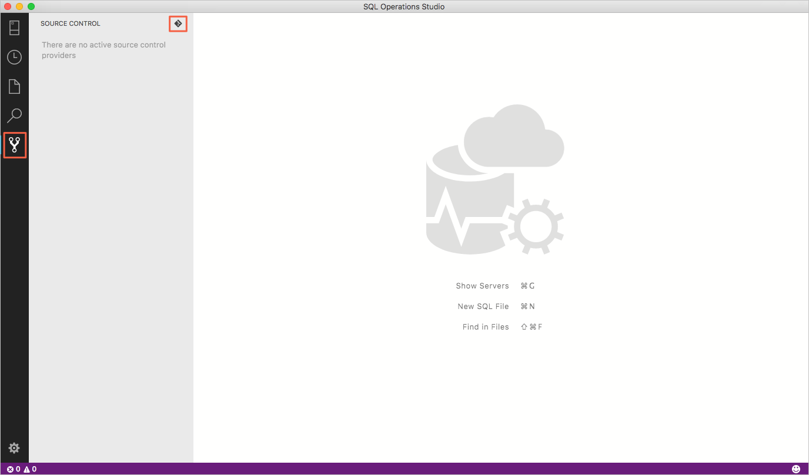
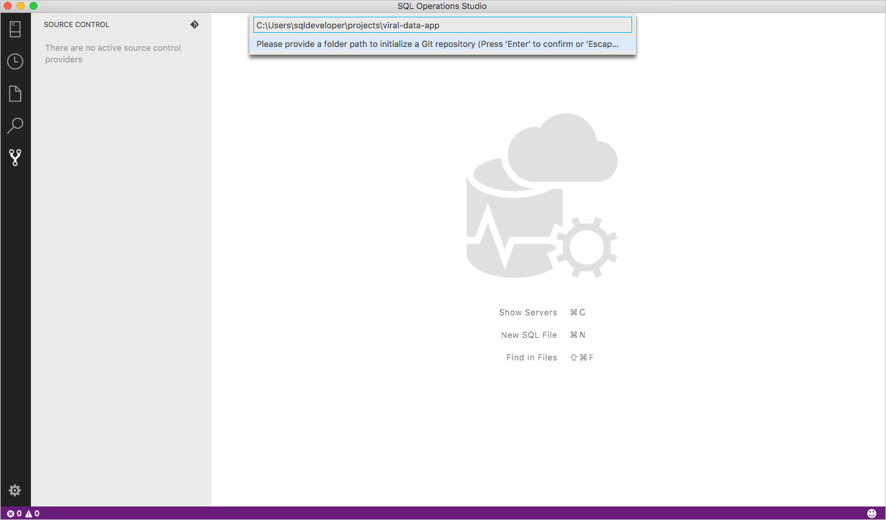

#  Using source control in [!INCLUDE[name-sos](../includes/name-sos-short.md)]

[!INCLUDE[name-sos](../includes/name-sos-short.md)] supports Git for version/source control.

## Git support in [!INCLUDE[name-sos](../includes/name-sos-short.md)]

[!INCLUDE[name-sos](../includes/name-sos-short.md)] ships with a Git source control manager (SCM) that leverages your computers Git installation, so you need to [install Git (version 2.0.0 or later)](https://git-scm.com/download) before these features are available. 

>**Note:** The [!INCLUDE[name-sos](../includes/name-sos-short.md)] documentation assumes you are already familiar with Git. If you are new to Git, the [git-scm](https://git-scm.com/documentation) website is a good place to start with a popular online [book](https://git-scm.com/book), Getting Started [videos](https://git-scm.com/video/what-is-git), and [cheat sheets](https://services.github.com/on-demand/downloads/github-git-cheat-sheet.pdf). 

>**Tip:** [!INCLUDE[name-sos](../includes/name-sos-short.md)] works with any Git repository.  If you don't already have a private hosted Git provider, [Visual Studio Team Services](https://www.visualstudio.com/products/visual-studio-team-services-vs) is a great free option. [Sign up for VSTS](https://go.microsoft.com/fwlink/?LinkID=307137&campaign=o~msft~code~vc). **??IS THIS TRUE??**

## Open an existing Git repository

1. Under the **File** menu, select **Open Folder...**
2. Browse to the folder that contains your files tracked by git, and click **Select Folder**. Subfolders in your local repository are okay to select here.

## Initialize a new git repository

1. Select Source Control, then select the git icon that appears.

   

1. Enter the path to the folder you want to initialize as a Git repository and press **Enter**.

   

## Working with Git repositories

[!INCLUDE[name-sos](../includes/name-sos-short.md)] inherits its Git implementation from VS Code, but does not currently support additional SCM providers. For the details about working with Git after you open or initialize a repository, see [Git support in VS Code](https://code.visualstudio.com/docs/editor/versioncontrol#_git-support).

## Additional resources
- [Git documentation](https://git-scm.com/documentation)
